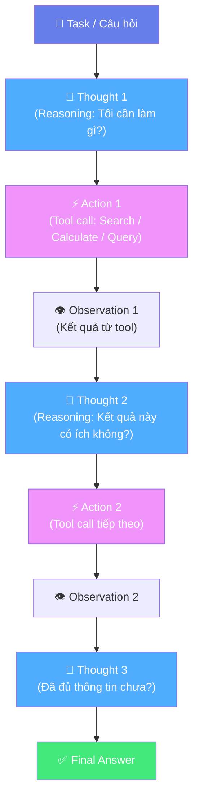
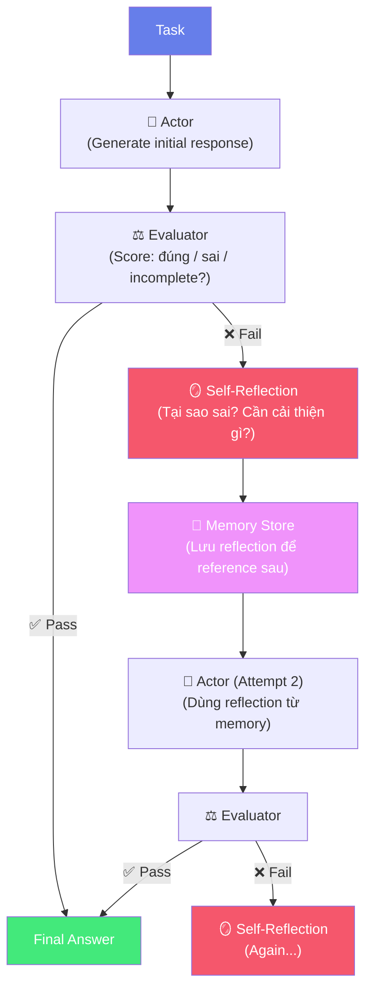
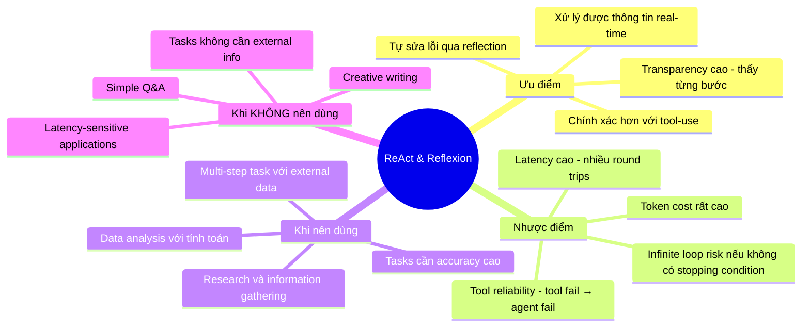

# ⚡ Bài 6: ReAct & Reflexion — AI Biết Tự Kiểm Tra và Sửa Lỗi

## 📋 Agenda

**Thời gian đọc ước tính:** ~30 phút

### Sau bài này, bạn sẽ:
- ✅ **Hiểu** tại sao AI "confident but wrong" và cần cơ chế self-correction
- ✅ **Áp dụng** ReAct framework (Reasoning + Acting) cho agentic tasks
- ✅ **Hiểu** Reflexion — AI học từ lỗi của chính mình
- ✅ **Nhận ra** khi nào các framework này cần thiết

### Prerequisites:
- 🔹 Đã đọc Bài 5 (Tree of Thoughts & Chaining)

---

## ❓ Vấn đề & Giải pháp

**Vấn đề:** LLM chuẩn hoàn toàn "mù" với thế giới bên ngoài và không biết khi nào mình sai:

```
Prompt: "Hôm nay giá Bitcoin là bao nhiêu?"
LLM: "$45,000"  ← Bịa (knowledge cutoff!)

Prompt: "Tính 2^100"
LLM: "1,267,650,600,228,229,401,496,703,205,376"  ← Có thể sai

Prompt: "Search GitHub để tìm repo nổi tiếng nhất về RAG"
LLM: "Tôi không có khả năng search internet..."  ← Bế tắc
```

**Giải pháp:** ReAct + Reflexion — cho AI khả năng **hành động** (search, calculate, query) và **tự sửa lỗi**.

---

## 📖 WHAT — ReAct Framework

> **ReAct (Reasoning + Acting)** là framework kết hợp reasoning (suy luận) và acting (hành động) trong một vòng lặp thống nhất, cho phép LLM tương tác với công cụ bên ngoài (tools) để thu thập thông tin và thực hiện task.
>
> — *Yao et al., 2022 — "ReAct: Synergizing Reasoning and Acting in Language Models"*

### ReAct Loop



### ReAct Trace Example — Research Task

```
Task: "Tìm hiểu về công ty Anthropic: khi nào thành lập, ai là CEO, và sản phẩm chính?"

Thought 1: Tôi cần tìm thông tin về Anthropic. Sẽ search Wikipedia trước.
Action 1: search("Anthropic AI company")
Observation 1: "Anthropic là công ty AI safety thành lập năm 2021 bởi Dario Amodei,
               Daniela Amodei và các cựu nhân viên OpenAI..."

Thought 2: Tốt, đã có thông tin cơ bản. Cần tìm thêm về CEO và sản phẩm.
Action 2: search("Anthropic CEO products Claude")
Observation 2: "CEO là Dario Amodei. Sản phẩm chính là Claude (AI assistant)..."

Thought 3: Đã đủ thông tin. Tổng hợp câu trả lời.
Action 3: finish("Anthropic thành lập 2021, CEO Dario Amodei, sản phẩm chính: Claude")
```

### Tools phổ biến trong ReAct

| Tool | Chức năng | Use case |
|------|-----------|---------|
| `search(query)` | Web search | Thông tin real-time |
| `lookup(term)` | Wikipedia lookup | Định nghĩa, facts |
| `calculate(expr)` | Calculator | Tính toán chính xác |
| `run_code(code)` | Code executor | Data analysis, automation |
| `query_db(sql)` | Database query | Business data |
| `read_file(path)` | File reader | Document processing |

---

## 🔄 ReAct Prompt Template

```
Bạn có thể sử dụng các tools sau:
- search[query]: Search thông tin từ web
- calculate[expression]: Tính toán toán học
- finish[answer]: Kết thúc và trả về đáp án cuối

Định dạng output:
Thought: [suy nghĩ của bạn]
Action: tool_name[input]
Observation: [kết quả trả về từ tool]
... (lặp lại nhiều lần nếu cần)
Thought: Đã đủ thông tin
Action: finish[câu trả lời cuối cùng]

---

Task: Giá vàng hiện tại tính theo VND là bao nhiêu?
```

---

## 🔁 Reflexion — AI Học Từ Lỗi Của Chính Mình

> **Reflexion** là framework cho phép LLM **tự đánh giá output của mình**, **xác định điểm yếu**, và **cải thiện** qua nhiều lần thử — mô phỏng quá trình học tập của con người.
>
> — *Shinn et al., 2023 — "Reflexion: Language Agents with Verbal Reinforcement Learning"*

**Analogy:** Tưởng tượng bạn viết essay, đọc lại, thấy argument yếu, viết lại. Reflexion là cơ chế đó cho AI.

### Reflexion Architecture



### Reflexion Example — Coding Task

```
[Attempt 1]
Task: "Viết hàm kiểm tra palindrome trong Python"
Output:
def is_palindrome(s):
    return s == s[::-1]

Evaluator: FAIL — Không handle case insensitive, không handle spaces
Score: 3/10

[Self-Reflection]
"Tôi đã bỏ qua edge cases quan trọng:
1. Case sensitivity: 'Racecar' nên return True nhưng code hiện tại return False
2. Spaces: 'A man a plan a canal Panama' nên return True
Cần normalize string trước khi check"

[Attempt 2 — With reflection]
def is_palindrome(s: str) -> bool:
    # Normalize: lowercase và remove non-alphanumeric
    cleaned = ''.join(c.lower() for c in s if c.isalnum())
    return cleaned == cleaned[::-1]

Evaluator: PASS
Score: 9/10
```

---

## 🔌 Automatic Reasoning and Tool-use (ART)

**ART** (Paranjape et al., 2023) là bước tiến từ ReAct: thay vì viết tool-use prompts thủ công, ART tự động:

1. Chọn demonstrations phù hợp từ task library
2. Pause để gọi external tools khi cần
3. Resume reasoning sau khi có kết quả từ tool

```
[ART — Automatic, không cần define tools manually]

Task: "Tính xem cần bao nhiêu ngày để đọc hết 'War and Peace'
       nếu đọc 30 trang/ngày?"

ART tự quyết định:
→ Cần lookup số trang sách (tool: search)
→ Cần tính toán (tool: calculate)
→ Trả kết quả

Không cần prompt engineer định nghĩa tools, ART tự chọn.
```

---

## ⚖️ Trade-offs



---

## 🔨 Ví dụ thực tế: ReAct cho Data Analysis

```python
# Pseudo-code: ReAct agent cho data analysis

SYSTEM_PROMPT = """
Bạn là data analyst AI. Bạn có thể sử dụng:
- query_db(sql): Thực thi SQL query
- calculate(expr): Tính toán
- visualize(data, chart_type): Tạo chart

Workflow:
Thought: [reasoning]
Action: tool[input]
Observation: [result]
... repeat ...
Thought: Đã có đủ dữ liệu
Action: finish[summary and insights]
"""

USER_TASK = """
Phân tích: Trong Q1 2025, sản phẩm nào có doanh thu cao nhất
và tăng trưởng so với Q4 2024 như thế nào?
"""

# Agent sẽ tự động:
# 1. Query DB để lấy Q1 2025 revenue theo product
# 2. Query DB để lấy Q4 2024 revenue
# 3. Calculate % growth
# 4. Trả kết quả với insights
```

---

## 💡 Bài tập thực hành

**Task 1 — ReAct Simulation:**
Giả lập một ReAct trace để trả lời câu hỏi:
"Startup Việt Nam nào gần đây nhất được định giá unicorn ($1B+)?"

Viết đầy đủ các bước: Thought → Action → Observation (dùng kiến thức bạn đã biết làm "observation").

**Task 2 — Reflexion:**
Dùng kỹ thuật Reflexion để cải thiện một đoạn code bạn đã viết gần đây:
1. Generate code ban đầu bằng AI
2. Tự đánh giá: tìm 3 điểm yếu
3. Viết lại với reflection

**Task 3:**
Tìm hiểu một AI agent framework thực tế (LangChain, LlamaIndex, hoặc CrewAI) và xem cách họ implement ReAct.

---

## 📌 Tóm tắt

| Framework | Core idea | Khi dùng |
|-----------|---------|---------|
| **ReAct** | Reasoning + Tool-use trong loop | Tasks cần external data/actions |
| **Reflexion** | Self-reflection để improve qua iterations | Tasks cần high accuracy, có thể retry |
| **ART** | Automatic tool selection từ library | Production agents, không muốn handcraft prompts |

**Bài tiếp theo:** [Bài 7 — RAG & Context Engineering: Cấp Cho AI "Bộ Nhớ Dài Hạn" →](./07-rag-context-engineering)

---

*Made by Anh Tu - Share to be share*
