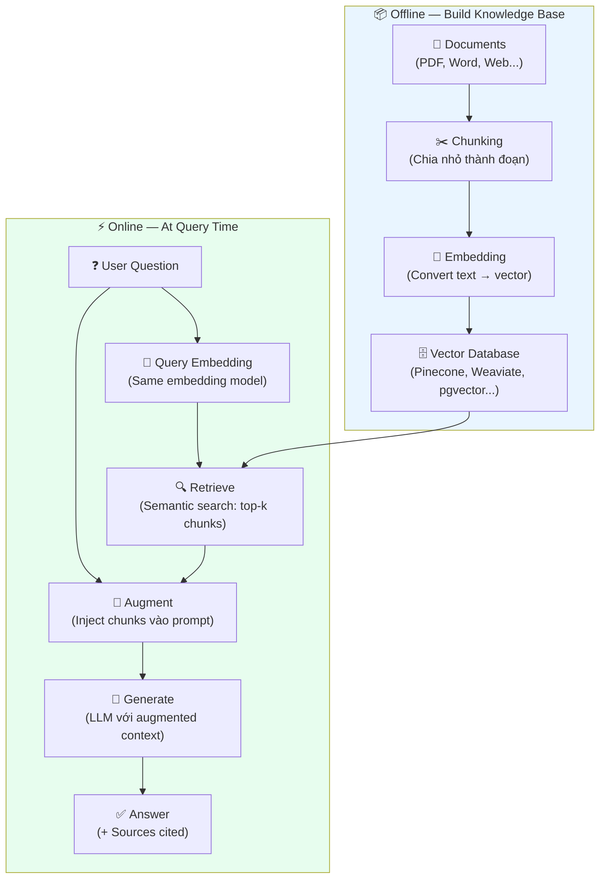
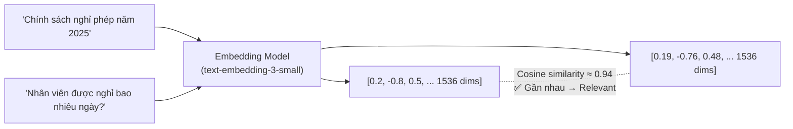
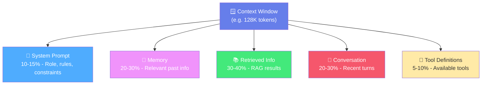
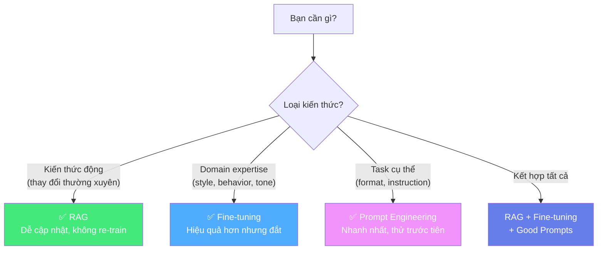
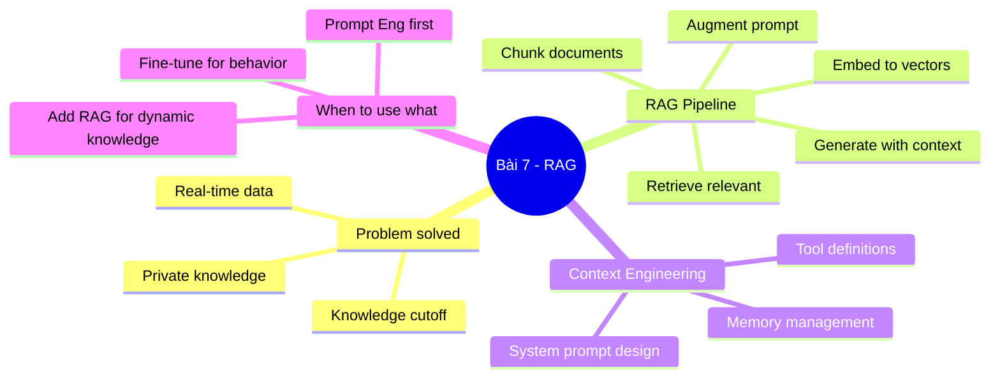

# 📚 Bài 7: RAG & Context Engineering — Cấp Cho AI "Bộ Nhớ Dài Hạn"

## 📋 Agenda

**Thời gian đọc ước tính:** ~35 phút

### Sau bài này, bạn sẽ:
- ✅ **Hiểu** vấn đề knowledge cutoff và context window của LLM
- ✅ **Giải thích** RAG pipeline từ Retrieve → Augment → Generate
- ✅ **Thiết kế** Context Engineering cho AI Agents
- ✅ **Chọn** đúng giữa RAG, Fine-tuning, và Prompt Engineering

### Prerequisites:
- 🔹 Đã đọc Bài 6 (ReAct & Reflexion)

---

## ❓ Vấn đề & Giải pháp

**Hai vấn đề cốt lõi của LLM trong production:**

```
🚫 Vấn đề 1 — Knowledge Cutoff:
LLM được train đến một thời điểm nhất định.
GPT-4 cutoff: Tháng 4/2023 → Không biết gì sau đó.
→ Hỏi về sự kiện gần đây → Hallucinate hoặc từ chối

🚫 Vấn đề 2 — Thiếu Private Knowledge:
LLM không biết thông tin nội bộ của công ty bạn.
→ "Chính sách nghỉ phép của công ty chúng tôi là gì?" → AI không biết
```

**Giải pháp: RAG (Retrieval-Augmented Generation)** — Cấp thêm context có liên quan vào prompt ngay tại runtime.

---

## 📖 WHAT — RAG là gì?

> **Retrieval-Augmented Generation (RAG)** là kiến trúc kết hợp giữa **Information Retrieval** (tìm kiếm thông tin) và **Text Generation** (sinh văn bản): trước khi generate response, hệ thống tự động tìm kiếm và đưa các đoạn thông tin liên quan nhất vào context của LLM.
>
> — *Lewis et al., 2020 — "Retrieval-Augmented Generation for Knowledge-Intensive NLP Tasks"*

### RAG giải quyết vấn đề gì so với alternatives?

| Vấn đề | Standard Prompt | Fine-tuning | RAG |
|--------|----------------|-------------|-----|
| Knowledge cutoff | ❌ | ❌ (phải re-train) | ✅ |
| Private knowledge | ❌ | ✅ (tốn kém) | ✅ |
| Real-time data | ❌ | ❌ | ✅ (với live retrieval) |
| Chi phí cập nhật | Rẻ | Rất đắt | Rẻ (chỉ cập nhật DB) |
| Transparency | Thấp | Thấp | Cao (có thể cite sources) |

---

## 🔨 HOW — RAG Pipeline chi tiết



### Bước 1: Chunking — Chia tài liệu thành đoạn nhỏ

**Tại sao cần chunking?**
- LLM có context window giới hạn → Không thể nhét toàn bộ tài liệu
- Semantic search hiệu quả hơn trên đoạn nhỏ

**Các chunking strategies:**

```python
# Strategy 1: Fixed-size chunking (đơn giản nhất)
chunk_size = 512  # tokens
overlap = 50  # tokens overlap giữa chunks

# Strategy 2: Semantic chunking (tốt hơn)
# Chia theo paragraph, section, hoặc semantic boundary

# Strategy 3: Hierarchical chunking
# Chunk lớn cho context, chunk nhỏ cho retrieval
```

**Trade-off:**
- Chunk nhỏ → Search chính xác hơn, nhưng thiếu context
- Chunk lớn → Nhiều context hơn, nhưng search kém chính xác hơn
- **Best practice:** Chunk 256-512 tokens với 10-20% overlap

### Bước 2: Embedding — Vector hóa văn bản



**Embedding models phổ biến:**

| Model | Dimensions | Use case |
|-------|-----------|---------|
| `text-embedding-3-small` (OpenAI) | 1536 | General, cost-effective |
| `text-embedding-3-large` (OpenAI) | 3072 | Higher accuracy |
| `all-MiniLM-L6-v2` (Sentence-BERT) | 384 | Open source, fast |
| `bge-m3` (BAAI) | 1024 | Multilingual, Vietnamese tốt |

### Bước 3: Augment — Inject context vào prompt

```python
# RAG Prompt Template
SYSTEM_PROMPT = """
Bạn là assistant hỗ trợ HR. Trả lời câu hỏi DỰA HOÀN TOÀN vào tài liệu được cung cấp.
Nếu thông tin không có trong tài liệu, hãy nói rõ "Tài liệu không đề cập đến điều này."
Không sử dụng kiến thức bên ngoài tài liệu.
"""

USER_PROMPT = f"""
Tài liệu tham khảo:
<document>
{retrieved_chunks}
</document>

Câu hỏi: {user_question}

Hãy trả lời và cite nguồn cụ thể từ tài liệu (trang/section nào).
"""
```

---

## 🏗️ Context Engineering for AI Agents

Khi build AI Agents (kết hợp RAG + ReAct), **Context Engineering** là kỹ năng tổng hợp để thiết kế toàn bộ context window hiệu quả.

```
Context Window = System Prompt + Memory + Retrieved Info + Conversation History + Tools
```



### System Prompt Design cho Agents

```
[AGENT SYSTEM PROMPT TEMPLATE]

## Role
Bạn là [tên agent], chuyên về [domain].

## Capabilities
Bạn có thể:
- [Capability 1]
- [Capability 2]

## Constraints
- Chỉ trả lời dựa trên thông tin trong tài liệu được cung cấp
- Không đưa ra lời khuyên pháp lý/y tế
- Luôn cite nguồn khi trả lời

## Response Format
[Quy định format output]

## Tone
Chuyên nghiệp, thân thiện, dùng tiếng Việt.
```

### Memory Management

**Types of memory trong AI Agents:**

| Memory Type | Mô tả | Implementation |
|------------|--------|---------------|
| **In-window** | Conversation history trong context | Trực tiếp trong prompt |
| **External short-term** | Tóm tắt conversation gần đây | Vector DB với TTL |
| **External long-term** | User preferences, facts | Persistent vector DB |
| **Episodic** | Specific past interactions | Structured storage |

---

## ⚖️ RAG vs Fine-tuning vs Prompt Engineering

**Đây là câu hỏi quan trọng nhất khi build AI applications:**



| | Prompt Eng. | RAG | Fine-tuning |
|--|------------|-----|-------------|
| **Setup time** | Giờ | Ngày | Tuần |
| **Cost** | Thấp | Trung bình | Cao |
| **Knowledge update** | Thay prompt | Cập nhật DB | Re-train |
| **Private knowledge** | ❌ | ✅ | ✅ |
| **Behavior customization** | Một phần | Không | ✅ |
| **Transparency** | Cao | Cao | Thấp |

**Rule of thumb:**
1. **Thử Prompt Engineering trước** — nếu đủ → dừng
2. **Thêm RAG** nếu cần private/dynamic knowledge
3. **Fine-tune** chỉ khi behavior cần thay đổi sâu (tone, style, domain)

---

## 🔨 Use Case thực tế: Chatbot HR nội bộ

```python
# Simplified RAG implementation

from openai import OpenAI
import numpy as np

client = OpenAI()

# Giả sử đã có vector database với HR documents
def retrieve_relevant_chunks(question: str, top_k: int = 3) -> list[str]:
    # 1. Embed query
    query_embedding = client.embeddings.create(
        input=question,
        model="text-embedding-3-small"
    ).data[0].embedding

    # 2. Search vector DB (pseudo-code)
    # results = vector_db.search(query_embedding, top_k=top_k)
    # return [r.text for r in results]
    pass

def answer_hr_question(question: str) -> str:
    # 1. Retrieve relevant context
    chunks = retrieve_relevant_chunks(question)
    context = "\n\n---\n\n".join(chunks)

    # 2. Augment prompt với context
    response = client.chat.completions.create(
        model="gpt-4o",
        messages=[
            {
                "role": "system",
                "content": """Bạn là HR Assistant của công ty. Trả lời câu hỏi
                DỰA HOÀN TOÀN vào tài liệu HR được cung cấp. Cite nguồn cụ thể."""
            },
            {
                "role": "user",
                "content": f"""
Tài liệu HR:
<documents>
{context}
</documents>

Câu hỏi: {question}"""
            }
        ]
    )
    return response.choices[0].message.content
```

---

## 💡 Bài tập thực hành

**Task 1:** Thiết kế RAG system cho một use case thực tế của bạn:
- Xác định nguồn documents
- Chunking strategy phù hợp
- Embedding model
- Prompt template với constraint "chỉ dùng thông tin trong document"

**Task 2:** So sánh 3 câu trả lời:
1. LLM không có RAG → trả lời câu hỏi về chính sách công ty
2. LLM với RAG (context là policy document giả) → trả lời lại
3. So sánh accuracy và hallucination

**Task 3:** Research: LangChain và LlamaIndex implement RAG như thế nào? Tìm hiểu concept "chunking strategy" và "hybrid search" (dense + sparse).

---

## 📌 Tóm tắt



**Bài tiếp theo:** [Bài 8 — Adversarial Prompting & Production Best Practices →](./08-adversarial-production.md)

---

*Made by Anh Tu - Share to be share*
