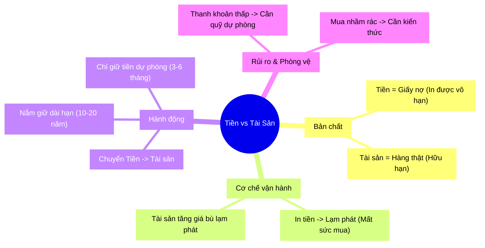

# Tiền vs Tài Sản: Cuộc Đua giữ Giá Trị

### Hook: Bát phở và ảo ảnh "Tăng Lương" 🍜

Hãy tưởng tượng năm 2010, bạn đi làm với mức lương 5 triệu/tháng, và một bát phở giá 20.000đ. Bạn có thể mua được 250 bát phở mỗi tháng.
Đến năm 2024, lương bạn tăng lên 15 triệu/tháng (gấp 3 lần!), bạn rất vui. Nhưng ra ngõ, bát phở giờ đã là 60.000đ.
Thực tế: Bạn vẫn chỉ mua được đúng 250 bát phở.

Sức lao động của bạn được định giá cao hơn, con số trong tài khoản lớn hơn, nhưng **chất lượng cuộc sống thực tế (sức mua)** không đổi. Đây chính là "ảo thuật" của **Tiền**. Vậy Tiền khác gì **Tài sản**? Tại sao người giàu lại sợ giữ tiền mặt?

---

### Analogy: Giấy nợ và Hàng hóa 📝 vs 🏠

Để hiểu đơn giản nhất:
*   **Tiền (Money):** Giống như tờ **Giấy nợ (IOU)**. Chính phủ/Ngân hàng đưa cho bạn tờ giấy này để ghi nhận công sức bạn đã bỏ ra.
*   **Tài sản (Assets):** Là **Hàng hóa thực** (Miếng đất, Ngôi nhà, Cổ phần công ty).

> **Ví dụ:** Bạn trồng lúa (sức lao động) và bán lấy Tiền (Giấy nợ). Bạn cầm Giấy nợ này ra chợ để đổi lấy Thịt, Cá (Hàng hóa/Tài sản).
> Vấn đề nằm ở chỗ: Người phát hành "Giấy nợ" (Chính phủ/Ngân hàng TW) có thể in thêm bao nhiêu tờ tùy thích, khiến giá trị mỗi tờ giấy bị loãng đi. Còn đất đai, nhà cửa thì không thể tự sinh ra thêm được.

---

### Deep Dive: Bản chất cuộc chơi

#### 1. Tiền (Money) - Công cụ điều phối
Dưới góc nhìn của người dân, Tiền là mồ hôi nước mắt, là mục tiêu phấn đấu. Nhưng dưới góc nhìn của vĩ mô (Chính phủ/Ngân hàng):
*   **Tiền là công cụ:** Dùng để vận hành nền kinh tế, trả lương, thu thuế.
*   **Không có giá trị nội tại cố định:** Tiền pháp định (Fiat Currency) bản chất không được neo vào vàng hay bạc từ lâu rồi. Nó dựa trên NIỀM TIN.
*   **Cơ chế mất giá:** Khi kinh tế khó khăn, cách dễ nhất để "cứu" là... in thêm tiền (Bơm thanh khoản). Khi lượng tiền nhiều lên mà hàng hóa vẫn thế -> Giá hàng hóa tăng -> Tiền mất giá.

⚠️ **Nguy hiểm ngầm:** Giữ tiền mặt lâu dài chính là bạn đang để sức lao động tích lũy của mình bị "bốc hơi" dần dần mà không hề hay biết.

#### 2. Tài sản (Assets) - Nơi trú ẩn giá trị
Tài sản là những thứ có giá trị sử dụng thực hoặc khả năng sinh lời: Bất động sản, Cổ phiếu doanh nghiệp tốt, Vàng...
*   **Hữu hạn:** Đất không thể "in" thêm (trừ lấn biển nhưng rất ít).
*   **Chống lạm phát:** Khi tiền mất giá, giá tài sản (tính bằng tiền) sẽ tăng lên tương ứng (hoặc hơn) để bù đắp.

🎯 **Mục tiêu đúng đắn:** Chúng ta đi làm kiếm **Tiền** (công cụ trung gian), nhưng mục đích cuối cùng phải là chuyển đổi nó sang **Tài sản** (giá trị thực).

---

### Practice: Chiến lược hành động 🛠️

Để chiến thắng trong trò chơi này, bạn cần thay đổi tư duy từ "Giữ Tiền" sang "Nắm Tài Sản":

1.  **Tích lũy Tài sản, không tích lũy Tiền:** Chỉ giữ một lượng tiền mặt vừa đủ cho sinh hoạt và dự phòng khẩn cấp (3-6 tháng).
2.  **Đầu tư dài hạn (10-20 năm):** Tài sản thực cần thời gian để tăng trưởng giá trị và vượt qua các biến động ngắn hạn. Đừng mua đất hôm nay để mong tuần sau bán lời.
3.  **Không bán Tài sản lấy Tiền:** (Trừ khi cực chẳng đã hoặc để chuyển sang tài sản tốt hơn). Người giàu thường vay tiền (dùng đòn bẩy) để mua tài sản, chứ ít khi bán tài sản để lấy tiền tiêu xài.

---

### Risk & Pitfalls: Cảnh báo rủi ro ⚠️

Tuy nhiên, chuyển sang Tài sản cũng có rủi ro nếu thiếu hiểu biết:
*   **Thanh khoản kém:** Cần tiền gấp thì bán đất, bán nhà rất khó và lâu. -> **Phòng vệ:** Luôn có quỹ dự phòng tiền mặt.
*   **Biến động giá (Volatility):** Giá tài sản có thể giảm trong ngắn hạn. -> **Phòng vệ:** Tư duy dài hạn (Long-term) loại bỏ nhiễu động ngắn hạn.
*   **Chọn sai tài sản:** Mua "tài sản rác" (đất dự án ma, cổ phiếu lởm) thì còn mất giá nhanh hơn tiền. -> **Phòng vệ:** Phải có kiến thức (Knowledge) trước khi xuống tiền.

---

### Tổng kết bài học (MECE Mindmap) 🧩

 

___

Made by Anh Tu - Share to be share

