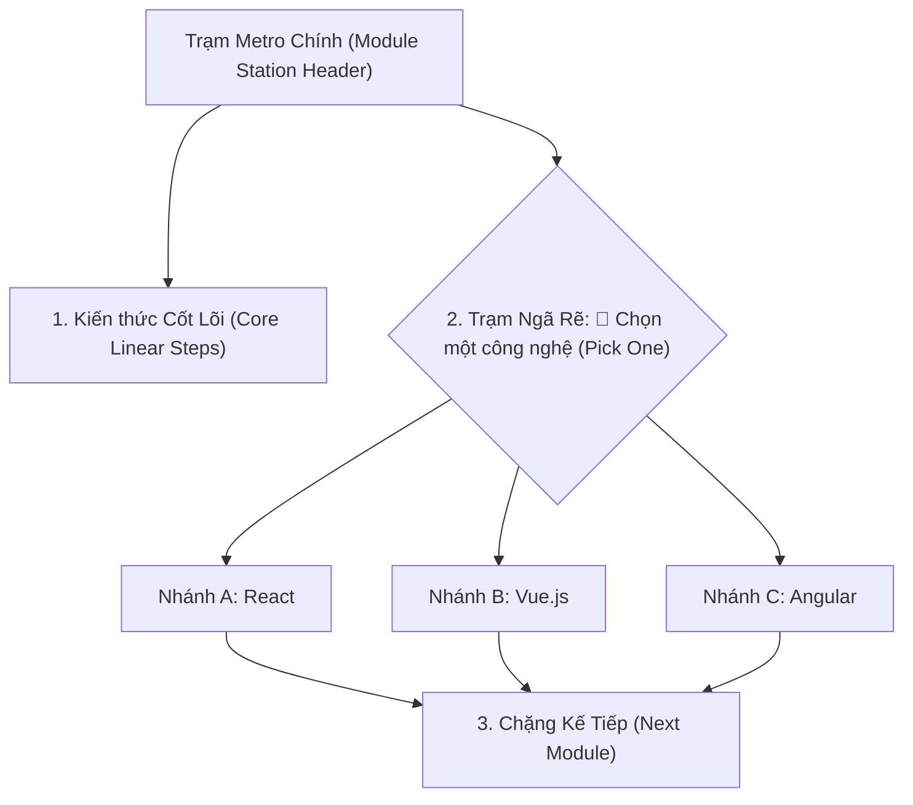

# Kế Hoạch Nâng Cấp Trực Quan Hóa Phân Nhánh (Roadmap Branching UI Plan)

> **Mục tiêu:** Nâng cấp trang `/roadmap` từ dạng danh sách thẳng hàng thành **Metro-Line Phân Nhánh Trực Quan (Branching Metro Timeline)**. Giúp sinh viên và người học dễ dàng nhận diện đâu là kiến thức cốt lõi tuần tự, đâu là các **ngã rẽ công nghệ (Alternatives / Pick One)** (ví dụ: chọn React vs Vue vs Svelte; hoặc chọn Prisma vs TypeORM).

---

## 1. Phân Tích Dữ Liệu & Giải Phẫu Nhánh Rẽ (Data Anatomy)

Trong kho dữ liệu `sources/roadmap-data/` (`frontend.json`, `nestjs.json`, `javascript.json`, `system-design.json`...):
* Dữ liệu đã có sẵn trường `parentTopic: { id, title }` và mã phân cấp `order: "9.0", "9.1", "9.2"...`.
* Ví dụ thực tế:
  * **Frontend Roadmap:** Chặng "Pick a Framework" (9.0) phân nhánh ra 5 lựa chọn: *React (9.3), Vue.js (9.4), Angular (9.5), Svelte (9.1), Solid.js (9.2)*.
  * **NestJS Roadmap:** Chặng "Database Integration" phân nhánh ra 4 lựa chọn: *TypeORM, Mongoose, Prisma ORM, MikroORM*.
  * **CSS Architecture:** Phân nhánh ra *Tailwind CSS, CSS Modules, Styled Components*.

---

## 2. Thiết Kế Trải Nghiệm Người Dùng (UX/UI Design)

### Chi tiết các thành phần giao diện mới:
1. **Trạm Phân Nhánh (Branch Fork Section):**
   * **Header ngã rẽ:**
     * Biểu tượng ngã rẽ `🔀` kèm tiêu đề nhánh (ví dụ: *Ngã rẽ: Chọn một Framework* hoặc *Ngã rẽ: Lựa chọn Database & ORM*).
     * Huy hiệu phân loại: `Chọn 1 trong các hướng (Pick One)` hoặc `Nhánh kỹ năng song song (Parallel)`.
   * **Đường nối phân nhánh đồ họa (Branching Connector Lines):**
     * Trục dọc tách ra thanh ngang và rẽ nhánh xuống từng thẻ bài công nghệ.
   * **Lưới thẻ bài Nhánh rẽ (Branch Cards Grid):**
     * Thay vì xếp thành 1 cột dọc buồn tẻ, các lựa chọn được dàn thành **Lưới thẻ bài đa cột (Multi-column Cards Grid, 2-3 cột trên Desktop, cuộn ngang hoặc khối thẻ trên Mobile)**.
     * Mỗi thẻ bài nhánh gồm:
       * Huy hiệu "Nhánh lựa chọn".
       * Tên công nghệ + Nút check hoàn thành nhanh.
       * Icon loại tài nguyên và nút mở Drawer đọc chi tiết.
       * Trạng thái đã học: Viền xanh ngọc bích, nền sáng sạch sẽ.
2. **Khối Tuần Tự (Linear Steps Section):**
   * Với các kiến thức nền tảng bắt buộc (không có `parentTopic` hoặc là các bước tuần tự bắt buộc): Vẫn hiển thị theo từng dòng checklist gọn gàng, rõ ràng.

---

## 3. Các File Cần Thay Đổi & Tạo Mới

### 1. [`RoadmapTimeline.jsx`](file:///Users/anhtus/Documents/Development/Documentary/vuanhtu1993.github.io/src/components/RoadmapDetail/RoadmapTimeline.jsx)
* **Thuật toán phân cụm nhóm (Branch Clustering Algorithm):**
  * Duyệt qua `subtopics` của mỗi trạm.
  * Gom nhóm các topic có cùng `parentTopic` thành một cụm `BranchCluster`.
  * Tách biệt giữa `linearTopics` (các bước tuần tự) và `branchClusters` (các cụm ngã rẽ).
* **Render giao diện:**
  * Render các dòng tuần tự bằng `linearStepRow`.
  * Render cụm rẽ nhánh bằng `branchContainer`, `branchForkHeader`, và `branchCardsGrid`.

### 2. [`RoadmapTimeline.module.css`](file:///Users/anhtus/Documents/Development/Documentary/vuanhtu1993.github.io/src/components/RoadmapDetail/RoadmapTimeline.module.css)
* Bổ sung styles:
  * `.branchSection`: Khung bao quanh ngã rẽ với viền bo tròn và nền phân cách nhẹ.
  * `.branchForkHeader`: Thanh tiêu đề ngã rẽ với icon `🔀` và badge hướng dẫn người học.
  * `.branchConnector`: Đồ họa đường rẽ nhánh phân tách từ tâm sang các cột.
  * `.branchGrid`: CSS Grid `repeat(auto-fit, minmax(220px, 1fr))` hiển thị các thẻ rẽ nhánh.
  * `.branchCard`: Thẻ bài công nghệ với hiệu ứng hover, checkbox, và trạng thái hoàn thành nổi bật.

---

## 4. Kế Hoạch Thực Hiện Chi Tiết (Bite-Sized Tasks)

### Task 1: Nâng cấp thuật toán phân loại nhánh trong `RoadmapTimeline.jsx`
- Viết logic nhóm các topic theo `parentTopic` hoặc tiền tố order (ví dụ `9.0` là cha, `9.1`, `9.2` là con).
- Xác định trạng thái của cụm: Là "Pick One" (nếu có từ khóa hoặc >= 2 lựa chọn) hay "Parallel".

### Task 2: Xây dựng UI Component Thẻ Rẽ Nhánh & Đồ Họa Phân Nhánh
- Tạo cấu trúc JSX cho `BranchSection`:
  - Tiêu đề ngã rẽ + Badge giải thích sư phạm.
  - Sơ đồ rẽ nhánh (Branching SVG/CSS lines).
  - Lưới các thẻ bài con (Branch cards).

### Task 3: Cập nhật CSS Module `RoadmapTimeline.module.css`
- Thêm các lớp CSS cho Grid phân nhánh, đồ họa đường nối, hiệu ứng hover và Dark/Light mode.

### Task 4: Kiểm thử đóng gói & Nghiệm thu
- Kiểm tra hiển thị phân nhánh trên lộ trình **Frontend** (ngã rẽ *Pick a Framework*, *CSS Frameworks*...).
- Kiểm tra trên lộ trình **NestJS** (ngã rẽ *Database Integration*...).
- Kiểm tra tính năng check hoàn thành và mở Drawer trên các thẻ bài nhánh.
- Chạy `npm run build` để đảm bảo 100% build thành công.

---

*Made by Anh Tu - Share to be share*
