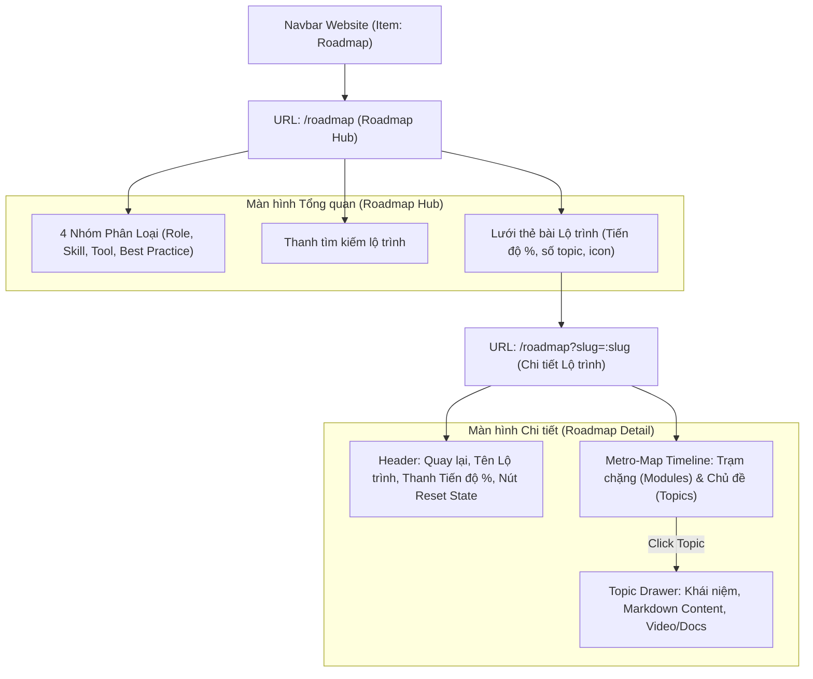

# Thiết Kế Trang Trực Quan Hóa Lộ Trình Kỹ Thuật (Developer Roadmaps Page)

> **Ngày lập:** 15/09/2026  
> **Tác giả:** Vũ Anh Tú & Antigravity  
> **Tài liệu nguồn:** `sources/roadmap-data/`  
> **Mục tiêu:** Xây dựng trang `/roadmap` trên website Docusaurus để trực quan hóa các lộ trình phát triển kỹ thuật (Frontend, React, NestJS, Docker, System Design...), hỗ trợ sinh viên và người mới bắt đầu (Junior/Intern) học tập tuần tự và theo dõi tiến độ.

---

## 1. Bối Cảnh & Động Lực (Root Cause & Motivation)

### 1.1 Vấn đề trong việc học công nghệ hiện nay
Sinh viên và người mới tiếp cận một công nghệ hoặc vị trí lập trình thường gặp tình trạng "ngợp" trước lượng kiến thức khổng lồ. Họ thường không biết:
* Nên bắt đầu học từ đâu (Prerequisites).
* Thứ tự các chặng học như thế nào để kiến thức không bị đứt gãy.
* Khái niệm cốt lõi nào cần nắm vững trước khi chuyển sang công cụ/thư viện nâng cao.

### 1.2 Giải pháp
Kho dữ liệu `sources/roadmap-data` (thu thập từ nguồn chuẩn của cộng đồng `roadmap.sh`) chứa 10 lộ trình hoàn chỉnh với 151 modules và hơn 1.000 chủ đề học tập. Trang **Developer Roadmaps** sẽ chuyển hóa kho dữ liệu tĩnh này thành một không gian học tập trực quan sinh động theo phương pháp **Metro-Map Phased Timeline (Lộ trình phân chặng kiểu tuyến Metro)**:
* Cung cấp cái nhìn tổng quan toàn cảnh về ngành và kỹ năng (Catalog Hub).
* Cấu trúc hóa việc học theo từng trạm dừng (Phased Milestones) rõ ràng.
* Đi kèm học liệu chi tiết, tài nguyên chính thống (Official Docs, Articles, Videos) và cơ chế theo dõi tiến độ tự học bền vững.

---

## 2. Kiến Trúc Thông Tin & Định Tuyến (Information Architecture & Routing)



### 2.1 Cấu trúc URLs:
* **`/roadmap`**: Trang Hub hiển thị danh mục các lộ trình, số liệu thống kê tổng thể và % tiến độ cá nhân của người học.
* **`/roadmap?slug={slug}`** (Ví dụ: `/roadmap?slug=frontend`, `/roadmap?slug=react`, `/roadmap?slug=nestjs`): Màn hình chi tiết của lộ trình được chỉ định. Sử dụng `@docusaurus/router` để điều hướng nội bộ (Client-side Routing) mượt mà, không giật lag và giữ trạng thái URL chia sẻ được (shareable & bookmarkable).

### 2.2 Tích hợp Menu Website:
* File `docusaurus.config.js` được bổ sung:
  ```javascript
  { to: '/roadmap', label: 'Roadmap', position: 'left' }
  ```
  nằm ngay sau mục `Ontology`.

---

## 3. Cấu Trúc Thành Phần Giao Diện (Component Specifications)

### 3.1 `RoadmapPage` (`src/pages/roadmap/index.jsx`)
* Đóng vai trò là Trang Entrypoint được bọc trong `<Layout>` và `<BrowserOnly>`.
* Đọc tham số truy vấn `slug` từ `useLocation().search`.
* Điều phối hiển thị: nếu `slug` hợp lệ thì render `RoadmapDetail`, ngược lại render `RoadmapHub`.

### 3.2 `RoadmapHub` (`src/components/RoadmapHub/`)
* **Thống kê:** Tổng số lộ trình, modules, topics từ `sources/roadmap-data/index.json`.
* **Bộ lọc Danh mục:** 4 tab chuyển đổi linh hoạt:
  1. *Tất cả (All)*
  2. *Vị trí Công việc (Role-based)*
  3. *Kỹ năng & Ngôn ngữ (Skill-based)*
  4. *Công cụ & Nền tảng (Tool & Platform)*
  5. *Quy chuẩn & Kiến trúc (Best Practices)*
* **Thanh tìm kiếm:** Lọc tức thì lộ trình theo tiêu đề hoặc slug.
* **Roadmap Cards:** Mỗi thẻ hiển thị:
  * Icon đặc trưng theo công nghệ.
  * Tiêu đề, danh mục, số lượng module & topic.
  * **Thanh tiến độ học tập thực tế (Progress Bar):** Được đọc từ `localStorage`, hiển thị % hoàn thành và số topic đã học.

### 3.3 `RoadmapDetail` (`src/components/RoadmapDetail/`)
* **Thanh điều khiển đầu trang (Sticky Header Bar):**
  * Nút `← Quay lại danh sách Lộ trình`.
  * Tên lộ trình, Badge nhóm danh mục.
  * **Chỉ số Tiến độ:** Ví dụ `15/83 topics (18%)` kèm thanh progress bar sinh động.
  * **Nút "Reset tiến độ":** Mở modal xác nhận (*"Bạn có chắc muốn đặt lại toàn bộ tiến độ của lộ trình này không?"*). Khi xác nhận, xóa trạng thái đã lưu trong `localStorage` và đưa tiến độ về 0%.
  * Nút **"Mở rộng tất cả / Thu gọn tất cả"** các chặng (Collapse/Expand All).
  * Ô tìm kiếm nhanh các chủ đề bên trong lộ trình để tự động highlight và cuộn tới.
* **Metro-Map Phased Timeline (`RoadmapTimeline`):**
  * Biểu diễn dạng trục dọc như tuyến tàu điện ngầm (Metro Line).
  * Mỗi chặng tương ứng với một Module chính (hoặc Cụm phân loại):
    * Trạm dừng (Station node) đánh số thứ tự chặng (1, 2, 3...).
    * Header chặng: Tên chặng, mô tả mục tiêu chặng, số topic con.
    * Danh sách các chủ đề con (Subtopics):
      * Nút checkbox tròn đánh dấu nhanh đã học (toggle completed).
      * Tên chủ đề.
      * Trạng thái đã học: chữ gạch ngang nhẹ hoặc đổi màu xanh kèm icon checkmark ✓.
      * Click vào dòng để mở chi tiết trong `TopicDrawer`.

### 3.4 `TopicDrawer` (`src/components/RoadmapDetail/TopicDrawer.jsx`)
* Slide-over panel từ bên phải màn hình với nền làm mờ nhẹ (Backdrop). Đóng bằng nút `✕`, phím `ESC` hoặc click ra ngoài.
* **Nội dung:**
  * Header: Tên chủ đề, nút Toggle "Đánh dấu đã hoàn thành".
  * Thẻ mô tả (Overview Description).
  * Bài học chi tiết (Markdown Body): Hỗ trợ render định dạng chuẩn với code block, lists.
  * **Kho tài nguyên học tập (Learning Resources):**
    * 📘 *Official Documentation*
    * 📝 *Technical Article*
    * 🎥 *Video Tutorial*
    * 🐙 *Source Code / GitHub*
  * **Điều hướng tuần tự (Sequential Navigation):** Nút `← Chủ đề trước` và `Chủ đề kế tiếp →` cho phép người học đọc xuyên suốt tài liệu mà không cần đóng mở drawer liên tục.
  * Footer: *"Made by Anh Tu - Share to be share"*.

---

## 4. Quản Lý Trạng Thái & Dữ Liệu (State Management & Data Flow)

### 4.1 Quản lý Dữ liệu Lộ trình (Data Loading)
* `index.json` được import trực tiếp để nạp danh sách lộ trình.
* Chi tiết từng roadmap được import theo nhu cầu (Lazy Dynamic Import) dựa trên `slug` thông qua hàm tiện ích `loadRoadmapData(slug)`:
  * Tránh nạp toàn bộ các file JSON nặng vào bộ nhớ cùng lúc.
  * Đảm bảo thời gian tải trang ban đầu cực nhanh.

### 4.2 Quản lý Tiến độ Học tập (`useRoadmapProgress` Custom Hook)
```typescript
interface RoadmapProgressHook {
  completedTopics: Set<string>;
  isCompleted: (topicId: string) => boolean;
  toggleCompleted: (topicId: string) => void;
  resetProgress: () => void;
  completedCount: number;
  totalTopics: number;
  percentage: number;
}
```
* **Khóa lưu trữ:** `localStorage.getItem('roadmap_progress_' + slug)` lưu mảng JSON các `topicId` hoặc `topicName`.
* **An toàn môi trường build:** Kiểm tra `typeof window !== 'undefined'` để chạy mượt mà trong cả quá trình Node.js build tĩnh của Docusaurus lẫn môi trường trình duyệt client.

---

## 5. Thiết Kế Thẩm Mỹ & Khả Năng Thích Ứng (Styling & Dark/Light Theming)

* **Thiết kế màu sắc & Tokens:** Tận dụng 100% biến chuẩn của Docusaurus Infima:
  * Nền: `var(--ifm-background-color)`, `var(--ifm-background-surface)`
  * Màu nhấn: `var(--ifm-color-primary)`, `var(--ifm-color-primary-dark)`
  * Đường viền: `var(--ifm-color-emphasis-200)`, `var(--ifm-color-emphasis-300)`
  * Màu văn bản: `var(--ifm-font-color-base)`, `var(--ifm-color-emphasis-600)`
  * Màu thành công (đã hoàn thành): `#10b981` (Emerald / Mint Green)
* **Hiệu ứng Micro-animations:**
  * Hiệu ứng hover nổi nhẹ (Lift effect `translateY(-2px)`) trên các thẻ bài lộ trình.
  * Hiệu ứng trượt mượt mà (Slide transition `cubic-bezier(0.16, 1, 0.3, 1)`) của Topic Drawer.
  * Hiệu ứng chuyển động của thanh tiến độ khi người dùng tick chọn topic.
* **Tương thích Mobile:**
  * Trên màn hình `< 768px`, Drawer mở rộng 100% chiều ngang như một màn hình đọc độc lập, các nút bấm to bản dễ chạm.

---

## 6. Kế Hoạch Kiểm Thử & Nghiệm Thu (Verification Plan)

| Hạng mục kiểm tra | Phương thức thực hiện | Tiêu chí thành công |
| :--- | :--- | :--- |
| **Docusaurus Static Build** | Chạy `npm run build` | Không có lỗi SSR, không có broken links, build ra thư mục `build/` thành công. |
| **Điều hướng & Routing** | Click navbar `Roadmap` ➔ Click thẻ ➔ Click `← Quay lại` | URL chuyển đổi chính xác giữa `/roadmap` và `/roadmap?slug=...`, không reload trang. |
| **Lưu trữ Tiến độ** | Tick hoàn thành một số topics, F5 reload trang | Tiến độ % và các dấu tick vẫn được bảo toàn nguyên vẹn. |
| **Tính năng Reset State** | Bấm nút "Reset tiến độ", xác nhận popup | Tiến độ quay về 0%, các dấu tick được bỏ chọn, `localStorage` của slug đó được xóa sạch. |
| **Giao diện Dark/Light** | Chuyển đổi nút mặt trời/mặt trăng trên navbar | Toàn bộ giao diện Hub, Timeline, Drawer tự động thích ứng với màu tương ứng. |

---

*Made by Anh Tu - Share to be share*
