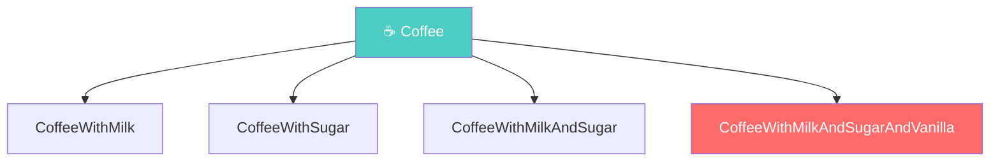
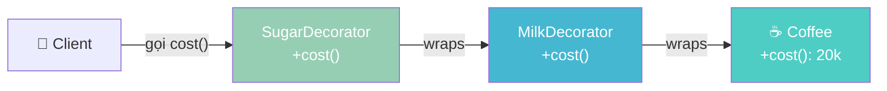
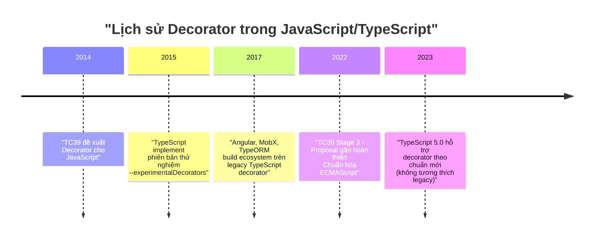
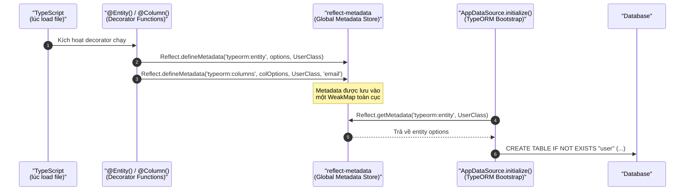
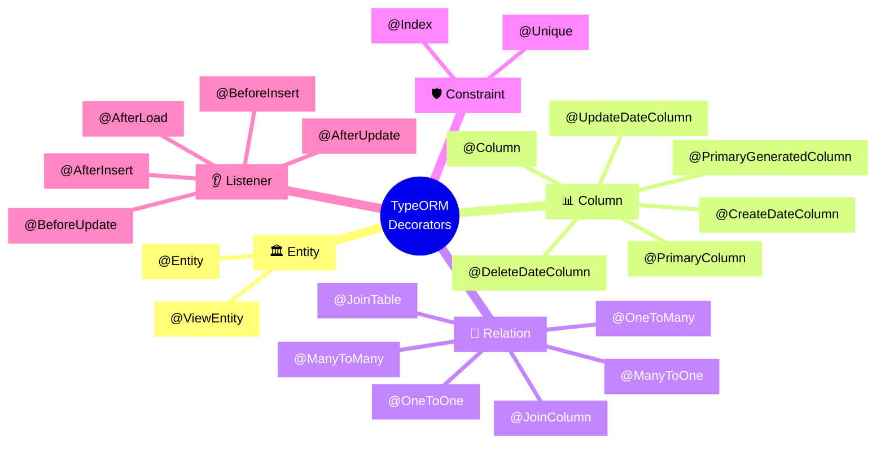

# Lesson 0: Bản chất của Decorator

## 📋 Agenda

**Thời gian đọc ước tính:** ~20 phút

### Sau bài này, bạn sẽ:

- ✅ **Giải thích** được Decorator Pattern (GoF) là gì và tại sao nó ra đời
- ✅ **Phân biệt** được Decorator Pattern (thiết kế) vs. decorator syntax (`@`) trong TypeScript
- ✅ **Hiểu** cơ chế `reflect-metadata` — "bộ nhớ bí mật" mà TypeORM dựa vào để hoạt động
- ✅ **Tự tay** viết được một custom decorator đơn giản để thấy rõ bản chất
- ✅ **Đọc hiểu** code khi gặp `@Entity()`, `@Column()` trong TypeORM

### Yêu cầu đầu vào (Prerequisites):

- 🔹 Biết cơ bản TypeScript (class, interface, generic)
- 🔹 Đã cài TypeORM và chạy thử ít nhất một lần (xem Lesson 1)

---

## ❓ Vấn đề & Giải pháp

### Vấn đề (Problem Statement)

Khi làm việc với TypeORM, bạn sẽ gặp ngay đoạn code như sau:

```typescript
@Entity()
export class User {
  @PrimaryGeneratedColumn()
  id: number;

  @Column()
  email: string;
}
```

Hai câu hỏi tự nhiên xuất hiện trong đầu mọi Junior Dev:

- **"Cái `@Entity()` này thực ra là gì? Nó không phải comment, không phải function call thông thường..."**
- **"TypeORM 'biết' class `User` tương ứng với table `user` trong database bằng cách nào?"**

Nếu không hiểu câu trả lời, bạn sẽ dùng TypeORM như "phép màu" — gặp lỗi là bí, không sửa được.

### Giải pháp (Solution)

`@Entity()` là một **decorator** — một hàm TypeScript đặc biệt chạy **lúc class được định nghĩa** (không phải lúc tạo object), với nhiệm vụ duy nhất: **ghi thông tin cấu hình vào một kho lưu trữ metadata toàn cục** (global metadata store).

Khi bạn khởi tạo `AppDataSource.initialize()`, TypeORM đọc lại kho đó và biết được mọi thứ: table nào, column nào, kiểu dữ liệu gì, quan hệ ra sao.

Bài này sẽ "phẫu thuật" cơ chế đó từng bước một.

---

## 📖 Phần 1: Decorator Pattern — Nền tảng tư duy

### Định nghĩa kỹ thuật

> **Decorator Pattern** (GoF — Gang of Four, 1994) là một **Structural Design Pattern** cho phép *gắn thêm hành vi mới vào một object một cách động* mà không thay đổi class gốc của nó, bằng cách bọc object đó trong một wrapper có cùng interface.

**"Giải phẫu" định nghĩa:**

| Từ khóa | Ý nghĩa |
|---|---|
| **Structural** | Liên quan đến cách *tổ chức, kết hợp* object/class — không phải cách tạo (Creational) hay cách tương tác (Behavioral) |
| **gắn thêm hành vi** | Thêm tính năng mới mà không sửa code cũ (Open/Closed Principle) |
| **một cách động** | Xảy ra lúc runtime, không phải compile-time |
| **wrapper có cùng interface** | `Decorator` implement cùng interface với object gốc → client không biết mình đang dùng wrapper hay object thật |

### Tại sao GoF tạo ra pattern này?

**Vấn đề của kế thừa (Inheritance):**

Giả sử bạn có `Coffee`. Muốn thêm tính năng: `CoffeeWithMilk`, `CoffeeWithSugar`, `CoffeeWithMilkAndSugar`... Kế thừa sẽ tạo ra "class explosion" (bùng nổ số lượng class).



**Giải pháp Decorator Pattern — Composition:**

Bọc object trong các wrapper linh hoạt, chồng lên nhau tùy ý:



Kết quả: `SugarDecorator.cost()` = gọi `MilkDecorator.cost()` + thêm giá đường. Linh hoạt, không cần tạo thêm class.

### Code minh họa Decorator Pattern thuần GoF

```typescript
// ✅ filename: decorator-pattern-gof.ts

// Bước 1: Định nghĩa interface chung (Decorator và Component cùng implement)
interface Coffee {
  cost(): number;
  description(): string;
}

// Bước 2: Component gốc
class SimpleCoffee implements Coffee {
  cost() { return 20_000; }
  description() { return "Cà phê đen"; }
}

// Bước 3: Base Decorator — bọc object và delegate về component
abstract class CoffeeDecorator implements Coffee {
  // Composition: GIỮ THAM CHIẾU đến object cần bọc
  constructor(protected wrapped: Coffee) {}

  // Delegate mặc định: gọi về component gốc (có thể override)
  cost() { return this.wrapped.cost(); }
  description() { return this.wrapped.description(); }
}

// Bước 4: Concrete Decorators — chỉ override phần mình quan tâm
class MilkDecorator extends CoffeeDecorator {
  // Override để THÊM hành vi, rồi gọi về wrapped
  cost() { return this.wrapped.cost() + 5_000; }
  description() { return this.wrapped.description() + " + Sữa"; }
}

class SugarDecorator extends CoffeeDecorator {
  cost() { return this.wrapped.cost() + 2_000; }
  description() { return this.wrapped.description() + " + Đường"; }
}

// Client code: Chồng decorator tùy ý
const myOrder = new SugarDecorator(new MilkDecorator(new SimpleCoffee()));
console.log(myOrder.description()); // "Cà phê đen + Sữa + Đường"
console.log(myOrder.cost());        // 27_000
```

:::note Điểm cốt lõi của GoF Decorator
**Composition over Inheritance** — không kế thừa để mở rộng, mà **bọc (wrap)** để thêm hành vi. Decorator và Component cùng implement một interface → client không phân biệt được.
:::

---

## 📖 Phần 2: Decorator Syntax `@` trong TypeScript

### Đây KHÔNG phải là GoF Decorator Pattern

:::warning Hiểu lầm phổ biến
Decorator syntax `@Something` trong TypeScript **có tên giống nhau** nhưng **hoạt động khác hoàn toàn** so với GoF Decorator Pattern. Đây là một quyết định đặt tên gây nhầm lẫn trong lịch sử JavaScript.

- **GoF Pattern:** Bọc object tại runtime để thêm hành vi
- **TypeScript `@` syntax:** Một hàm đặc biệt chạy lúc class được **load** (định nghĩa), dùng để **ghi metadata** hoặc sửa class
:::

### Lịch sử ra đời



**TypeORM hiện tại dùng phiên bản legacy** (`experimentalDecorators: true`). Đây là lý do bạn thấy config đó trong `tsconfig.json`.

### Decorator là hàm — không hơn không kém

Khi bạn viết `@Entity()`, thực chất TypeScript biên dịch nó thành:

```typescript
// ✅ Bạn viết:
@Entity()
class User {}

// 🔧 TypeScript dịch ra tương đương:
let User = class User {};
User = Entity()(User) || User;
//     ^^^^^^^^ Entity() trả về một hàm decorator
//               hàm đó nhận class User làm argument
```

Có **4 loại decorator** tương ứng với 4 vị trí gắn:

| Loại | Cú pháp | Đối số nhận vào |
|------|---------|-----------------|
| **Class Decorator** | `@Entity()` trên class | `constructor` của class |
| **Property Decorator** | `@Column()` trên property | `prototype`, `propertyKey` |
| **Method Decorator** | `@BeforeInsert()` trên method | `prototype`, `methodName`, `descriptor` |
| **Parameter Decorator** | `@Param()` trên tham số | `prototype`, `methodName`, `paramIndex` |

### Tự viết decorator để hiểu bản chất

```typescript
// ✅ filename: custom-decorator.ts

// ① Class Decorator — nhận vào constructor của class
function LogClass(constructor: Function) {
  // Hàm này chạy ngay khi file được LOAD (không phải khi new User())
  console.log(`[ClassDecorator] Class "${constructor.name}" đã được định nghĩa`);
}

// ② Property Decorator — nhận prototype và tên property
function LogProperty(target: any, propertyKey: string) {
  console.log(`[PropertyDecorator] Property "${propertyKey}" trên class "${target.constructor.name}"`);
}

@LogClass
class User {
  @LogProperty
  name: string = "";
}

// OUTPUT khi file được require/import:
// [PropertyDecorator] Property "name" trên class "User"
// [ClassDecorator] Class "User" đã được định nghĩa
```

:::note Thứ tự thực thi
Property Decorator → Method Decorator → Class Decorator (từ trong ra ngoài, từ dưới lên trên).
:::

---

## 📖 Phần 3: `reflect-metadata` — Bộ nhớ bí mật của TypeORM

### Vấn đề: Decorator biết gì sau khi chạy?

Decorator chạy xong thì biến mất. Câu hỏi đặt ra: **Làm sao TypeORM lưu lại "User là một Entity" để dùng về sau?**

Câu trả lời: **`reflect-metadata`** — một thư viện cung cấp cơ chế lưu trữ key-value gắn vào class/property.



### API cốt lõi của `reflect-metadata`

```typescript
// ✅ filename: reflect-metadata-demo.ts
import "reflect-metadata"; // PHẢI import ở entry point

class User {
  name: string = "";
}

const MY_KEY = "app:description";

// GHI metadata vào class User
Reflect.defineMetadata(MY_KEY, "Đây là bảng người dùng", User);

// GHI metadata vào property 'name' của User
Reflect.defineMetadata(MY_KEY, "Tên đăng nhập", User.prototype, "name");

// ĐỌC lại metadata
console.log(Reflect.getMetadata(MY_KEY, User));               
// "Đây là bảng người dùng"

console.log(Reflect.getMetadata(MY_KEY, User.prototype, "name")); 
// "Tên đăng nhập"
```

### TypeORM dùng `reflect-metadata` như thế nào?

Dưới đây là mã giả mô phỏng cách TypeORM implement `@Entity()` và `@Column()`:

```typescript
// ✅ filename: typeorm-decorator-simulation.ts
// (Mã giả — đơn giản hóa so với source thực tế của TypeORM)
import "reflect-metadata";

const ENTITY_METADATA_KEY = "typeorm:entity";
const COLUMN_METADATA_KEY = "typeorm:columns";

// --- Implement @Entity() ---
function Entity(tableName?: string) {
  // Entity() là factory function, trả về class decorator
  return function (constructor: Function) {
    // Ghi vào metadata store: "class này là entity, tên table là ..."
    Reflect.defineMetadata(
      ENTITY_METADATA_KEY,
      { name: tableName || constructor.name.toLowerCase() },
      constructor
    );
    console.log(`✅ [Entity] Đã đăng ký class "${constructor.name}" → table "${tableName || constructor.name.toLowerCase()}"`);
  };
}

// --- Implement @Column() ---
function Column(options: { type?: string; nullable?: boolean } = {}) {
  // Column() là factory function, trả về property decorator
  return function (target: any, propertyKey: string) {
    // Đọc danh sách column hiện tại (nếu có)
    const existingColumns: any[] =
      Reflect.getMetadata(COLUMN_METADATA_KEY, target.constructor) || [];

    // Đọc type từ TypeScript (nhờ emitDecoratorMetadata: true)
    const designType = Reflect.getMetadata("design:type", target, propertyKey);

    // Thêm column mới vào danh sách
    existingColumns.push({
      propertyKey,
      type: options.type || designType?.name?.toLowerCase() || "varchar",
      nullable: options.nullable ?? false,
    });

    // Ghi lại vào metadata store
    Reflect.defineMetadata(COLUMN_METADATA_KEY, existingColumns, target.constructor);
    console.log(`✅ [Column] Đăng ký property "${propertyKey}" → cột database`);
  };
}

// --- Dùng decorator ---
@Entity("users")
class User {
  @Column()
  email: string = "";

  @Column({ nullable: true })
  bio: string = "";
}

// --- Mô phỏng TypeORM đọc metadata khi initialize() ---
function simulateInitialize(EntityClass: Function) {
  const entityMeta = Reflect.getMetadata(ENTITY_METADATA_KEY, EntityClass);
  const columnMeta = Reflect.getMetadata(COLUMN_METADATA_KEY, EntityClass);

  console.log("\n📦 TypeORM đọc metadata:");
  console.log("  Entity config:", entityMeta);
  console.log("  Columns:", columnMeta);

  // Từ đây, TypeORM generate SQL:
  const cols = columnMeta
    .map((c: any) => `  ${c.propertyKey} ${c.type} ${c.nullable ? "NULL" : "NOT NULL"}`)
    .join(",\n");
  console.log(`\n🔨 SQL được generate:\nCREATE TABLE IF NOT EXISTS "${entityMeta.name}" (\n${cols}\n);`);
}

simulateInitialize(User);
```

**Output:**

```
✅ [Column] Đăng ký property "email" → cột database
✅ [Column] Đăng ký property "bio" → cột database
✅ [Entity] Đã đăng ký class "User" → table "users"

📦 TypeORM đọc metadata:
  Entity config: { name: 'users' }
  Columns: [ { propertyKey: 'email', type: 'string', nullable: false }, ... ]

🔨 SQL được generate:
CREATE TABLE IF NOT EXISTS "users" (
  email string NOT NULL,
  bio string NULL
);
```

---

## 🔨 Phần 4: Decorator trong TypeORM thực tế

### Bản đồ tổng thể các decorator của TypeORM



### Entity Decorators

```typescript
// ✅ filename: entity/product.entity.ts

import {
  Entity, PrimaryGeneratedColumn, Column,
  CreateDateColumn, UpdateDateColumn, DeleteDateColumn,
  Index, Unique
} from "typeorm";

// @Entity() — Đăng ký class này là 1 Entity, ánh xạ vào table "products"
// Nếu không truyền tên, TypeORM tự dùng tên class dạng snake_case
@Entity("products")
// @Unique() trên class — Ràng buộc UNIQUE trên nhiều cột cùng lúc
@Unique(["sku", "warehouseId"])
export class Product {

  // Auto-increment INTEGER primary key
  // Tham số: 'increment' (mặc định) | 'uuid' | 'rowid'
  @PrimaryGeneratedColumn()
  id: number;

  // UUID primary key — tốt cho distributed systems để tránh trùng ID
  // @PrimaryGeneratedColumn("uuid")
  // id: string;

  @Index()   // Tạo index trên cột này → tăng tốc WHERE/ORDER BY queries
  @Column({ length: 100 })
  name: string;

  @Column({ unique: true, length: 50 })
  sku: string;

  @Column({ type: "decimal", precision: 10, scale: 2, default: 0 })
  price: number;

  // nullable: true → Cột có thể NULL trong database
  @Column({ nullable: true })
  description: string;

  // Tự động gán timestamp khi INSERT
  @CreateDateColumn()
  createdAt: Date;

  // Tự động cập nhật timestamp khi UPDATE
  @UpdateDateColumn()
  updatedAt: Date;

  // Dùng cho Soft Delete — không xóa thật, chỉ đánh dấu deletedAt
  @DeleteDateColumn()
  deletedAt: Date;
}
```

### Relation Decorators

```typescript
// ✅ filename: entity/user.entity.ts (phần Relation)

import { Entity, PrimaryGeneratedColumn, Column, OneToMany, ManyToOne, ManyToMany, JoinColumn, JoinTable } from "typeorm";

@Entity()
export class User {
  @PrimaryGeneratedColumn()
  id: number;

  @Column()
  email: string;

  // 1 User có nhiều Post
  // () => Post: Lazy loading type reference — tránh circular import
  // (post) => post.author: chỉ ra property ngược lại trên Post
  @OneToMany(() => Post, (post) => post.author)
  posts: Post[];

  // Nhiều User thuộc nhiều Role (thông qua junction table)
  @ManyToMany(() => Role, (role) => role.users)
  @JoinTable({
    name: "user_roles",          // Tên junction table tùy chỉnh
    joinColumn: { name: "user_id" },
    inverseJoinColumn: { name: "role_id" }
  })
  roles: Role[];
}

@Entity()
export class Post {
  @PrimaryGeneratedColumn()
  id: number;

  @Column()
  title: string;

  // Nhiều Post thuộc 1 User (lưu foreign key `author_id` tại đây)
  @ManyToOne(() => User, (user) => user.posts)
  @JoinColumn({ name: "author_id" }) // Tên cột FK trong database
  author: User;
}

@Entity()
export class Role {
  @PrimaryGeneratedColumn()
  id: number;

  @Column()
  name: string;

  @ManyToMany(() => User, (user) => user.roles)
  users: User[];
}
```

### Lifecycle Listener Decorators

```typescript
// ✅ filename: entity/user.entity.ts (phần Listener)

import { Entity, Column, PrimaryGeneratedColumn, BeforeInsert, AfterLoad } from "typeorm";
import * as bcrypt from "bcrypt";

@Entity()
export class User {
  @PrimaryGeneratedColumn()
  id: number;

  @Column()
  email: string;

  // select: false → Cột này bị ẩn khỏi SELECT mặc định
  // Phải dùng { select: true } trong find options để lấy
  @Column({ select: false })
  password: string;

  @Column({ nullable: true })
  fullName: string;

  // Chạy TRƯỚC KHI INSERT vào database
  // Dùng để hash password, normalize data, validate...
  @BeforeInsert()
  async hashPassword() {
    if (this.password) {
      // Hash password trước khi lưu để bảo mật
      this.password = await bcrypt.hash(this.password, 10);
    }
    // Normalize email
    this.email = this.email.toLowerCase().trim();
  }

  // Chạy SAU KHI load từ database
  // Dùng để compute virtual fields
  @AfterLoad()
  computeDisplayName() {
    if (!this.fullName) {
      this.fullName = this.email.split("@")[0];
    }
  }
}
```

### Setup bắt buộc để decorator hoạt động

```json
// ✅ filename: tsconfig.json
{
  "compilerOptions": {
    // Bật decorator syntax @
    "experimentalDecorators": true,

    // Bật TypeScript tự động emit type info vào metadata
    // Nhờ đó @Column() biết 'price: number' → map thành 'int' trong DB
    "emitDecoratorMetadata": true,

    "target": "ES2021",
    "module": "commonjs"
  }
}
```

```typescript
// ✅ filename: src/main.ts (ENTRY POINT — dòng ĐẦU TIÊN)

// reflect-metadata PHẢI được import trước tất cả mọi thứ
// Nếu không, decorator sẽ không có nơi để lưu metadata → lỗi
import "reflect-metadata";

import { AppDataSource } from "./data-source";

AppDataSource.initialize()
  .then(() => console.log("Database connected!"))
  .catch((err) => console.error(err));
```

---

## 🚀 Phần 5: Khi nào dùng, khi nào không?

### Trade-off của Decorator trong TypeORM

| ✅ Ưu điểm | ❌ Nhược điểm |
|------------|--------------|
| Code khai báo rõ ràng, dễ đọc | Phụ thuộc vào `experimentalDecorators` (non-standard) |
| Metadata tách biệt khỏi business logic | Khó debug hơn vì magic xảy ra ngầm |
| Auto type mapping (number → int) | TypeScript 5+ decorators không tương thích (breaking change tương lai) |
| Tích hợp tốt với NestJS | Performance overhead nhỏ khi load (chạy tất cả decorator 1 lần) |

### ⚠️ Pitfalls hay gặp

**1. Quên `import "reflect-metadata"` ở entry point**

```typescript
// ❌ Lỗi: Metadata không được khởi tạo
// app.ts (entry point)
import { AppDataSource } from "./data-source"; // import TypeORM trước

// ✅ Đúng: reflect-metadata PHẢI là dòng đầu tiên
import "reflect-metadata";
import { AppDataSource } from "./data-source";
```

**2. Circular dependency với Relation Decorators**

```typescript
// ❌ Sai: Trực tiếp reference class gây circular import
@OneToMany(Post, (post) => post.author)
posts: Post[];

// ✅ Đúng: Dùng arrow function lazy reference
@OneToMany(() => Post, (post) => post.author)
posts: Post[];
```

**3. Không bật `emitDecoratorMetadata` — TypeORM không nhận ra type**

```typescript
// Khi emitDecoratorMetadata: false
@Column()
price: number; // TypeORM không biết đây là number → lỗi hoặc dùng sai type
```

**4. Nhầm `@JoinColumn` — đặt sai phía**

```typescript
// @JoinColumn phải đặt ở phía OWNING SIDE — phía có foreign key trong DB
// ❌ Sai: Đặt cả hai phía
@OneToOne(() => Profile)
@JoinColumn()
profile: Profile; // OK

// Nhưng ở Profile lại cũng JoinColumn → conflict

// ✅ Đúng: Chỉ đặt một phía
// User là owning side (bảng users có cột profile_id)
@OneToOne(() => Profile)
@JoinColumn()
profile: Profile;
```

---

## 💬 Câu hỏi thảo luận

**1. Tại sao TypeORM chọn dùng Decorator Metadata thay vì một file config JSON/YAML riêng?**

> *Gợi ý: So sánh với cách Hibernate (Java) dùng XML annotations vs. Java annotations. Trade-off là gì về Developer Experience vs. Coupling?*

**2. Nếu `emitDecoratorMetadata: false`, decorator có còn hoạt động không?**

> *Gợi ý: Decorator vẫn chạy, nhưng TypeORM sẽ mất thông tin về loại TypeScript. Bạn sẽ phải truyền type thủ công: `@Column({ type: "int" })` thay vì `@Column()`.*

**3. Vì sao TypeORM recommend dùng arrow function `() => Entity` trong Relation Decorators thay vì viết thẳng tên class?**

> *Gợi ý: Từ khóa "circular dependency" và "lazy evaluation" — JavaScript evaluate lúc nào vs. lúc file được load.*

---

*Made by Anh Tu - Share to be share*
