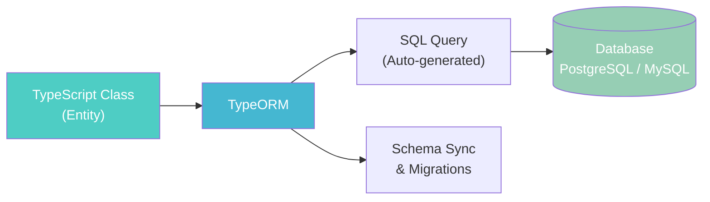
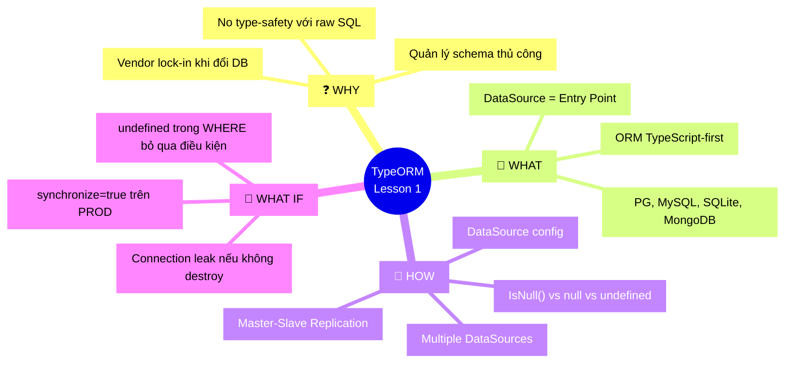

# Lesson 1: Mở đầu & Data Source

## 📋 Agenda

**Thời gian đọc ước tính:** ~20 phút

### Sau bài này, bạn sẽ:
- ✅ **Hiểu** TypeORM là gì và tại sao nó ra đời
- ✅ **Giải thích** được lợi ích của ORM so với raw SQL
- ✅ **Cấu hình** được DataSource với Multiple connections và Replication
- ✅ **Phân biệt** cách xử lý `null` và `undefined` trong điều kiện WHERE

### Yêu cầu đầu vào (Prerequisites):
- 🔹 Biết cơ bản TypeScript (interface, decorator, generic)
- 🔹 Đã từng sử dụng một cơ sở dữ liệu quan hệ (PostgreSQL, MySQL)
- 🔹 Đã cài đặt Node.js và npm

---

## ❓ Vấn đề & Giải pháp

**Vấn đề (Problem Statement):**
- Viết raw SQL thuần túy dễ gây lỗi typo, không có type-check từ TypeScript
- Khi đổi database (MySQL → PostgreSQL), phải viết lại nhiều câu query
- Không có cơ chế quản lý schema tự động khi model thay đổi (thiếu Migrations)
- Code SQL lẫn lộn với business logic, khó đọc và khó test

**Giải pháp (Solution):**
TypeORM là một **ORM (Object-Relational Mapper)** dành cho TypeScript/JavaScript. Nó giúp map các class TypeScript thành các bảng SQL, cung cấp type-safety đầy đủ và một lớp trừu tượng nhất quán bất kể backend database là gì.

---

## 📖 TypeORM là gì?

**Định nghĩa:** TypeORM là một thư viện ORM chạy trên Node.js, hỗ trợ TypeScript first-class, cho phép tương tác với database thông qua các class và decorator thay vì raw SQL.

**Hỗ trợ:** PostgreSQL, MySQL, MariaDB, SQLite, Oracle, MS SQL Server, MongoDB (NoSQL), CockroachDB,...



### So sánh: Trước và Sau TypeORM

**❌ Trước (Raw SQL + node-postgres):**

```typescript
// filename: user.repository.ts — Trước TypeORM

import { Pool } from 'pg';
const pool = new Pool({ connectionString: '...' });

// Không có type-safety — gõ sai tên cột thì chỉ biết lúc runtime
async function findUserByEmail(email: string) {
  const result = await pool.query(
    'SELECT id, name, email FROM users WHERE email = $1 AND deleted_at IS NULL',
    [email]
  );
  // result.rows có type là any[] — không biết shape của object
  return result.rows[0];
}

// Khi thêm cột mới vào DB, phải tìm và sửa thủ công TẤT CẢ câu SQL liên quan
async function createUser(name: string, email: string) {
  const result = await pool.query(
    'INSERT INTO users (name, email, created_at) VALUES ($1, $2, NOW()) RETURNING *',
    [name, email]
  );
  return result.rows[0];
}
```

**✅ Sau (TypeORM):**

```typescript
// filename: user.entity.ts — Sau TypeORM

import { Entity, PrimaryGeneratedColumn, Column, CreateDateColumn, DeleteDateColumn } from 'typeorm';

@Entity('users')
export class User {
  @PrimaryGeneratedColumn()
  id: number;

  @Column()
  name: string;

  @Column({ unique: true })
  email: string;

  @CreateDateColumn()
  createdAt: Date;

  // Soft-delete: TypeORM tự động thêm WHERE deleted_at IS NULL vào mọi query
  @DeleteDateColumn()
  deletedAt: Date;
}

// filename: user.service.ts
import { InjectRepository } from '@nestjs/typeorm';
import { Repository } from 'typeorm';

class UserService {
  constructor(
    @InjectRepository(User)
    private userRepository: Repository<User>
  ) {}

  // TypeScript biết rõ return type là Promise<User | null>
  findByEmail(email: string): Promise<User | null> {
    return this.userRepository.findOne({ where: { email } });
  }

  createUser(name: string, email: string): Promise<User> {
    const user = this.userRepository.create({ name, email });
    return this.userRepository.save(user);
  }
}
```

| Tiêu chí | Raw SQL | TypeORM |
|---|---|---|
| **Type-safety** | ❌ `any[]` | ✅ TypeScript Entity |
| **Đổi Database** | ❌ Viết lại query | ✅ Chỉ đổi `type` config |
| **Quản lý Schema** | ❌ Thủ công | ✅ Migrations tự động |
| **Code maintainability** | ❌ SQL lẫn logic | ✅ Tách biệt rõ ràng |

---

## 🔨 Data Source — Nguồn dữ liệu

### DataSource là gì?

`DataSource` là **entry point** trung tâm của TypeORM — nó quản lý kết nối đến database, chứa config, và cung cấp các API để tương tác với database.

```typescript
// filename: data-source.ts

import { DataSource } from 'typeorm';
import { User } from './user.entity';

export const AppDataSource = new DataSource({
  type: 'postgres',           // Loại database
  host: 'localhost',
  port: 5432,
  username: 'postgres',
  password: 'secret',
  database: 'mydb',
  entities: [User],           // Danh sách entities
  migrations: ['src/migrations/**/*.ts'],
  synchronize: false,         // ⚠️ Chỉ dùng true trong DEV, KHÔNG BAOGIỜ dùng trên PROD
  logging: true,
});
```

### Data Source Options — Các tùy chọn quan trọng

```typescript
const dataSource = new DataSource({
  // --- Connectivity ---
  type: 'postgres',
  host: process.env.DB_HOST,
  port: parseInt(process.env.DB_PORT, 10),
  username: process.env.DB_USER,
  password: process.env.DB_PASS,
  database: process.env.DB_NAME,
  
  // --- TLS/SSL (Production bắt buộc) ---
  ssl: { rejectUnauthorized: false },
  
  // --- Connection Pool ---
  // Tại sao pool? Vì mở kết nối DB tốn kém, pool giúp tái sử dụng kết nối cũ
  extra: {
    max: 10,  // Tối đa 10 kết nối đồng thời
    min: 2,   // Giữ ít nhất 2 kết nối luôn sẵn sàng
    idleTimeoutMillis: 30000,
  },

  // --- Entities & Migrations ---
  entities: ['src/**/*.entity.ts'],
  migrations: ['src/migrations/*.ts'],
  
  // --- Behavior ---
  synchronize: false,   // ⚠️ Tắt trên PROD — dùng migrations thay thế
  logging: ['error', 'warn'], // Chỉ log lỗi và cảnh báo trên PROD
});
```

### DataSource API — Khởi tạo và Đóng kết nối

```typescript
// filename: main.ts

import { AppDataSource } from './data-source';

async function bootstrap() {
  // Khởi tạo kết nối — PHẢI await trước khi dùng bất kỳ thứ gì
  await AppDataSource.initialize();
  console.log('Database connected!');

  // Kiểm tra trạng thái kết nối
  if (AppDataSource.isInitialized) {
    console.log('DataSource is active');
  }

  // Lấy Repository từ DataSource (thường dùng trong non-NestJS apps)
  const userRepo = AppDataSource.getRepository(User);
  const users = await userRepo.find();

  // Đóng kết nối khi app shutdown (quan trọng để giải phóng tài nguyên)
  await AppDataSource.destroy();
}

bootstrap().catch(console.error);
```

### Multiple Data Sources — Kết nối nhiều Database

Scenario thực tế: App cần đọc dữ liệu từ cả PostgreSQL (transactional) và MySQL (legacy).

```typescript
// filename: data-sources.ts

import { DataSource } from 'typeorm';

// DataSource 1: PostgreSQL cho dữ liệu chính
export const PostgresDataSource = new DataSource({
  name: 'postgres_main',  // Tên định danh — phải unique
  type: 'postgres',
  host: 'postgres-host',
  port: 5432,
  username: 'pg_user',
  password: 'pg_pass',
  database: 'main_db',
  entities: ['src/entities/postgres/**/*.entity.ts'],
});

// DataSource 2: MySQL cho hệ thống legacy
export const MysqlDataSource = new DataSource({
  name: 'mysql_legacy',   // Tên khác với DataSource 1
  type: 'mysql',
  host: 'mysql-host',
  port: 3306,
  username: 'mysql_user',
  password: 'mysql_pass',
  database: 'legacy_db',
  entities: ['src/entities/mysql/**/*.entity.ts'],
});

// Khởi tạo cả hai
async function connectAll() {
  await PostgresDataSource.initialize();
  await MysqlDataSource.initialize();
}

// Dùng trong NestJS module
// Trong TypeOrmModule.forFeature, chỉ định connection name
// @InjectRepository(Order, 'mysql_legacy') private orderRepo: Repository<Order>
```

### Replication Setup — Master-Slave

**Tại sao cần?** Trong hệ thống traffic cao, tất cả đọc-ghi vào 1 DB sẽ tạo bottleneck. Master-Slave cho phép:
- **Master:** Xử lý ghi (INSERT, UPDATE, DELETE)
- **Slave(s):** Xử lý đọc (SELECT) — có thể có nhiều Slave để scale out

```typescript
// filename: data-source.replication.ts

import { DataSource } from 'typeorm';

export const ReplicatedDataSource = new DataSource({
  type: 'postgres',
  
  // TypeORM tự động route: writes → master, reads → slave (round-robin)
  replication: {
    master: {
      host: 'master-db.example.com',
      port: 5432,
      username: 'master_user',
      password: 'master_pass',
      database: 'app_db',
    },
    slaves: [
      // Có thể có nhiều slaves — TypeORM sẽ load balance theo round-robin
      {
        host: 'slave1-db.example.com',
        port: 5432,
        username: 'slave_user',
        password: 'slave_pass',
        database: 'app_db',
      },
      {
        host: 'slave2-db.example.com',
        port: 5432,
        username: 'slave_user',
        password: 'slave_pass',
        database: 'app_db',
      },
    ],
  },
  
  entities: ['src/**/*.entity.ts'],
  migrations: ['src/migrations/*.ts'],
});
```

```typescript
// filename: user.service.ts — Sử dụng Replication

import { DataSource } from 'typeorm';

class UserService {
  constructor(private dataSource: DataSource) {}

  async getUsers() {
    // Mặc định: TypeORM tự gửi SELECT đến slave
    return this.dataSource.getRepository(User).find();
  }

  async createUser(data: Partial<User>) {
    // TypeORM tự gửi INSERT đến master
    return this.dataSource.getRepository(User).save(data);
  }

  async getUsersFromMaster() {
    // Khi cần đọc từ master (ví dụ: đọc sau khi ghi để đảm bảo consistency)
    const queryRunner = this.dataSource.createQueryRunner('master');
    try {
      return await queryRunner.manager.find(User);
    } finally {
      await queryRunner.release();
    }
  }
}
```

### Xử lý null và undefined trong WHERE

Đây là **điểm hay nhầm lẫn nhất** khi dùng TypeORM. Hành vi mặc định:

- `undefined` → **Bỏ qua điều kiện** (không thêm vào WHERE clause)
- `null` → **So sánh với NULL** (`WHERE column IS NULL`)

```typescript
// filename: user.repository.ts — null vs undefined behavior

import { Repository } from 'typeorm';
import { IsNull, Not } from 'typeorm';

// Case 1: undefined — bỏ qua điều kiện hoàn toàn
// WHERE: (không có điều kiện nào cho deletedAt)
await repo.findOne({ where: { deletedAt: undefined } });

// Case 2: null trực tiếp — CẢNH BÁO: có thể gây unexpected behavior
// TypeORM v0.3+ sẽ generate: WHERE deletedAt IS NULL
await repo.findOne({ where: { deletedAt: null as any } });

// Case 3: IsNull() — CÁCH ĐÚNG để tìm bản ghi chưa bị soft-delete
// WHERE: deletedAt IS NULL
await repo.findOne({
  where: { deletedAt: IsNull() }
});

// Case 4: Not(IsNull()) — Tìm bản ghi ĐÃ bị soft-delete
// WHERE: deletedAt IS NOT NULL
await repo.find({
  where: { deletedAt: Not(IsNull()) },
  withDeleted: true, // Phải thêm để bypass auto-filter của @DeleteDateColumn
});

// Case 5: Thực tế — tìm user active theo email
const email = req.query.email; // Có thể là undefined nếu không truyền
await repo.find({
  where: {
    // Nếu email === undefined, điều kiện email sẽ bị bỏ qua → trả về tất cả
    // Đây có thể là LOỖ BẢO MẬT! Hãy validate input trước
    email: email,
    deletedAt: IsNull(), // ← Luôn đảm bảo chỉ lấy record chưa xóa
  }
});
```

> 💡 **Best Practice:** Luôn dùng `IsNull()` thay vì `null` để code rõ ý định. Với data filter có thể optional, hãy build object `where` động thay vì gắn `undefined` trực tiếp.

---

## 🚀 Trade-off & Pitfalls

| ✅ NÊN | ❌ KHÔNG nên |
|---|---|
| `synchronize: false` trên PROD | `synchronize: true` trên PROD — sẽ tự ý xóa cột! |
| Dùng env variables cho credentials | Hard-code password trong source code |
| Dùng Connection Pool | Mở kết nối mới cho mỗi request |
| `IsNull()` cho null checks | `null` trực tiếp trong where |

### ⚠️ Pitfalls hay gặp

**1. `synchronize: true` trên Production**
Đây là lỗi chết người. TypeORM sẽ tự `DROP COLUMN` nếu phát hiện column trong DB không còn trong Entity. Luôn dùng Migrations trên môi trường thực.

**2. Không `await` `DataSource.initialize()`**
Nếu query database trước khi DataSource được khởi tạo xong, bạn sẽ gặp `"DataSource is not initialized"`. Hãy đảm bảo app chờ `initialize()` hoàn tất.

**3. Không `destroy()` khi app shutdown**
Dẫn đến connection leak — đặc biệt nguy hiểm trong môi trường serverless (Lambda, Cloud Run) khi function khởi/hủy liên tục.

---

## 🗺️ MECE Mindmap



---

*Made by Anh Tu - Share to be share*
