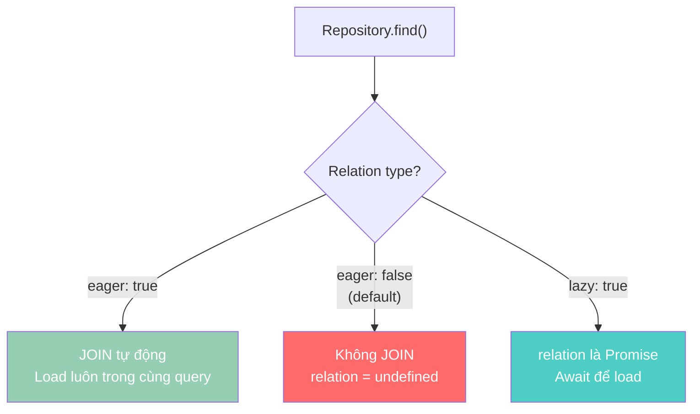
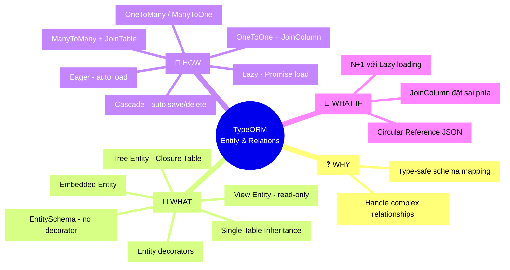

# Lesson 2: Entity & Relations

## 📋 Agenda

**Thời gian đọc ước tính:** ~25 phút

### Sau bài này, bạn sẽ:
- ✅ **Định nghĩa** Entity với đầy đủ decorator TypeORM
- ✅ **Phân biệt** các kiểu Entity: Embedded, Inheritance, Tree, View
- ✅ **Thiết lập** quan hệ One-to-One, Many-to-One, Many-to-Many
- ✅ **Hiểu** sự khác biệt giữa Eager và Lazy loading và khi nào dùng cái nào

### Yêu cầu đầu vào (Prerequisites):
- 🔹 Đã hoàn thành Lesson 1 (DataSource)
- 🔹 Nắm cơ bản về quan hệ CSDL (foreign key, join table)

---

## ❓ Vấn đề & Giải pháp

**Vấn đề:** Làm sao map một cấu trúc dữ liệu phức tạp (có quan hệ, có kế thừa, có phân cấp) từ TypeScript class sang database tables một cách rõ ràng và maintainable?

**Giải pháp:** TypeORM cung cấp hệ thống decorator đầy đủ cho mọi pattern quan hệ phổ biến, từ đơn giản đến phức tạp.

---

## 📖 Entity

### Entities cơ bản

```typescript
// filename: product.entity.ts

import {
  Entity,
  PrimaryGeneratedColumn,
  Column,
  CreateDateColumn,
  UpdateDateColumn,
  DeleteDateColumn,
  Index,
} from 'typeorm';

@Entity('products')           // Tên bảng trong DB
@Index(['name', 'category'])  // Composite index để tối ưu query tìm kiếm
export class Product {

  // Auto-increment ID (type: SERIAL / AUTO_INCREMENT)
  @PrimaryGeneratedColumn()
  id: number;

  // UUID thay thế — tốt hơn cho distributed systems
  // @PrimaryGeneratedColumn('uuid')
  // id: string;

  @Column({ length: 255 })
  name: string;

  @Column('decimal', { precision: 10, scale: 2 })
  price: number;

  @Column({ default: true })
  isActive: boolean;

  // nullable: true → cột cho phép NULL trong DB
  @Column({ nullable: true })
  description?: string;

  @CreateDateColumn()   // Tự set giá trị khi INSERT lần đầu
  createdAt: Date;

  @UpdateDateColumn()   // Tự update khi record thay đổi
  updatedAt: Date;

  @DeleteDateColumn()   // Soft-delete: SET thay vì DELETE
  deletedAt?: Date;
}
```

### Embedded Entities — Gom nhóm columns

Dùng khi nhiều Entity chia sẻ các cột giống nhau (ví dụ: địa chỉ). Thay vì lặp code, ta tạo một Embedded class.

```typescript
// filename: address.embed.ts — Class nhúng, KHÔNG có @Entity
export class Address {
  @Column()
  street: string;

  @Column()
  city: string;

  @Column()
  country: string;
}
```

```typescript
// filename: user.entity.ts

import { Entity, PrimaryGeneratedColumn, Column } from 'typeorm';
import { Address } from './address.embed';

@Entity('users')
export class User {
  @PrimaryGeneratedColumn()
  id: number;

  @Column()
  name: string;

  // TypeORM sẽ tạo các cột: address_street, address_city, address_country
  // Prefix mặc định là tên property (address_)
  @Column(() => Address)
  address: Address;
}

// Cách dùng:
// user.address.city = 'Ho Chi Minh';
// TypeORM tự map sang cột address_city
```

### Entity Inheritance — Single Table Inheritance (STI)

Dùng khi nhiều entity có chung thuộc tính nhưng có type khác nhau (ví dụ: Content có thể là Article hoặc Video).

```typescript
// filename: content.entity.ts

import { Entity, TableInheritance, ChildEntity, Column, PrimaryGeneratedColumn } from 'typeorm';

// Bảng cha chứa TẤT CẢ columns của tất cả loại
// TypeORM thêm cột `type` varchar để phân biệt loại record
@Entity('content')
@TableInheritance({ column: { type: 'varchar', name: 'type' } })
export class Content {
  @PrimaryGeneratedColumn()
  id: number;

  @Column()
  title: string;
}

// ChildEntity KHÔNG tạo bảng riêng — dùng chung bảng content
@ChildEntity()
export class Article extends Content {
  @Column({ nullable: true })
  readingTimeMinutes?: number;
}

@ChildEntity()
export class Video extends Content {
  @Column({ nullable: true })
  durationSeconds?: number;
}

// Cách query — TypeORM tự lọc theo type
// articleRepo.find() → WHERE type = 'article'
// videoRepo.find()   → WHERE type = 'video'
```

### Tree Entities — Cấu trúc phân cấp

Dùng cho category tree, comment threads, organizational chart. TypeORM hỗ trợ nhiều chiến lược lưu trữ; **Closure Table** được khuyên dùng vì query hiệu quả nhất.

```typescript
// filename: category.entity.ts

import {
  Entity,
  PrimaryGeneratedColumn,
  Column,
  Tree,
  TreeChildren,
  TreeParent,
} from 'typeorm';

@Entity('categories')
@Tree('closure-table')  // Chiến lược: closure-table (khuyên dùng cho READ nhiều)
// Các lựa chọn khác: 'nested-set' | 'materialized-path' | 'adjacency-list'
export class Category {
  @PrimaryGeneratedColumn()
  id: number;

  @Column()
  name: string;

  // Tham chiếu đến con từ node hiện tại
  @TreeChildren()
  children: Category[];

  // Tham chiếu đến cha của node hiện tại (nullable vì root node không có cha)
  @TreeParent()
  parent?: Category;
}
```

```typescript
// filename: category.service.ts — Dùng TreeRepository

import { InjectRepository } from '@nestjs/typeorm';
import { TreeRepository } from 'typeorm';

class CategoryService {
  constructor(
    @InjectRepository(Category)
    private categoryRepo: TreeRepository<Category> // ← TreeRepository thay vì Repository
  ) {}

  // Lấy toàn bộ cây phân cấp
  getTree() {
    return this.categoryRepo.findTrees();
  }

  // Lấy toàn bộ hậu duệ (descendants) của một node
  async getDescendants(parentId: number) {
    const parent = await this.categoryRepo.findOneBy({ id: parentId });
    return this.categoryRepo.findDescendantsTree(parent);
  }
}
```

### View Entities — Map vào SQL View

Khi cần map một SQL View có sẵn (aggregated data, complex JOINs) vào TypeScript.

```typescript
// filename: user-stats.view.entity.ts

import { ViewEntity, ViewColumn } from 'typeorm';

// TypeORM KHÔNG tự tạo view — bạn phải tạo view trong migration
@ViewEntity({
  name: 'user_order_stats',
  expression: `
    SELECT
      u.id            AS "userId",
      u.name          AS "userName",
      COUNT(o.id)     AS "totalOrders",
      SUM(o.amount)   AS "totalAmount"
    FROM users u
    LEFT JOIN orders o ON o.user_id = u.id
    GROUP BY u.id, u.name
  `,
})
export class UserOrderStats {
  @ViewColumn()
  userId: number;

  @ViewColumn()
  userName: string;

  @ViewColumn()
  totalOrders: number;

  @ViewColumn()
  totalAmount: number;
}

// Dùng giống như Entity thường, nhưng chỉ có thể READ (không thể save)
// const stats = await dataSource.getRepository(UserOrderStats).find();
```

### Separating Entity Definition — EntitySchema

Khi không dùng decorator (ví dụ: project không dùng `experimentalDecorators`), có thể dùng `EntitySchema`.

```typescript
// filename: user.schema.ts — Định nghĩa bằng EntitySchema
import { EntitySchema } from 'typeorm';

export interface User {
  id: number;
  name: string;
  email: string;
}

export const UserSchema = new EntitySchema<User>({
  name: 'User',
  tableName: 'users',
  columns: {
    id: { type: Number, primary: true, generated: true },
    name: { type: String, length: 255 },
    email: { type: String, unique: true },
  },
});
```

---

## 📖 Relations — Quan hệ

### One-to-One

```typescript
// filename: profile.entity.ts

import { Entity, PrimaryGeneratedColumn, Column, OneToOne } from 'typeorm';
import { User } from './user.entity';

@Entity('profiles')
export class Profile {
  @PrimaryGeneratedColumn()
  id: number;

  @Column()
  bio: string;

  // Phía KHÔNG có @JoinColumn — đây là phía "inverse" (không giữ FK)
  @OneToOne(() => User, (user) => user.profile)
  user: User;
}
```

```typescript
// filename: user.entity.ts

import { Entity, PrimaryGeneratedColumn, Column, OneToOne, JoinColumn } from 'typeorm';
import { Profile } from './profile.entity';

@Entity('users')
export class User {
  @PrimaryGeneratedColumn()
  id: number;

  @Column()
  name: string;

  // @JoinColumn đặt trên phía giữ FOREIGN KEY (cột profile_id sẽ nằm trên bảng users)
  @JoinColumn()
  @OneToOne(() => Profile, (profile) => profile.user, {
    cascade: true,    // Khi save User, tự động save Profile liên quan
    eager: false,     // Không tự động load Profile khi query User
    nullable: true,   // Cho phép User chưa có Profile
  })
  profile?: Profile;
}
```

### Many-to-One / One-to-Many

Quan hệ phổ biến nhất: Order có nhiều OrderItem; một OrderItem thuộc về một Order.

```typescript
// filename: order.entity.ts

import { Entity, PrimaryGeneratedColumn, Column, OneToMany } from 'typeorm';
import { OrderItem } from './order-item.entity';

@Entity('orders')
export class Order {
  @PrimaryGeneratedColumn()
  id: number;

  @Column('decimal', { precision: 10, scale: 2 })
  totalAmount: number;

  // "One" phía Order — một Order có nhiều Items
  @OneToMany(() => OrderItem, (item) => item.order, { cascade: true })
  items: OrderItem[];
}
```

```typescript
// filename: order-item.entity.ts

import { Entity, PrimaryGeneratedColumn, Column, ManyToOne, JoinColumn } from 'typeorm';
import { Order } from './order.entity';

@Entity('order_items')
export class OrderItem {
  @PrimaryGeneratedColumn()
  id: number;

  @Column()
  productName: string;

  @Column()
  quantity: number;

  // "Many" phía OrderItem — nhiều Items thuộc về một Order
  // FK nằm ở đây: cột order_id trên bảng order_items
  @ManyToOne(() => Order, (order) => order.items)
  @JoinColumn({ name: 'order_id' })  // Đặt tên cột FK tường minh
  order: Order;
}
```

### Many-to-Many

```typescript
// filename: student.entity.ts

import { Entity, PrimaryGeneratedColumn, Column, ManyToMany, JoinTable } from 'typeorm';
import { Course } from './course.entity';

@Entity('students')
export class Student {
  @PrimaryGeneratedColumn()
  id: number;

  @Column()
  name: string;

  // @JoinTable đặt trên MỘT PHÍA duy nhất (phía "owning side")
  // TypeORM tự tạo bảng trung gian: students_courses_courses
  @JoinTable({
    name: 'student_courses',       // Tên bảng trung gian tường minh
    joinColumn: { name: 'student_id', referencedColumnName: 'id' },
    inverseJoinColumn: { name: 'course_id', referencedColumnName: 'id' },
  })
  @ManyToMany(() => Course, (course) => course.students)
  courses: Course[];
}
```

```typescript
// filename: course.entity.ts

import { Entity, PrimaryGeneratedColumn, Column, ManyToMany } from 'typeorm';
import { Student } from './student.entity';

@Entity('courses')
export class Course {
  @PrimaryGeneratedColumn()
  id: number;

  @Column()
  title: string;

  // Phía "inverse" — không có @JoinTable
  @ManyToMany(() => Student, (student) => student.courses)
  students: Student[];
}
```

### Eager vs Lazy Relations



```typescript
// filename: user.entity.ts — So sánh Eager vs Lazy

@Entity('users')
export class User {
  @PrimaryGeneratedColumn()
  id: number;

  // EAGER: Luôn load profile trong mọi query tìm user
  // Nguy hiểm nếu relation nặng → dùng khi data relation nhỏ và LUÔN cần
  @OneToOne(() => Profile, { eager: true })
  @JoinColumn()
  profile: Profile;

  // LAZY: Phải gọi await để load, tránh N+1 problem tốt hơn
  // Chỉ load khi thực sự cần → tối ưu performance hơn
  @OneToMany(() => Order, (order) => order.user, { lazy: true })
  orders: Promise<Order[]>;  // ← Type là Promise, không phải Order[]
}

// Cách dùng Lazy:
const user = await userRepo.findOneBy({ id: 1 });
// Tại đây user.orders là Promise — chưa load xuống

const orders = await user.orders; // ← Mới query DB
console.log(orders.length);
```

> 💡 **Best Practice:** Tránh `eager: true` trên quan hệ có thể trả về nhiều bản ghi (OneToMany, ManyToMany). Dùng `relations` option trong query thay thế để kiểm soát tốt hơn.

### Relations FAQ — Cascade

```typescript
// filename: post.entity.ts — Cascade example

@Entity('posts')
export class Post {
  @PrimaryGeneratedColumn()
  id: number;

  @Column()
  title: string;

  // cascade: true → khi save/delete Post, tự động save/delete Comments liên quan
  @OneToMany(() => Comment, (comment) => comment.post, { cascade: true })
  comments: Comment[];
}

// Service
async createPostWithComments() {
  const post = new Post();
  post.title = 'TypeORM Tips';
  post.comments = [
    Object.assign(new Comment(), { content: 'Great article!' }),
    Object.assign(new Comment(), { content: 'Very helpful!' }),
  ];

  // Một lần save() → TypeORM tự INSERT cả Post VÀ Comments
  // Không cần save riêng từng Comment
  await postRepo.save(post);
}

async deletePostWithComments(postId: number) {
  // Với cascade: ['remove'], xóa Post sẽ tự xóa Comments
  // Nhớ load relations trước khi delete nếu dùng cascade remove
  const post = await postRepo.findOne({
    where: { id: postId },
    relations: ['comments']
  });
  await postRepo.remove(post); // ← Cascade remove comments
}
```

---

## 🚀 Trade-off & Pitfalls

| ✅ NÊN | ❌ KHÔNG nên |
|---|---|
| `eager: false` + explicit `relations` | `eager: true` trên relation lớn |
| `JoinColumn` tường minh với tên FK | Để TypeORM tự đặt tên FK |
| `cascade: ['insert', 'update']` cụ thể | `cascade: true` (cascade mọi thứ kể cả xóa) |
| EntitySchema khi không có decorator | Mix decorator và EntitySchema |

### ⚠️ Pitfalls hay gặp

**1. N+1 Query Problem với Lazy Relations**
Nếu bạn load danh sách User rồi loop và `await user.orders` cho từng user → gây N+1 queries. Luôn dùng `relations: ['orders']` trong find options hoặc Query Builder với `leftJoinAndSelect`.

**2. Circular Reference trong JSON Serialization**
Entity có quan hệ hai chiều (bidirectional) sẽ gây lỗi khi JSON.stringify vì vòng lặp vô hạn. Dùng `class-transformer` với `@Exclude()` hoặc tạo DTO riêng.

**3. `@JoinColumn` đặt sai phía**
`@JoinColumn` phải đặt trên phía **giữ Foreign Key** trong DB. Đặt nhầm sẽ tạo cột FK ở bảng sai.

---

## 🗺️ MECE Mindmap



---

*Made by Anh Tu - Share to be share*
