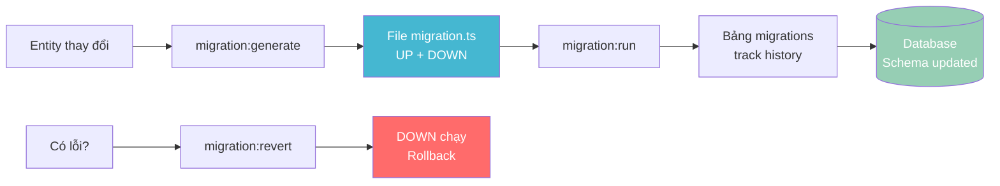
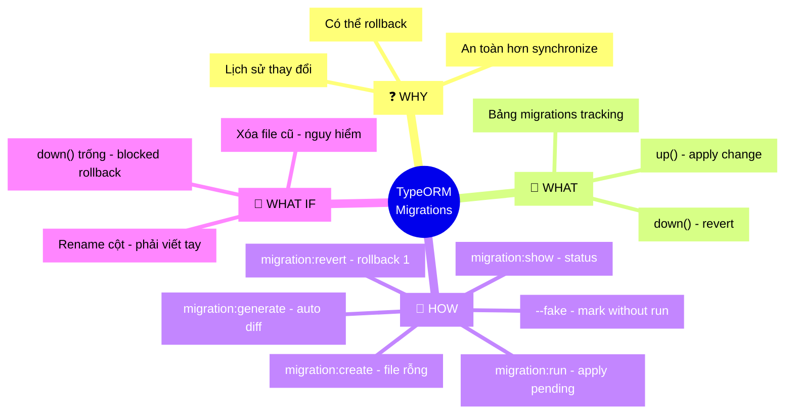

# Lesson 3: Quản lý Migrations

## 📋 Agenda

**Thời gian đọc ước tính:** ~20 phút

### Sau bài này, bạn sẽ:
- ✅ **Hiểu** cơ chế hoạt động của UP/DOWN migrations
- ✅ **Sử dụng** thành thạo các CLI commands: generate, run, revert, show
- ✅ **Biết** khi nào cần Fake Migrations và cách dùng
- ✅ **Viết** logic migration phức tạp bằng Query Runner API

### Yêu cầu đầu vào (Prerequisites):
- 🔹 Đã hoàn thành Lesson 1 & 2 (DataSource, Entity)
- 🔹 Đã cài TypeORM CLI: `npm install typeorm ts-node -D`

---

## ❓ Vấn đề & Giải pháp

**Vấn đề:**
- `synchronize: true` nguy hiểm trên Production (tự động DROP cột, xóa dữ liệu)
- Thay đổi schema DB cần có lịch sử, có thể rollback khi lỗi
- Nhiều developer cùng làm việc — cần cơ chế đồng bộ schema nhất quán

**Giải pháp:**
Migrations là các file TypeScript ghi lại **chính xác từng thay đổi** schema database, chạy tuần tự (UP) hoặc rollback (DOWN).

---

## 📖 How Migrations Work?



TypeORM tạo bảng `migrations` trong DB để track:

```sql
CREATE TABLE migrations (
    id        SERIAL PRIMARY KEY,
    timestamp BIGINT NOT NULL,
    name      VARCHAR NOT NULL
);
```

Mỗi migration file có 2 hàm:
- **`up()`**: Áp dụng thay đổi (thêm cột, tạo bảng, index...)
- **`down()`**: Hoàn tác — là đối nghịch chính xác của `up()`

---

## 🔨 Setup DataSource cho CLI

```typescript
// filename: src/database/data-source.cli.ts

import { DataSource } from 'typeorm';
import * as dotenv from 'dotenv';
dotenv.config();

export default new DataSource({
  type: 'postgres',
  host: process.env.DB_HOST,
  port: parseInt(process.env.DB_PORT, 10),
  username: process.env.DB_USER,
  password: process.env.DB_PASS,
  database: process.env.DB_NAME,
  entities: ['src/**/*.entity.ts'],
  migrations: ['src/database/migrations/*.ts'],
  synchronize: false,
});
```

```json
// filename: package.json — Scripts tiện lợi
{
  "scripts": {
    "typeorm": "ts-node -r tsconfig-paths/register ./node_modules/typeorm/cli.js --dataSource src/database/data-source.cli.ts",
    "migration:generate": "npm run typeorm -- migration:generate src/database/migrations/$npm_config_name",
    "migration:run": "npm run typeorm -- migration:run",
    "migration:revert": "npm run typeorm -- migration:revert",
    "migration:show": "npm run typeorm -- migration:show",
    "migration:create": "npm run typeorm -- migration:create src/database/migrations/$npm_config_name"
  }
}
```

---

## 🔨 CLI Commands Chi Tiết

### 1. Creating — Tạo file trống

```bash
# Tạo file migration rỗng để viết SQL thủ công
npm run migration:create --name=AddIndexToUsers
```

```typescript
// filename: 1712345678901-AddIndexToUsers.ts — Template trống

import { MigrationInterface, QueryRunner } from 'typeorm';

export class AddIndexToUsers1712345678901 implements MigrationInterface {
  public async up(queryRunner: QueryRunner): Promise<void> {
    // TODO: Viết logic ở đây
  }

  public async down(queryRunner: QueryRunner): Promise<void> {
    // TODO: Viết ROLLBACK ở đây
  }
}
```

### 2. Generating — Auto-generate từ Entity ⭐

```bash
# So sánh Entity với DB schema → tự gen SQL diff
npm run migration:generate --name=AddPhoneToUser
```

```typescript
// filename: 1712345678902-AddPhoneToUser.ts — Auto-generated

import { MigrationInterface, QueryRunner } from 'typeorm';

export class AddPhoneToUser1712345678902 implements MigrationInterface {
  name = 'AddPhoneToUser1712345678902';

  public async up(queryRunner: QueryRunner): Promise<void> {
    await queryRunner.query(`ALTER TABLE "users" ADD "phone" character varying`);
    await queryRunner.query(`ALTER TABLE "users" ADD "phoneVerified" boolean NOT NULL DEFAULT false`);
  }

  public async down(queryRunner: QueryRunner): Promise<void> {
    // DOWN là ngược lại của UP
    await queryRunner.query(`ALTER TABLE "users" DROP COLUMN "phoneVerified"`);
    await queryRunner.query(`ALTER TABLE "users" DROP COLUMN "phone"`);
  }
}
```

> 💡 **Best Practice:** Sau khi generate, luôn **đọc lại file migration** trước khi chạy. Đặc biệt khi đổi type cột — TypeORM có thể gen DROP + ADD thay vì ALTER.

### 3. Run, Revert, Show

```bash
# Chạy tất cả migration chưa được chạy (theo thứ tự timestamp)
npm run migration:run

# Rollback migration MỚI NHẤT (chạy hàm down())
npm run migration:revert

# Xem trạng thái: [X] đã chạy | [ ] chưa chạy
npm run migration:show
# [X] AddUserTable1712300000000
# [X] AddPhoneToUser1712345678902
# [ ] AddAvatarToUser1712400000000
```

---

## 📖 Faking Migrations

**Scenario:** Bạn join project có DB production đã có schema đúng, nhưng chưa có migration history. Chạy `migration:run` sẽ cố CREATE bảng đã tồn tại → **lỗi**.

**`--fake`** — ghi vào bảng `migrations` **mà không** thực thi SQL:

```bash
# Đánh dấu migration là "đã chạy" mà không ALTER/CREATE bất cứ thứ gì
npm run typeorm -- migration:run --fake

# Fake revert: xóa record tracking mà không chạy down()
npm run typeorm -- migration:revert --fake
```

**Khi nào dùng Fake:**
- ✅ Sync migration history cho DB production đã có schema sẵn
- ✅ Skip migration vì DBA đã chạy SQL thủ công
- ❌ KHÔNG dùng để "bỏ qua" migration vì lười viết

---

## 🔨 Query Runner API trong Migration

Khi cần thao tác phức tạp hơn ADD/DROP column đơn giản:

```typescript
// filename: 1712400000000-ComplexMigration.ts

import { MigrationInterface, QueryRunner, Table, TableIndex, TableForeignKey } from 'typeorm';

export class ComplexMigration1712400000000 implements MigrationInterface {
  public async up(queryRunner: QueryRunner): Promise<void> {
    
    // 1. Tạo bảng mới
    await queryRunner.createTable(
      new Table({
        name: 'tags',
        columns: [
          { name: 'id', type: 'int', isPrimary: true, isGenerated: true, generationStrategy: 'increment' },
          { name: 'name', type: 'varchar', length: '100', isNullable: false },
          { name: 'created_at', type: 'timestamp', default: 'CURRENT_TIMESTAMP' },
        ],
      }),
      true, // ifNotExists — an toàn khi chạy lại
    );

    // 2. Thêm cột vào bảng đã có
    await queryRunner.addColumn('users', {
      name: 'avatar_url',
      type: 'varchar',
      length: '500',
      isNullable: true,
    } as any);
    
    // 3. Thêm unique index
    await queryRunner.createIndex(
      'users',
      new TableIndex({
        name: 'IDX_USER_EMAIL',
        columnNames: ['email'],
        isUnique: true,
      }),
    );

    // 4. Thêm Foreign Key
    await queryRunner.createForeignKey(
      'orders',
      new TableForeignKey({
        columnNames: ['user_id'],
        referencedTableName: 'users',
        referencedColumnNames: ['id'],
        onDelete: 'CASCADE',
      }),
    );

    // 5. Data migration — fill giá trị cho cột mới
    await queryRunner.query(`
      UPDATE users 
      SET avatar_url = 'https://example.com/default.png'
      WHERE avatar_url IS NULL
    `);
  }

  public async down(queryRunner: QueryRunner): Promise<void> {
    // DOWN: thứ tự NGƯỢC với UP

    // Xóa FK trước (không thể drop cột/bảng khi còn FK)
    const table = await queryRunner.getTable('orders');
    const fk = table.foreignKeys.find(k => k.columnNames.includes('user_id'));
    if (fk) await queryRunner.dropForeignKey('orders', fk);

    await queryRunner.dropIndex('users', 'IDX_USER_EMAIL');
    await queryRunner.dropColumn('users', 'avatar_url');
    await queryRunner.dropTable('tags', true);
  }
}
```

---

## 🚀 Trade-off & Pitfalls

| ✅ NÊN | ❌ KHÔNG nên |
|---|---|
| Review migration file trước khi chạy | Chạy ngay file auto-gen mà không đọc |
| Viết `down()` chính xác | Để `down()` trống |
| Dùng `--fake` khi sync schema có sẵn | Xóa record thủ công trong bảng migrations |
| Chạy migration trong CI/CD | Chạy thủ công trên production |

### ⚠️ Pitfalls hay gặp

**1. Rename cột → mất data**
TypeORM generate `DROP COLUMN old` + `ADD COLUMN new` khi đổi tên. Phải viết tay: `await queryRunner.renameColumn('users', 'old_name', 'new_name')`.

**2. Xóa file migration cũ để dọn dẹp**
Bảng `migrations` vẫn còn record → TypeORM báo lỗi "migration file not found". Chỉ xóa file khi đã xóa record tương ứng trong DB.

---

## 🗺️ MECE Mindmap



---

*Made by Anh Tu - Share to be share*
