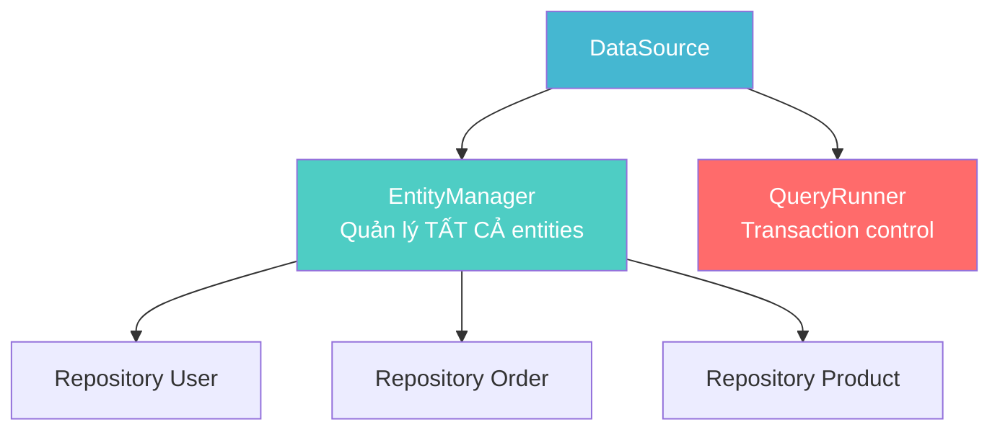
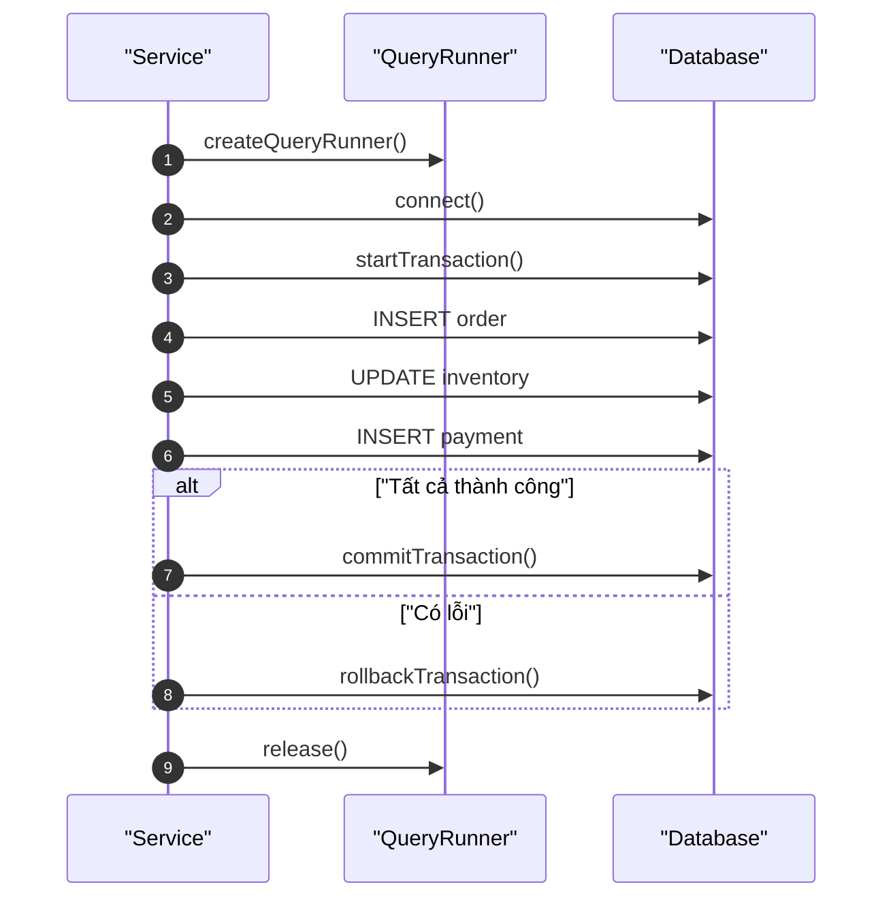
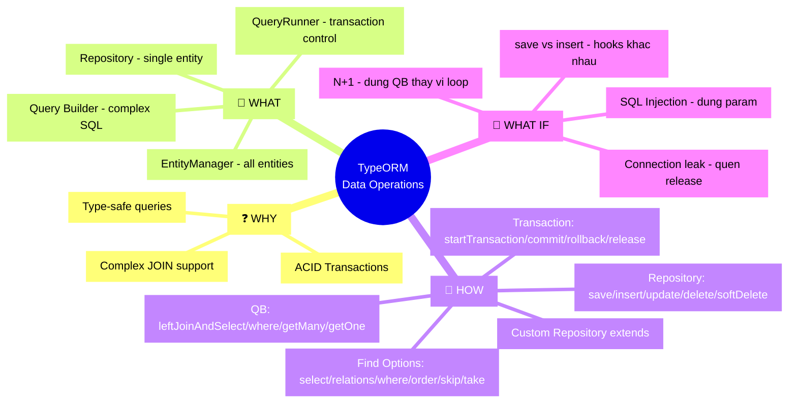

# Lesson 4: Thao Tác Dữ Liệu

## 📋 Agenda

**Thời gian đọc ước tính:** ~30 phút

### Sau bài này, bạn sẽ:
- ✅ **Phân biệt** EntityManager và Repository — dùng cái nào khi nào
- ✅ **Tra cứu** đầy đủ Find Options: select, relations, where, order, skip, take
- ✅ **Viết** Query Builder với JOIN, WHERE phức tạp
- ✅ **Implement** Database Transaction đúng chuẩn với try-catch-finally

### Yêu cầu đầu vào (Prerequisites):
- 🔹 Đã hoàn thành Lesson 1, 2, 3
- 🔹 Hiểu cú pháp async/await trong TypeScript

---

## ❓ Vấn đề & Giải pháp

**Vấn đề:**
- Cần nhiều cách truy vấn: đơn giản (Repository), phức tạp (Query Builder), raw SQL
- Transaction phải đảm bảo tính ACID — nếu một bước fail, toàn bộ phải rollback
- Custom logic query lặp lại ở nhiều nơi cần được tái sử dụng

**Giải pháp:**
TypeORM cung cấp 3 cấp độ API từ high-level đến low-level, phù hợp với độ phức tạp của từng use case.

---

## 📖 EntityManager vs Repository



| | EntityManager | Repository |
|---|---|---|
| **Scope** | Làm việc với nhiều entity | Gắn với 1 entity cụ thể |
| **Lấy từ** | `dataSource.manager` | `dataSource.getRepository(User)` |
| **Dùng khi** | Transaction cross-entity | CRUD đơn giản |
| **NestJS** | `@InjectEntityManager()` | `@InjectRepository(User)` |

```typescript
// filename: user.service.ts — EntityManager vs Repository

import { EntityManager, Repository } from 'typeorm';
import { InjectEntityManager, InjectRepository } from '@nestjs/typeorm';

class UserService {
  constructor(
    // EntityManager — có thể thao tác bất kỳ entity nào
    @InjectEntityManager()
    private entityManager: EntityManager,

    // Repository — chỉ thao tác với User
    @InjectRepository(User)
    private userRepository: Repository<User>,
  ) {}

  // Dùng Repository — ngắn gọn, phù hợp CRUD đơn
  getUsers() {
    return this.userRepository.find();
  }

  // Dùng EntityManager — thao tác nhiều entity trong cùng transaction
  async transferCredit(fromId: number, toId: number, amount: number) {
    return this.entityManager.transaction(async (transactionalEM) => {
      // transactionalEM đảm bảo mọi thao tác trong đây cùng 1 transaction
      const from = await transactionalEM.findOneByOrFail(User, { id: fromId });
      const to = await transactionalEM.findOneByOrFail(User, { id: toId });
      from.credit -= amount;
      to.credit += amount;
      await transactionalEM.save([from, to]);
    });
  }
}
```

---

## 🔨 Find Options — Tra cứu đầy đủ

### select — Chỉ lấy các cột cần thiết

```typescript
// Chỉ SELECT id, name, email — tránh trả về password hash
const users = await userRepo.find({
  select: {
    id: true,
    name: true,
    email: true,
    // password: false ← không cần ghi, bỏ qua là đủ
  },
});
```

### relations — Load quan hệ

```typescript
// Load 1 cấp
const orders = await orderRepo.find({
  relations: { user: true, items: true },
});

// Load nhiều cấp (nested)
const orders = await orderRepo.find({
  relations: {
    user: true,
    items: {
      product: true,   // items.product
    },
  },
});
```

### where — Điều kiện lọc

```typescript
import { Between, Like, In, MoreThan, IsNull, Not } from 'typeorm';

const results = await productRepo.find({
  where: [
    // [condition1] OR [condition2] — mảng là OR
    {
      // Trong cùng object là AND
      isActive: true,
      price: Between(100, 500),          // WHERE price BETWEEN 100 AND 500
      name: Like('%laptop%'),             // WHERE name LIKE '%laptop%'
    },
    {
      category: In(['Electronics', 'Gaming']),  // WHERE category IN (...)
      stock: MoreThan(0),                       // WHERE stock > 0
    },
  ],
});

// Lọc theo relation
const orders = await orderRepo.find({
  where: {
    user: { id: 5 },        // WHERE user.id = 5 (auto JOIN)
    status: Not('cancelled'),
  },
});
```

### order, skip, take — Sắp xếp và Pagination

```typescript
const page = 2;
const pageSize = 10;

const [users, total] = await userRepo.findAndCount({
  order: {
    createdAt: 'DESC',   // Mới nhất trước
    name: 'ASC',
  },
  skip: (page - 1) * pageSize,  // OFFSET
  take: pageSize,                // LIMIT
});

// Trả về: { data: users, total, page, pageSize }
```

---

## 🔨 Repository APIs

```typescript
// filename: user.service.ts — Repository API Reference

class UserService {
  constructor(
    @InjectRepository(User)
    private repo: Repository<User>
  ) {}

  // --- CREATE ---

  // create(): tạo entity instance (CHƯA lưu vào DB)
  // save(): INSERT hoặc UPDATE (dựa vào có id hay không)
  async createUser(dto: CreateUserDto) {
    const user = this.repo.create(dto);  // → new User() + gán giá trị
    return this.repo.save(user);         // → INSERT INTO users...
  }

  // insert(): INSERT nhanh — KHÔNG trigger hooks (@BeforeInsert, cascade)
  // Dùng khi bulk insert không cần hooks
  async bulkInsert(users: Partial<User>[]) {
    return this.repo.insert(users);
  }

  // --- READ ---

  findAll() {
    return this.repo.find();
  }

  findById(id: number) {
    // findOneBy: shortcut của findOne({ where: { id } })
    return this.repo.findOneBy({ id });
  }

  // findOneByOrFail: throw EntityNotFoundError nếu không tìm thấy
  async findOrFail(id: number) {
    return this.repo.findOneByOrFail({ id });
  }

  // exists: kiểm tra có tồn tại không — hiệu quả hơn find() + check length
  async checkEmailExists(email: string) {
    return this.repo.exists({ where: { email } });
  }

  count(where?: any) {
    return this.repo.count({ where });
  }

  // --- UPDATE ---

  // update(): UPDATE trực tiếp — KHÔNG load entity, KHÔNG trigger hooks
  async updateStatus(id: number, isActive: boolean) {
    // Cú pháp: update(criteria, partialEntity)
    return this.repo.update({ id }, { isActive });
  }

  // save() với entity có id: UPDATE
  async updateUser(id: number, dto: UpdateUserDto) {
    const user = await this.repo.findOneByOrFail({ id });
    Object.assign(user, dto);
    return this.repo.save(user);  // → UPDATE users SET ... WHERE id = ?
  }

  // --- DELETE ---

  // delete(): DELETE cứng, KHÔNG trigger hooks, KHÔNG soft-delete
  hardDelete(id: number) {
    return this.repo.delete({ id });
  }

  // softDelete(): SET deleted_at = NOW() (với @DeleteDateColumn)
  softDelete(id: number) {
    return this.repo.softDelete({ id });
  }

  // restore(): undelete — SET deleted_at = NULL
  restore(id: number) {
    return this.repo.restore({ id });
  }

  // remove(): load entity rồi DELETE — CÓ trigger hooks
  async removeUser(id: number) {
    const user = await this.repo.findOneByOrFail({ id });
    return this.repo.remove(user);
  }
}
```

### Custom Repositories — Mở rộng Repository

```typescript
// filename: user.repository.ts — Custom Repository

import { Injectable } from '@nestjs/common';
import { DataSource, Repository } from 'typeorm';
import { InjectDataSource } from '@nestjs/typeorm';

@Injectable()
export class UserRepository extends Repository<User> {
  constructor(@InjectDataSource() dataSource: DataSource) {
    // Kế thừa hoàn toàn từ Repository<User>
    super(User, dataSource.createEntityManager());
  }

  // Thêm method domain-specific
  findActiveAdmins(): Promise<User[]> {
    return this.find({
      where: { isActive: true, role: 'admin' },
      order: { createdAt: 'DESC' },
    });
  }

  async findWithOrderStats(userId: number) {
    return this.createQueryBuilder('user')
      .leftJoinAndSelect('user.orders', 'order')
      .where('user.id = :userId', { userId })
      .addSelect('COUNT(order.id)', 'orderCount')
      .groupBy('user.id')
      .getRawAndEntities();
  }
}
```

```typescript
// filename: user.module.ts — Đăng ký Custom Repository

@Module({
  imports: [TypeOrmModule.forFeature([User])],
  providers: [UserRepository, UserService],
})
export class UserModule {}
```

---

## 🔨 Query Builder

Dùng khi cần JOIN phức tạp, subquery, hoặc HAVING.

```typescript
// filename: product.service.ts — Query Builder Reference

class ProductService {
  constructor(
    @InjectRepository(Product)
    private productRepo: Repository<Product>
  ) {}

  async findWithFilters(filters: {
    minPrice?: number;
    maxPrice?: number;
    categoryName?: string;
    keyword?: string;
  }) {
    // createQueryBuilder('alias') — alias dùng trong toàn bộ query
    const qb = this.productRepo
      .createQueryBuilder('product')
      // LEFT JOIN: lấy cả product chưa có category
      .leftJoinAndSelect('product.category', 'category')
      // INNER JOIN: chỉ lấy product CÓ supplier
      .innerJoinAndSelect('product.supplier', 'supplier')
      // WHERE cơ bản — :param là parameterized query (tránh SQL injection)
      .where('product.isActive = :active', { active: true });

    // Thêm điều kiện động với andWhere
    if (filters.minPrice !== undefined) {
      qb.andWhere('product.price >= :minPrice', { minPrice: filters.minPrice });
    }

    if (filters.maxPrice !== undefined) {
      qb.andWhere('product.price <= :maxPrice', { maxPrice: filters.maxPrice });
    }

    if (filters.categoryName) {
      // Điều kiện trên relation (category)
      qb.andWhere('category.name = :catName', { catName: filters.categoryName });
    }

    if (filters.keyword) {
      // OR condition trong andWhere
      qb.andWhere(
        '(product.name LIKE :kw OR product.description LIKE :kw)',
        { kw: `%${filters.keyword}%` }
      );
    }

    // ORDER và PAGINATION
    qb.orderBy('product.price', 'ASC')
      .addOrderBy('product.name', 'ASC')
      .skip(0)
      .take(20);

    // getMany(): trả về Entity[]
    return qb.getMany();
  }

  // getOne(): trả về Entity | null
  async findBySlug(slug: string) {
    return this.productRepo
      .createQueryBuilder('product')
      .where('product.slug = :slug', { slug })
      .getOne();
  }

  // getManyAndCount(): trả về [Entity[], number] cho pagination
  async paginate(page: number, size: number) {
    return this.productRepo
      .createQueryBuilder('product')
      .skip((page - 1) * size)
      .take(size)
      .getManyAndCount();
  }

  // getRawMany(): trả về raw object (dùng với SELECT aggregate)
  async getStatsByCategory() {
    return this.productRepo
      .createQueryBuilder('product')
      .select('category.name', 'categoryName')
      .addSelect('COUNT(product.id)', 'productCount')
      .addSelect('AVG(product.price)', 'avgPrice')
      .leftJoin('product.category', 'category')
      .groupBy('category.name')
      .having('COUNT(product.id) > :minCount', { minCount: 5 })
      .getRawMany();
  }
}
```

---

## 🔨 Database Transactions với Query Runner

**Quan trọng nhất trong phần này.** Transaction đảm bảo nhiều thao tác DB thành công hoặc thất bại cùng nhau (ACID).



```typescript
// filename: order.service.ts — Transaction Pattern chuẩn

import { DataSource } from 'typeorm';
import { InjectDataSource } from '@nestjs/typeorm';

class OrderService {
  constructor(
    @InjectDataSource()
    private dataSource: DataSource,
  ) {}

  async placeOrder(userId: number, items: OrderItemDto[]): Promise<Order> {
    
    // Bước 1: Lấy QueryRunner từ DataSource
    const queryRunner = this.dataSource.createQueryRunner();

    // Bước 2: Kết nối và bắt đầu transaction
    await queryRunner.connect();
    await queryRunner.startTransaction();

    try {
      // Bước 3: Thực hiện các thao tác DB

      // 3a. Tạo Order
      const order = queryRunner.manager.create(Order, {
        userId,
        status: 'pending',
        totalAmount: 0,
      });
      const savedOrder = await queryRunner.manager.save(order);

      let totalAmount = 0;

      // 3b. Tạo từng OrderItem và cập nhật inventory
      for (const itemDto of items) {
        const product = await queryRunner.manager.findOneByOrFail(Product, {
          id: itemDto.productId,
        });

        // Kiểm tra tồn kho — nếu lỗi sẽ throw, trigger catch block
        if (product.stock < itemDto.quantity) {
          throw new Error(`Sản phẩm "${product.name}" không đủ hàng`);
        }

        // Trừ tồn kho
        product.stock -= itemDto.quantity;
        await queryRunner.manager.save(product);

        // Tạo OrderItem
        const orderItem = queryRunner.manager.create(OrderItem, {
          orderId: savedOrder.id,
          productId: product.id,
          quantity: itemDto.quantity,
          price: product.price,
        });
        await queryRunner.manager.save(orderItem);

        totalAmount += product.price * itemDto.quantity;
      }

      // 3c. Cập nhật tổng tiền
      savedOrder.totalAmount = totalAmount;
      savedOrder.status = 'confirmed';
      await queryRunner.manager.save(savedOrder);

      // Bước 4: COMMIT — chỉ ghi vào DB khi mọi bước thành công
      await queryRunner.commitTransaction();
      return savedOrder;

    } catch (error) {
      // Bước 5: ROLLBACK — hoàn tác toàn bộ nếu có lỗi
      // Nhờ rollback, DB không bị dirty (không có order dở dang)
      await queryRunner.rollbackTransaction();
      throw error;  // Re-throw để caller biết đã có lỗi

    } finally {
      // Bước 6: RELEASE — BẮT BUỘC, luôn trả QueryRunner về pool
      // finally đảm bảo release() chạy dù có lỗi hay không
      await queryRunner.release();
    }
  }
}
```

> ⚠️ **Quan trọng:** `finally` block với `release()` là **bắt buộc**. Nếu quên `release()`, connection pool sẽ cạn kiệt (connection leak) và app bị treo.

### Transaction với EntityManager.transaction() — Cách ngắn gọn hơn

```typescript
// Cách viết gọn hơn khi logic không quá phức tạp
async simpleTransfer(fromId: number, toId: number, amount: number) {
  return this.dataSource.manager.transaction(async (manager) => {
    // manager đã tự wrapped trong transaction
    // TypeORM tự commit khi hàm return và rollback khi throw

    const from = await manager.findOneByOrFail(Account, { id: fromId });
    const to = await manager.findOneByOrFail(Account, { id: toId });

    if (from.balance < amount) {
      throw new Error('Insufficient balance'); // → auto rollback
    }

    from.balance -= amount;
    to.balance += amount;

    await manager.save([from, to]);
    // → auto commit khi hàm hoàn thành
  });
}
```

**Khi nào dùng QueryRunner vs manager.transaction():**

| | `QueryRunner` | `manager.transaction()` |
|---|---|---|
| **Verbose** | Nhiều code hơn | Ngắn gọn hơn |
| **Control** | Toàn quyền (manual commit/rollback) | Auto commit/rollback |
| **Nested** | Hỗ trợ Savepoint | Không hỗ trợ tốt |
| **Dùng khi** | Logic phức tạp, cần kiểm soát từng bước | Simple transactional logic |

---

## 🚀 Trade-off & Pitfalls

| ✅ NÊN | ❌ KHÔNG nên |
|---|---|
| `find({ select: {...} })` chỉ lấy cột cần | `find()` rồi lọc ở application layer |
| `findOneByOrFail()` khi expect entity phải tồn tại | `findOneBy()` rồi kiểm tra null thủ công |
| Query Builder cho JOIN phức tạp | Nhiều vòng lặp query riêng lẻ (N+1) |
| `finally { queryRunner.release() }` | Release bên trong try hoặc catch |
| Parameterized query `:param` | Template string với input trực tiếp |

### ⚠️ Pitfalls hay gặp

**1. SQL Injection với Query Builder**
```typescript
// ❌ Nguy hiểm — user input trực tiếp trong query string
qb.where(`user.name = '${userInput}'`);

// ✅ Parameterized — TypeORM tự escape
qb.where('user.name = :name', { name: userInput });
```

**2. Quên `release()` trong Transaction**
Mỗi `createQueryRunner()` chiếm 1 connection trong pool. Không release → pool cạn → requests tiếp theo bị block.

**3. `save()` vs `insert()` / `update()` — Hiểu nhầm**
- `save()` = INSERT nếu không có id, UPDATE nếu có id. Có load entity trước, trigger hooks.
- `insert()` / `update()` = SQL trực tiếp, nhanh hơn, nhưng KHÔNG trigger `@BeforeInsert`, `@AfterInsert` hooks.

---

## 🗺️ MECE Mindmap



---

*Made by Anh Tu - Share to be share*
