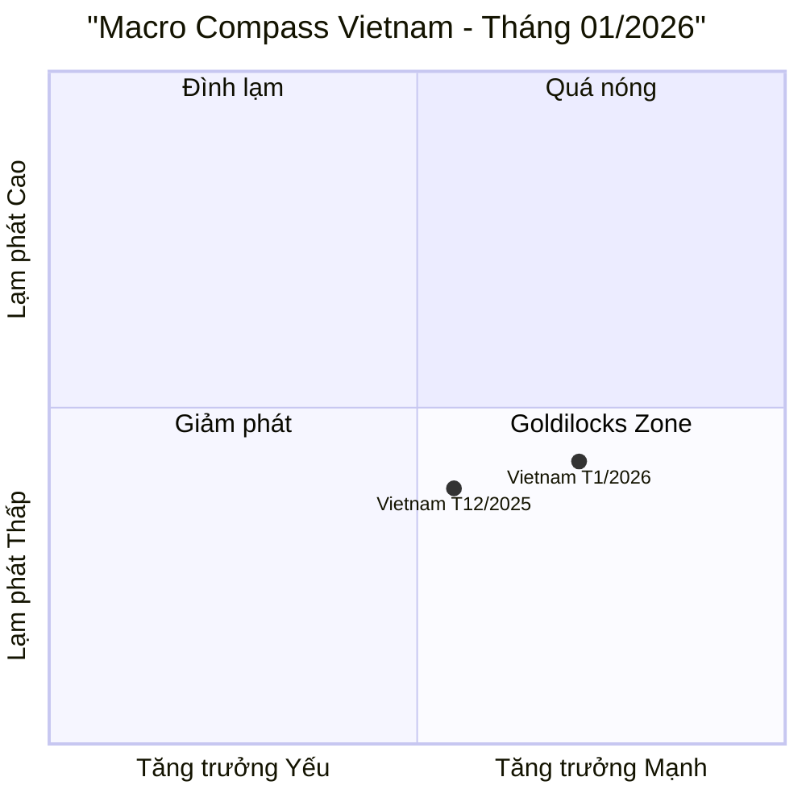
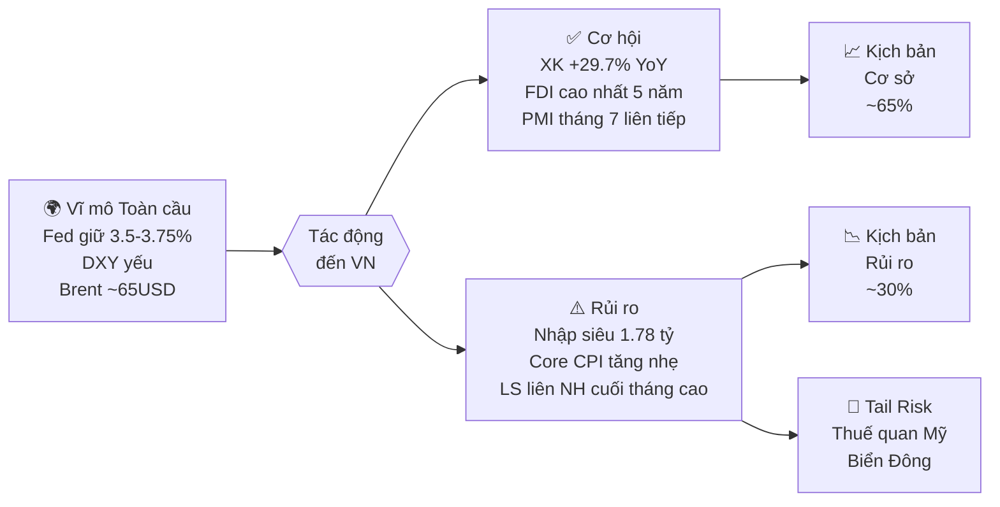

import Tabs from '@theme/Tabs';
import TabItem from '@theme/TabItem';

# Báo cáo Chiến lược Vĩ mô Việt Nam — Tháng 01/2026

> **Phạm vi:** Tháng 01/2026 so với 12/2025 (MoM) và 01/2025 (YoY)
> **Cập nhật lúc:** 31/01/2026

---

## 🎯 MỤC TIÊU CHÍNH PHỦ VIỆT NAM NĂM 2026

> **Nguồn:** Nghị quyết 244/2025/QH15 (Quốc hội, 13/11/2025) & Nghị quyết 01/NQ-CP (Chính phủ, 08/01/2026)

| # | Chỉ tiêu | Mục tiêu 2026 | Thực tế T1/2026 | Trạng thái |
|:---:|:---|:---:|:---:|:---:|
| 1 | **Tăng trưởng GDP** | **≥ 10%** (2 chữ số) | Q1 mục tiêu ~8% | 🟡 Chờ số liệu Q1 |
| 2 | **CPI bình quân** | **≤ 4.5%** | 2.53% YoY | 🟢 Đang tốt |
| 3 | **Tổng kim ngạch XK** | **546–550 tỷ USD** (+15-16% YoY) | 43.19 tỷ/tháng | 🟢 Pace đạt mục tiêu |
| 4 | **Cán cân thương mại** | Xuất siêu **> 23 tỷ USD** | -1.78 tỷ (nhập siêu T1) | 🟡 Theo dõi xu hướng |
| 5 | **FDI giải ngân** | **~30 tỷ USD** (+9% YoY est.) | 1.68 tỷ/tháng | 🟢 Cao nhất 5 năm |
| 6 | **GDP bình quân đầu người** | **5,400–5,500 USD** | — | 🕐 Cuối năm đánh giá |
| 7 | **Tỷ lệ thất nghiệp đô thị** | **< 4%** | — | 🕐 Cuối năm đánh giá |
| 8 | **Tăng trưởng tín dụng** | **~16%** | ~1-2% YTD | 🟡 Đầu năm thấp, bình thường |

> **Cách đọc:** 🟢 Đang đúng hướng | 🟡 Cần theo dõi | 🔴 Lệch mục tiêu | 🕐 Chưa đánh giá được

---

## I. EXECUTIVE SUMMARY

Khu vực sản xuất mở đầu năm 2026 với đà tăng tốc đáng chú ý khi PMI đạt **52.5 điểm** (tháng thứ bảy liên tiếp mở rộng) và IIP bứt phá **+21.5% YoY**, được thúc đẩy bởi ngành chế biến chế tạo và hiệu ứng nền thấp năm trước. Lạm phát tiếp tục được kiểm soát tốt với CPI **+2.53% YoY** — thấp hơn mục tiêu 4.5% của Chính phủ — trong khi FDI giải ngân đạt mức cao nhất 5 năm gần đây, xác nhận niềm tin của nhà đầu tư nước ngoài. Điểm đáng chú ý nhất tháng 1 là **nhập siêu 1.78 tỷ USD** — hiếm gặp nhưng là tín hiệu lành mạnh, phản ánh doanh nghiệp đang đẩy mạnh nhập nguyên liệu, máy móc để chuẩn bị cho chu kỳ sản xuất mới; rủi ro chính cần theo dõi là lãi suất liên ngân hàng tăng vọt cuối tháng, phản ánh áp lực thanh khoản cục bộ.

---

## II. BỐI CẢNH VĨ MÔ TOÀN CẦU

### A. Động thái các Ngân hàng Trung ương lớn

| Ngân hàng TW | Quyết định T1/2026 | Forward Guidance | Tác động đến Việt Nam |
|:---|:---|:---|:---|
| **Fed (Mỹ)** | Giữ nguyên **3.5–3.75%** | Tiếp tục "data-dependent"; 2/12 thành viên muốn cắt giảm | Áp lực tỷ giá USD/VND giảm bớt khi DXY suy yếu so với 2025 |
| **ECB (Eurozone)** | Giảm nhẹ về **2.5%** | Lạm phát EU tiến về mục tiêu 2%, dư địa cắt thêm | EUR mạnh hơn hỗ trợ XK hàng Việt Nam sang EU |
| **BOJ (Nhật)** | Giữ nguyên, nghiên cứu tăng nhẹ | Lạm phát Nhật ổn định trên 2% | JPY hồi phục làm giảm áp lực nhập khẩu lạm phát từ Nhật |

### B. DXY & Lợi suất Trái phiếu Mỹ

```
DXY: ~99–101 (Q1/2026 projection) → Giảm ~9.3% trong năm 2025
  → DXY suy yếu làm giảm áp lực tỷ giá VND, tạo dư địa SBV 
    giữ ổn định mà không cần bán can thiệp

US 10Y Treasury: ~4.3–4.5%
  → Vẫn ở mức cao lịch sử nhưng xu hướng giảm dần theo chu kỳ Fed cắt lãi suất
  → Dòng vốn EM vẫn cạnh tranh nhưng áp lực đã giảm so với 2023-2024
```

### C. Hàng hóa Chiến lược & Tác động đến Việt Nam

| Hàng hóa | T12/2025 | T1/2026 | MoM | Tác động đến VN |
|:---|:---:|:---:|:---:|:---|
| **Brent Crude** (USD/thùng) | ~62 | **~65** | +4.8% | Nhập khẩu xăng dầu đắt hơn, CPI nhóm giao thông tăng nhẹ |
| **Vàng** (USD/oz) | ~2,620 | ~2,700 | +3.1% | Nhu cầu vàng trong nước tăng theo mùa Tết |
| **Gạo** (USD/tấn) | ~530 | ~515 | -2.8% | Thuận lợi cho NK, nhẹ áp lực với nông dân XK |

---

## III. BẢNG MACRO DASHBOARD — Tháng 01/2026

> ✅ = Đã xác minh từ nguồn gốc | ⚠️ = Cần theo dõi thêm | 🔴 = Rủi ro

| Chỉ số | T12/2025 | T1/2026 | MoM | YoY | Nhận định |
|:---|:---:|:---:|:---:|:---:|:---|
| **PMI Manufacturing** (điểm) | 53.0 | **52.5** | -0.5đ | N/A | ✅ Vẫn >50, tháng thứ 7 mở rộng liên tiếp |
| **IIP** (%YoY) | ~8.7% | **+21.5%** | N/A | +21.5% | ✅ Động lực mạnh từ chế biến chế tạo (+23.6%) |
| **Tổng mức bán lẻ** (%YoY) | ~9.8% | **+9.2%** | N/A | +9.2% | ✅ Sức mua nội địa ổn định, hiệu ứng Tết |
| **Xuất khẩu** (tỷ USD) | ~44.5 | **43.19** | -3.0% | **+29.7%** | ✅ Tăng tốt nhờ điện tử, dệt may |
| **Nhập khẩu** (tỷ USD) | ~43.8 | **44.97** | +2.7% | **+49.2%** | ⚠️ Tăng mạnh vì tư liệu sản xuất |
| **Cán cân TM** (tỷ USD) | +0.7 | **-1.78** | Đổi chiều | N/A | ⚠️ Nhập siêu — dấu hiệu tích cực về nhu cầu SX |
| **FDI giải ngân** (tỷ USD) | ~2.0 | **1.68** | -16% | **+11.3%** | ✅ Cao nhất T1 trong 5 năm, 82.5% vào chế tạo |
| **CPI chung** (%YoY) | 2.49% | **2.53%** | +0.05%MoM | +2.53% | ✅ Tốt, dưới mục tiêu 4.5% |
| **Core CPI** (%YoY) | 2.95% | **3.19%** | +0.35%MoM | +3.19% | ⚠️ Xu hướng tăng nhẹ, cần theo dõi |
| **Tăng trưởng tín dụng** (%YTD) | 15.08% | **~1–2%** | — | — | ✅ Đầu năm tăng chậm theo mùa, bình thường |
| **Tỷ giá trung tâm** (VND/USD) | 25.167 | **25.074** | -0.4% | — | ✅ VND vững, SBV hút ròng kiểm soát |

---

## IV. PHÂN TÍCH CHUYÊN SÂU

### A. Khu vực Sản xuất: "Khởi động Năm Bính Ngọ"

**IIP tháng 1 tăng +21.5% YoY** là con số ấn tượng nhất trong bức tranh tháng 1. Cần đặt trong ngữ cảnh đúng:

- **Hiệu ứng nền thấp**: Tháng 1/2025 có ít ngày làm việc hơn do Tết Ất Tỵ đến sớm. Tháng 1/2026 (Tết Bính Ngọ muộn hơn) có nhiều ngày sản xuất hơn → Tăng trưởng thực sự không hoàn toàn là +21.5%.
- **Tín hiệu thực sự mạnh**: PMI **52.5 điểm** (nguồn: S&P Global) xác nhận hoạt động sản xuất đang mở rộng thực chất, với chỉ số đơn hàng mới xuất khẩu bắt đầu phục hồi sau thời gian dài đình trệ. Business confidence đạt đỉnh 22 tháng.
- **Sản phẩm nổi bật**: Linh kiện điện thoại (+92.7% YoY), xe máy (+54.3%), ô tô (+48.5%) — cho thấy chuỗi cung ứng điện tử đang tăng tốc, phù hợp xu hướng dịch chuyển chuỗi cung ứng từ Trung Quốc.

**Nhập khẩu tăng +49.2% YoY** — con số đáng lo ngại bề ngoài, nhưng thực chất tích cực. Phần lớn là **tư liệu sản xuất** (máy móc, nguyên liệu chế tạo), phản ánh doanh nghiệp đang tích trữ để phục vụ đơn hàng xuất khẩu Q2-Q3/2026. Khu vực FDI chiếm 74.6% kim ngạch nhập khẩu.

### B. Tiêu dùng Nội địa: Ổn nhưng chưa bứt phá

Tổng mức bán lẻ tăng **+9.2% YoY** (theo SSI Research) — ổn định nhưng chưa tăng tốc so với 2024. Dịch vụ ăn uống và lưu trú hưởng lợi từ hiệu ứng Tết, song tiêu dùng hàng hóa thiết yếu vẫn thận trọng. Tách bạch ra:
- Doanh thu dịch vụ lưu trú & ăn uống: Ước tính +12-15% theo mùa Tết
- Hàng hóa tiêu dùng bền: Tăng chậm, phản ánh hộ gia đình đang quản lý chi tiêu

### C. Áp lực Tỷ giá & Thanh khoản: Câu chuyện Hai Nửa Tháng

**Diễn biến phân nửa tháng** là điểm thú vị nhất về phía tiền tệ:

| Thời điểm | Tỷ giá liên NH | OMO | Giải thích |
|:---|:---:|:---:|:---|
| Đầu T1/2026 | Ổn định | Bơm ròng 44,311 tỷ | SBV hỗ trợ thanh khoản đầu năm |
| Giữa T1/2026 | Giảm về 2.6% | Hút ròng 40,526 tỷ | SBV thu hồi thanh khoản dư thừa |
| Cuối T1/2026 | Tăng vọt **5.6%** | Bơm ròng lại | Nhu cầu VND bùng nổ dịp trước Tết |

Tính cả tháng, NHNN **hút ròng ~88.2 nghìn tỷ VND** — kết thúc chuỗi 4 tháng bơm ròng liên tiếp. Đây là hành động chủ động kiểm soát lạm phát và ổn định tỷ giá.

**Tỷ giá trung tâm SBV** kết thúc tháng ở **25,074 VND/USD** — giảm 0.4% so với đầu năm, phản ánh DXY toàn cầu suy yếu và việc SBV giữ chính sách ổn định tỷ giá. Tỷ giá thương mại Vietcombank cuối tháng tại ~25,870-26,260 — hẹp lại đáng kể so với đỉnh 2024.

---

## V. DỰ BÁO & RỦI RO THÁNG 02/2026

### Kịch bản Cơ sở (Xác suất ~65%)

```
Điều kiện: Tháng 2/2026 trùng với Tết Bính Ngọ (cuối tháng 1 - đầu tháng 2)
→ Sản xuất chậm lại theo mùa (ít ngày làm việc)
→ Tiêu dùng nội địa tăng vọt trong dịp Tết

Dự báo T2/2026:
  PMI: 51–52 điểm (đi ngang hoặc nhích giảm do nghỉ Tết)
  IIP: Giảm MoM, nhưng so YoY vẫn tích cực do nền thấp
  CPI: Tăng MoM 0.3–0.5% (nhu cầu Tết đẩy giá thực phẩm)
  Tỷ giá: Ổn định 25,000–25,200 VND/USD (trung tâm)
  Tín dụng: Bắt đầu tăng tốc khi doanh nghiệp mở rộng sau Tết

Hành động SBV: Tiếp tục trung pháp, bơm thanh khoản dịp Tết
```

### Kịch bản Rủi ro (Xác suất ~30%)

```
Trigger: Fed bất ngờ phát tín hiệu hawkish (giữ lãi suất cao hơn dự kiến),
         DXY đảo chiều tăng mạnh → áp lực tỷ giá VND

Diễn biến:
  DXY tăng → USD/VND tăng → SBV phải bán can thiệp
  → Dự trữ ngoại hối giảm → Việt Nam phải tăng lãi suất liên NH
  → Chi phí vốn doanh nghiệp tăng → đình trệ đầu tư tư nhân

Chỉ báo cần theo dõi (Early Warning):
  - DXY: Nếu vượt 104 → kịch bản rủi ro đang hiện thực hóa
  - Tỷ giá TM: Nếu vượt 26,500 VND/USD → SBV sẽ phải hành động
  - LS liên NH qua đêm: Nếu duy trì >5% qua nhiều tuần → áp lực thanh khoản
```

### Thiên Nga Đen Cần Phòng Thủ

```
🦢 Thuế quan Trump leo thang: Nếu Mỹ áp thuế bổ sung lên hàng VN
   → XK điện tử (-40% giá trị) và dệt may (-25%) bị tổn thất nặng
   → FDI đăng ký mới có thể giảm khi nhà đầu tư chờ đợi

🦢 Địa chính trị Biển Đông leo thang: Gián đoạn tuyến hàng hải
   → Chi phí logistics tăng, bảo hiểm hàng hải tăng
   → Áp lực lên CPI nhập khẩu và chuỗi cung ứng xuất khẩu
```

---

## VI. TÓM TẮT BẰNG BIỂU ĐỒ

### Macro Compass — T1/2026



> **Đọc biểu đồ:** Việt Nam tháng 1/2026 dịch chuyển mạnh sang phải (IIP bứt phá, PMI cao) nhưng lạm phát vẫn được kiểm soát → Đang ở **góc phần tư Goldilocks** lý tưởng. Rủi ro là Core CPI tăng nhẹ có thể đẩy lên vùng "Quá nóng" nếu cầu tiếp tục mạnh.

### Luồng Rủi ro-Cơ hội



---

## VII. NGUỒN DỮ LIỆU

| Chỉ số | Nguồn | Ngày công bố |
|:---|:---|:---|
| PMI | S&P Global Vietnam PMI | Ngày 3/2/2026 |
| IIP, Bán lẻ, CPI | Tổng cục Thống kê (GSO) | 29/1/2026 |
| Xuất/Nhập khẩu | Tổng cục Hải quan | 29/1/2026 |
| FDI | Cục Đầu tư nước ngoài - MPI | 29/1/2026 |
| Tỷ giá, OMO, Lãi suất | Ngân hàng Nhà nước (SBV) | Daily |
| Phân tích bổ sung | SSI Research - Báo cáo Chiến lược T1/2026 | 15/1/2026 |
| Phân tích bổ sung | TCBS Research - VietnamOutlook T1/2026 | 15/1/2026 |
| Fed, DXY | Federal Reserve, forex.com | 28/1/2026 |
| Dầu Brent | EIA | 31/1/2026 |

---

> **Miễn trừ trách nhiệm:** Báo cáo này được lập dựa trên các nguồn thông tin công khai và mang tính tham khảo nghiên cứu. Đây **không phải** là khuyến nghị đầu tư. Số liệu có thể được điều chỉnh khi cơ quan nhà nước cập nhật.
>
> *Made by Anh Tu - Share to be share*
