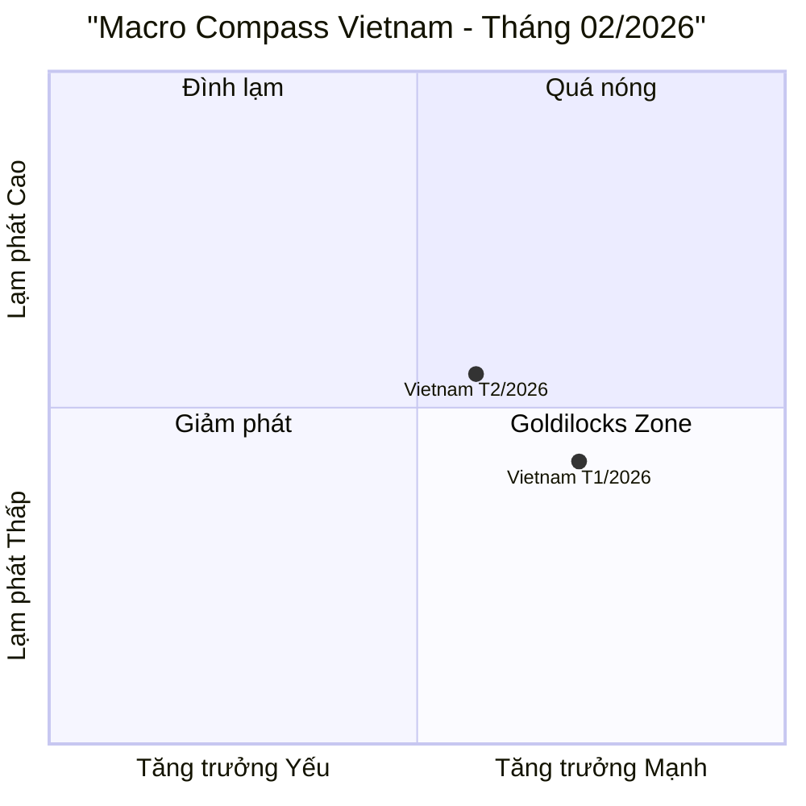
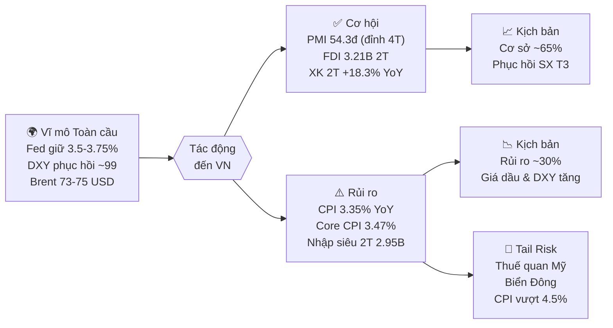

import Tabs from '@theme/Tabs';
import TabItem from '@theme/TabItem';

# Báo cáo Chiến lược Vĩ mô Việt Nam — Tháng 02/2026

> **Phạm vi:** Tháng 02/2026 so với 01/2026 (MoM) và 02/2025 (YoY)
> **Cập nhật lúc:** 28/02/2026

---

## 🎯 MỤC TIÊU CHÍNH PHỦ VIỆT NAM NĂM 2026

> **Nguồn:** Nghị quyết 244/2025/QH15 (Quốc hội, 13/11/2025) & Nghị quyết 01/NQ-CP (Chính phủ, 08/01/2026)

| # | Chỉ tiêu | Mục tiêu 2026 | Thực tế T2/2026 | Trạng thái |
|:---:|:---|:---:|:---:|:---:|
| 1 | **Tăng trưởng GDP** | **≥ 10%** (2 chữ số) | Q1 chờ số liệu cuối tháng 3 | 🕐 Chưa đánh giá |
| 2 | **CPI bình quân** | **≤ 4.5%** | 2.94% (bình quân 2T) | 🟢 Đang tốt |
| 3 | **Tổng kim ngạch XK** | **546–550 tỷ USD** (+15-16% YoY) | XK 2T: 76.39 tỷ (pace ~458 tỷ/năm) | 🟡 Cần đẩy thêm |
| 4 | **Cán cân thương mại** | Xuất siêu **> 23 tỷ USD** | -2.95 tỷ (nhập siêu lũy kế 2T) | 🟡 Theo dõi xu hướng |
| 5 | **FDI giải ngân** | **~30 tỷ USD** (+9% YoY est.) | 3.21 tỷ (2T, +8.8% YoY) | 🟢 Đúng tiến độ |
| 6 | **GDP bình quân đầu người** | **5,400–5,500 USD** | — | 🕐 Cuối năm đánh giá |
| 7 | **Tỷ lệ thất nghiệp đô thị** | **< 4%** | — | 🕐 Cuối năm đánh giá |
| 8 | **Tăng trưởng tín dụng** | **~15%** | ~3-4% YTD (ước tính) | 🟡 Đầu năm thấp, bình thường |

> **Cách đọc:** 🟢 Đang đúng hướng | 🟡 Cần theo dõi | 🔴 Lệch mục tiêu | 🕐 Chưa đánh giá được

---

## I. EXECUTIVE SUMMARY

Sản xuất là điểm sáng nhất tháng 2 khi PMI Manufacturing **vọt lên 54.3 điểm** — mức cao nhất 4 tháng và là tháng thứ tám liên tiếp mở rộng — bất chấp số ngày làm việc ít hơn do kỳ nghỉ Tết Bính Ngọ; đơn hàng mới tăng vọt và niềm tin kinh doanh đạt đỉnh 41 tháng. Lạm phát tăng tốc đáng kể với CPI **+3.35% YoY** (cao nhất kể từ 2024) và Core CPI bình quân đạt **3.47%**, phản ánh áp lực kép từ nhu cầu Tết và chi phí vận tải toàn cầu tăng do căng thẳng Trung Đông — đây là điểm cần theo dõi sát để bảo vệ mục tiêu CPI ≤ 4.5% cả năm. Rủi ro kép đến từ (1) tỷ giá liên ngân hàng leo dần, với DXY toàn cầu phục hồi từ vùng đáy do căng thẳng địa chính trị Trung Đông, và (2) FDI đăng ký mới *giảm 12.6%* dù giải ngân vẫn tích cực, cho thấy nhà đầu tư nước ngoài đang thận trọng hơn trong cam kết dài hạn.

---

## II. BỐI CẢNH VĨ MÔ TOÀN CẦU

### A. Động thái các Ngân hàng Trung ương lớn

| Ngân hàng TW | Quyết định T2/2026 | Forward Guidance | Tác động đến Việt Nam |
|:---|:---|:---|:---|
| **Fed (Mỹ)** | Giữ nguyên **3.5–3.75%** (không họp T2; họp T1 đã giữ nguyên) | "Data-dependent"; thị trường kỳ vọng giữ nguyên tại họp T3/17-18/3 | DXY phục hồi ~99 gây áp lực nhẹ lên tỷ giá VND, hút vốn từ EM |
| **ECB (Eurozone)** | Tiếp tục chu kỳ cắt giảm, về ~2.25% | Lạm phát EU hướng về mục tiêu 2%; trung lập-nhẹ dovish | EUR ổn định, hỗ trợ XK hàng Việt Nam sang EU |
| **BOJ (Nhật)** | Giữ nguyên, nghiên cứu tăng dần | BOJ theo dõi lạm phát Nhật ~2%; chưa vội tăng | JPY đứng giá hỗ trợ nhà đầu tư Nhật không rút vốn carry trade |

### B. DXY & Lợi suất Trái phiếu Mỹ

```
DXY: Phục hồi về ~99.0 (đầu tháng 3) sau đáy ~98 giữa T2
  → Nguyên nhân: Căng thẳng Trung Đông đẩy giá dầu, giảm kỳ vọng Fed cắt lãi suất
  → Ý nghĩa: DXY tăng tạo áp lực tỷ giá USD/VND, tuy nhiên SBV vẫn kiểm soát được

US 10Y Treasury: ~4.3–4.5% (ổn định trong T2)
  → Vẫn cao so với lịch sử nhưng xu hướng đi ngang
  → Chi phí vay vốn toàn cầu duy trì ở mức cao, cạnh tranh dòng vốn vào EM
```

### C. Hàng hóa Chiến lược & Tác động đến Việt Nam

| Hàng hóa | T1/2026 | T2/2026 | MoM | Tác động đến VN |
|:---|:---:|:---:|:---:|:---|
| **Brent Crude** (USD/thùng) | ~65 | **~73–75** | +12–15% | Căng thẳng Trung Đông đẩy giá dầu → CPI nhóm giao thông +1.23% MoM; chi phí vận chuyển XNK tăng |
| **Vàng** (USD/oz) | ~2,700 | **~2,870–2,900** | +6–7% | Tâm lý trú ẩn tăng cao; vàng trong nước giao dịch sôi động |
| **Gạo** (USD/tấn) | ~515 | **~520–530** | +1–3% | Gạo Việt Nam XK ổn định, không tác động lớn đến CPI |

> **Rủi ro nổi bật:** Giá dầu Brent leo thang là yếu tố quan trọng nhất ảnh hưởng đến CPI tháng 3/2026 cần theo dõi.

---

## III. BẢNG MACRO DASHBOARD — Tháng 02/2026

> ✅ = Đã xác minh từ nguồn Tier 1 | ⚠️ = Cần theo dõi | 🔴 = Rủi ro

| Chỉ số | T1/2026 | T2/2026 | MoM | YoY | Nhận định |
|:---|:---:|:---:|:---:|:---:|:---|
| **PMI Manufacturing** (điểm) | 52.5 | **54.3** | +1.8đ | N/A | ✅ Vượt kỳ vọng; tháng thứ 8 mở rộng; đỉnh 4 tháng |
| **IIP** (%YoY) | +21.5% | **+1.0%** | -18.4%MoM | +1.0% | ✅ Giảm MoM do Tết; YoY thấp nhưng bình thường mùa vụ |
| **Tổng mức bán lẻ** (%YoY) | +9.2% | **+8.5%** | Giảm nhẹ | +8.5% | ✅ Tết Bính Ngọ hỗ trợ tiêu dùng dịch vụ, ăn uống |
| **Xuất khẩu** (tỷ USD) | 43.19 | **33.09** | -23.4% | **+8.7%** | ⚠️ Giảm MoM do Tết; YoY tích cực; 2T đạt 76.39 tỷ |
| **Nhập khẩu** (tỷ USD) | 44.97 | **34.10** | -24.2% | **+10.5%** | ⚠️ Nhập nhiều tư liệu SX; tổng 2T: 79.34 tỷ |
| **Cán cân TM** (tỷ USD) | -1.78 | **-1.01** | Cải thiện | N/A | ⚠️ Nhập siêu tháng 2; lũy kế 2T: -2.95 tỷ |
| **FDI giải ngân** (tỷ USD, YTD) | 1.68 | **3.21** (2T) | +91% | **+8.8%** | ✅ Cao nhất 5 năm; 82.7% vào chế biến chế tạo |
| **CPI chung** (%YoY) | 2.53% | **3.35%** | **+1.14%MoM** | +3.35% | ⚠️ Tăng đột biến do Tết; cần theo dõi xu hướng T3 |
| **Core CPI** (%YoY) | 3.19% | **~3.47%** (bình quân 2T) | +0.82%MoM | ~3.5% | ⚠️ Lạm phát lõi leo dần — áp lực nội sinh cần quan sát |
| **Tăng trưởng tín dụng** (%YTD) | ~1–2% | **~3–4%** (ước tính) | Tăng dần | — | 🟡 SBV yêu cầu Q1 không vượt 25% chỉ tiêu năm (~3.75%) |
| **Tỷ giá trung tâm** (VND/USD) | 25,074 | **25,044** | -0.1% | — | ✅ VND ổn định; thị trường tự do ~26,500–26,700 |

*PMI không có YoY do là chỉ số cấp độ, không phải tốc độ tăng trưởng.

---

## IV. PHÂN TÍCH CHUYÊN SÂU

### A. Khu vực Sản xuất: "Đơn Hàng Bùng Nổ Sau Tết"

**PMI 54.3 điểm** (nguồn: S&P Global, công bố 3/3/2026) là tín hiệu mạnh nhất trong nhiều tháng. Điều đặc biệt là lần đầu tiên chỉ số đơn hàng xuất khẩu mới (New Export Orders sub-index) tăng mạnh nhất trong 18 tháng — cho thấy cầu nước ngoài đang phục hồi thực chất, không chỉ là hiệu ứng mùa vụ. Nhân công tăng tháng thứ 5 liên tiếp với tốc độ cao nhất từ tháng 9/2022, xác nhận doanh nghiệp đang mở rộng quy mô sản xuất dài hạn. Niềm tin kinh doanh đạt đỉnh 41 tháng.

**IIP tháng 2 chỉ tăng +1.0% YoY** — thấp hơn rất nhiều so với +21.5% YoY tháng 1. Đây là điều bình thường về mùa vụ: Tết Bính Ngọ kéo dài vào đầu tháng 2, giảm số ngày làm việc đáng kể. Cần nhìn vào số lũy kế 2T: IIP 2T/2026 tăng **+10.4% YoY** — tốc độ bền vững. Ngành chế biến chế tạo (chiếm tỷ trọng lớn nhất) tăng **+11.5% YoY** lũy kế 2T, là trụ cột chính.

**Xuất khẩu 2T/2026 đạt 76.39 tỷ USD (+18.3% YoY)** — pace này nếu duy trì sẽ cho phép Việt Nam xuất approximately 458 tỷ USD cả năm, thấp hơn mục tiêu 546-550 tỷ nhưng T1&T2 vốn là tháng yếu nhất. Nhóm hàng đóng góp chính: điện tử & linh kiện (khu vực FDI, chiếm 78.8% XK tổng).

**FDI giải ngân 3.21 tỷ USD trong 2T** (+8.8% YoY) xác nhận Việt Nam vẫn là điểm đến hấp dẫn. Tuy nhiên cần lưu ý: **FDI đăng ký giảm 12.6%** dù đăng ký mới tăng 61.5% — sự phân hóa này phản ánh một số dự án lớn cũ không gia hạn/tăng vốn, trong khi các dự án nhỏ-mới đang vào mạnh hơn. Hàn Quốc dẫn đầu với 1.34 tỷ USD đăng ký mới.

### B. Tiêu dùng Nội địa: Tết Đẩy Nhưng Không Đột Phá

Tổng mức bán lẻ tháng 2 tăng **+8.5% YoY** (theo GSO) — duy trì được đà từ tháng 1, với hiệu ứng Tết Bính Ngọ hỗ trợ mạnh nhóm dịch vụ. Phân tích theo nhóm hàng:

- **Nhóm hàng ăn & dịch vụ ăn uống:** Tăng 2.02% MoM (đóng góp 0.72 điểm % vào CPI) — Tết đúng nghĩa là catalyst duy nhất trong tháng này
- **Văn hóa, giải trí, du lịch:** +1.36% MoM — phục hồi mạnh khi người dân chi tiêu Tết
- **Tiêu dùng hàng hóa bền vững:** Chưa có dấu hiệu bứt phá, hộ gia đình vẫn thận trọng quản lý chi tiêu

Bán lẻ thực (đã loại trừ lạm phát) tăng ~5% — mức vừa phải, cho thấy sức mua thực tế không tăng tốc quá mạnh. Dư địa cải thiện phụ thuộc vào ổn định lạm phát và tốc độ giải ngân đầu tư công tạo việc làm thu nhập.

### C. Lạm phát & Áp lực Giá: Tháng Vượt Ngưỡng Cần Theo Dõi

CPI tháng 2 tăng **+3.35% YoY** — đây là mức cao nhất kể từ cuối 2024 và tăng đột biến so với +2.53% tháng 1. Ba nhân tố chính:

1. **Nhu cầu Tết:** Nhóm hàng ăn uống tăng 2.02% MoM — yếu tố nhất thời, sẽ đảo chiều tháng 3
2. **Giá dầu toàn cầu leo thang:** Brent từ ~65 lên ~73-75 USD/thùng do căng thẳng Trung Đông → CPI giao thông +1.23% MoM
3. **Chi phí vận tải hàng hải:** Nhà sản xuất trong nước chịu thêm áp lực từ cước vận chuyển quốc tế tăng

**Core CPI bình quân 2T/2026 đạt 3.47% YoY** — đây là cảnh báo cần theo dõi kỹ. Lạm phát lõi phản ánh áp lực cầu nội sinh; khi giá dịch vụ và lao động tăng theo sức mua cải thiện, nếu không được kiểm soát sẽ làm khó SBV trong việc hạ lãi suất thêm.

**Dự báo:** Tháng 3/2026, CPI MoM có thể đảo chiều về vùng 0 đến -0.3% (hiệu ứng nền Tết mất đi), nhưng CPI YoY vẫn duy trì cao ~3.0-3.3% do giá dầu. Mục tiêu CPI ≤ 4.5% cả năm vẫn trong tầm với nhưng biên an toàn đang thu hẹp.

### D. Áp lực Tỷ giá & Thanh khoản: Ổn Định Nhưng Mong Manh

| Thước đo | T1/2026 | T2/2026 cuối | Nhận định |
|:---|:---:|:---:|:---|
| Tỷ giá trung tâm SBV | 25,074 | **25,044** | VND nhích mạnh nhẹ so với USD |
| Tỷ giá liên NH | ~25,870 | **~26,058** | Tăng 0.4% so với T1; áp lực nhẹ từ DXY |
| Tỷ giá thị trường tự do | ~26,260 | **~26,500–26,700** | Tăng 0.85% MoM; chênh lệch với tỷ giá chính thức giãn ra |

**Diễn biến tỷ giá tháng 2** phản ánh hai chiều ngược nhau:
- **Lực hỗ trợ VND:** FDI giải ngân mạnh, kiều hối dịp Tết về lớn, xuất khẩu 2T tích cực
- **Lực gây áp lực:** DXY toàn cầu phục hồi từ đáy, nhu cầu USD nhập khẩu nguyên liệu tăng

**Chính sách SBV:** Tiếp tục trung lập. Không có can thiệp bán USD đáng kể trong tháng. SBV yêu cầu TCTD kiểm soát tín dụng Q1 không vượt 25% chỉ tiêu năm (~3.75% YTD), phản ánh muốn cân bằng giữa hỗ trợ tăng trưởng và kiểm soát lạm phát. Techcombank dự báo USD/VND có thể tăng khoảng 2% cả năm 2026, với áp lực tập trung Q2-Q3.

---

## V. DỰ BÁO & RỦI RO THÁNG 03/2026

### Kịch bản Cơ sở (Xác suất ~60-65%)

```
Điều kiện: Giá dầu tạm ổn định vùng 70-75 USD; Fed tiếp tục giữ lãi suất tại họp 17-18/3;
           sản xuất sau Tết phục hồi mạnh.

Dự báo T3/2026:
  PMI: 53–55 điểm (duy trì trên 53; sản xuất hậu Tết bùng nổ)
  IIP: +8–12% YoY (hồi phục mạnh sau tháng 2 thấp + đơn hàng tăng)
  CPI: +2.8–3.2% YoY (+0 đến -0.3% MoM; hiệu ứng Tết tan biến)
  Tỷ giá: 25,000–25,200 VND/USD (trung tâm); 26,200–26,600 thương mại
  Tín dụng: Bắt đầu tăng tốc khi doanh nghiệp mở rộng SX hậu Tết
  XK: Phục hồi về 38–42 tỷ USD/tháng (đơn hàng mới Q1 thực hiện)

Hành động SBV dự kiến: Điều hành trung lập; theo dõi CPI lõi sát;
                        không hạ lãi suất điều hành thêm trong Q1
```

### Kịch bản Rủi ro (Xác suất ~30-35%)

```
Trigger: Leo thang vượt ngưỡng tại Trung Đông → Brent vượt 90 USD/thùng;
         đồng thời Fed phát tín hiệu giữ lãi suất cao lâu hơn → DXY vượt 101-102.

Diễn biến:
  Giá dầu tăng → CPI nhập khẩu tăng → CPI VN vượt 3.8–4.0% YoY
  DXY tăng mạnh → USD/VND liên NH vượt 26,300 → SBV phải bán USD can thiệp
  → Dự trữ ngoại hối giảm → SBV duy trì lãi suất cao → chi phí vốn doanh nghiệp tăng
  → FDI đăng ký mới tiếp tục thận trọng; đầu tư tư nhân chậm lại

Chỉ báo cần theo dõi (Early Warning):
  - Giá Brent: Nếu vượt 85 USD/thùng liên tục > 2 tuần → xem xét kịch bản rủi ro
  - DXY: Nếu vượt 101 → áp lực tỷ giá VND leo thang
  - Tỷ giá TM Vietcombank: Nếu vượt 26,800 → SBV sẽ phải hành động bán ngoại tệ
  - Core CPI: Nếu chạm 3.8% YoY → rủi ro mất mục tiêu CPI ≤ 4.5%
```

### 🦢 Thiên Nga Đen Cần Phòng Thủ

```
🦢 Thuế quan Trump leo thang (xác suất thấp, tác động cao):
   → Mỹ áp thuế bổ sung 25-45% lên hàng VN (điện tử, dệt may, giày dép)
   → XK VN mất 15-25% giá trị; GDP giảm 1-2 điểm %; FDI đăng ký đình trệ 6-12 tháng
   → VND có thể mất giá 3-5% nếu thặng dư thương mại đảo chiều dài hạn

🦢 Căng thẳng Biển Đông leo thang đột biến:
   → Gián đoạn tuyến hàng hải qua KV Biển Đông (30% XNK VN đi qua đây)
   → Cước tàu biển tăng 40-80%; bảo hiểm hàng hải neo cao
   → CPI nhập khẩu tăng mạnh, chuỗi cung ứng XK bị gián đoạn 2-4 tuần

🦢 Hạ cấp tín nhiệm quốc gia do lạm phát dai dẳng:
   → Nếu CPI bình quân vượt 4.5% trong Q2-Q3, Moody's/S&P có thể đưa VN vào "Negative Outlook"
   → Chi phí huy động vốn quốc tế tăng; dòng vốn portfolio rút ra
```

---

## VI. TÓM TẮT BẰNG BIỂU ĐỒ

### Macro Compass — T2/2026



> **Đọc biểu đồ:** Việt Nam tháng 2 dịch chuyển sang trái (IIP/XK giảm do Tết) và lên trên (CPI +3.35% YoY do Tết & giá dầu) — tạm thời ra khỏi vùng Goldilocks. **Đây là tín hiệu mùa vụ, không phải xu hướng cấu trúc.** Kỳ vọng tháng 3 sẽ quay về vùng Goldilocks khi sản xuất hậu Tết phục hồi và CPI MoM đảo chiều.

### Luồng Rủi ro-Cơ hội



---

## VII. NGUỒN DỮ LIỆU

| Chỉ số | Nguồn | Ngày công bố |
|:---|:---|:---|
| PMI Manufacturing | S&P Global Vietnam PMI | 03/3/2026 |
| IIP, Bán lẻ, CPI | Tổng cục Thống kê (GSO / nso.gov.vn) | 27/2/2026 |
| Xuất/Nhập khẩu, Cán cân TM | Tổng cục Hải quan (customs.gov.vn) | 28/2/2026 |
| FDI | Cục Đầu tư nước ngoài - MPI | 27/2/2026 |
| Tỷ giá, OMO, Lãi suất | Ngân hàng Nhà nước (SBV) | Daily |
| Phân tích bổ sung | SSI Research - Báo cáo Chiến lược T2/2026 | 15/2/2026 |
| Phân tích bổ sung | TCBS Research - VietnamOutlook 25/2/2026 | 25/2/2026 |
| Fed, DXY | Federal Reserve, J.P. Morgan | 28/1/2026 |
| Dầu Brent | EIA / MarketPulse | 28/2/2026 |

> ⚠️ **Lưu ý về dữ liệu extracted:** File `extracted_2026-02.json` có nhiều giá trị bất hợp lý (CPI 20%, XK 1.49 tỷ) do lỗi regex trong quá trình trích xuất tự động từ PDF. Báo cáo này ưu tiên số liệu từ nguồn Tier 1 (GSO, Hải quan, MPI, S&P Global) thay vì số liệu extracted tự động.

---

> **Miễn trừ trách nhiệm:** Báo cáo này được lập dựa trên các nguồn thông tin công khai và
> mang tính tham khảo nghiên cứu. Đây **không phải** là khuyến nghị đầu tư.
> Số liệu có thể được điều chỉnh khi cơ quan nhà nước cập nhật.
>
> *Made by Anh Tu - Share to be share*
