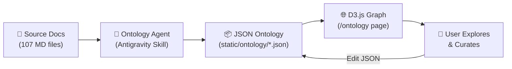
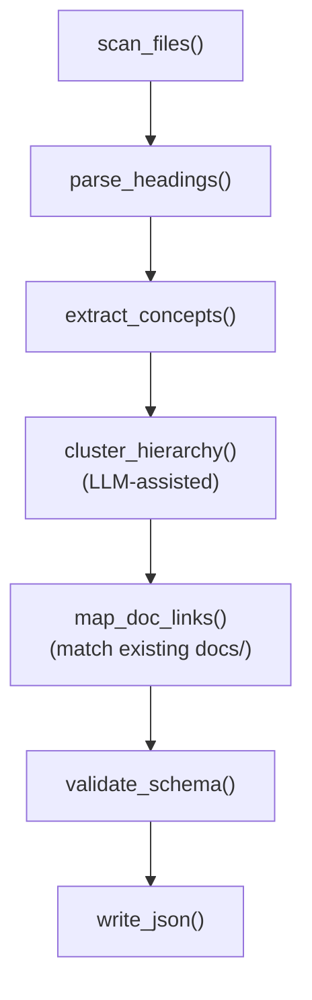
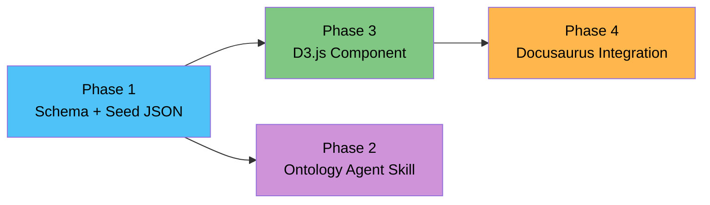

# Knowledge Ontology Explorer — Implementation Plan

## Tóm tắt

Xây dựng hệ thống **Knowledge Ontology Explorer** tích hợp vào Docusaurus site hiện tại, cho phép:
1. **Agent** (Antigravity skill) đọc source docs → generate JSON ontology 4-5 levels
2. **Interactive Graph** (D3.js) render ontology trên trang `/ontology` với khả năng drill-down
3. **Human-in-the-loop**: Người dùng review, đính chính JSON → rebuild graph

### Kiến trúc tổng quan



---

## User Review Required

> [!IMPORTANT]
> **Dependency mới**: Plan sử dụng **D3.js** (via `d3` npm package, ~250KB gzipped). Đây là thư viện visualization tiêu chuẩn, không có alternative nhẹ hơn có cùng khả năng force-directed graph + zoom/pan + drill-down.

> [!WARNING]
> **Bundle size**: D3.js sẽ tăng bundle size. Tuy nhiên, nó chỉ load ở trang `/ontology` (code-splitting tự nhiên của Docusaurus custom pages), không ảnh hưởng trang khác.

---

## Proposed Changes

### Phase 1: Ontology Data Schema & Seed Data

#### Mục tiêu
Thiết kế JSON schema cho ontology và tạo seed data từ 107 source docs Microsoft Learn đã có.

---

#### [NEW] [azure-ai-agent.schema.json](file:///Users/anhtus/Documents/Development/Documentary/vuanhtu1993.github.io/static/ontology/azure-ai-agent.schema.json)

JSON Schema định nghĩa cấu trúc ontology. Mỗi domain có 1 file JSON riêng.

```json
{
  "$schema": "http://json-schema.org/draft-07/schema#",
  "title": "OntologyNode",
  "type": "object",
  "required": ["id", "label", "level"],
  "properties": {
    "id": {
      "type": "string",
      "description": "Unique identifier, kebab-case. VD: 'mcp-authentication'"
    },
    "label": {
      "type": "string",
      "description": "Tên hiển thị. VD: 'MCP Authentication'"
    },
    "level": {
      "type": "integer",
      "enum": [0, 1, 2, 3, 4],
      "description": "0=Domain, 1=Category, 2=Topic, 3=Sub-topic, 4=Detail"
    },
    "description": {
      "type": "string",
      "description": "Mô tả ngắn 1-2 câu"
    },
    "docLink": {
      "type": "string",
      "description": "Relative link tới bài docs trên site (nếu có). VD: '/docs/azure-ai-agent/02-tools/mcp-server-client'"
    },
    "sourceRef": {
      "type": "string",
      "description": "Path tới source doc gốc (để trace provenance)"
    },
    "tags": {
      "type": "array",
      "items": { "type": "string" },
      "description": "Tags phân loại. VD: ['compute', 'serverless', 'beginner']"
    },
    "children": {
      "type": "array",
      "items": { "$ref": "#" },
      "description": "Danh sách concept con (recursive)"
    },
    "relations": {
      "type": "array",
      "items": {
        "type": "object",
        "properties": {
          "targetId": { "type": "string" },
          "type": {
            "type": "string",
            "enum": ["depends-on", "related-to", "alternative-to", "part-of"]
          }
        }
      },
      "description": "Cross-references giữa các node không phải parent-child"
    }
  }
}
```

**Giải thích các level:**

| Level | Tên | Ví dụ | Số lượng ước tính |
|-------|-----|-------|-------------------|
| 0 | Domain | Azure AI Agent | 1 per file |
| 1 | Category | Tools, Knowledge & RAG, Orchestration | 5-8 |
| 2 | Topic | Custom Tools, MCP Protocol, Workflow Patterns | 15-25 |
| 3 | Sub-topic | Function Calling, OpenAPI Tool, MCP Auth | 30-50 |
| 4 | Detail | Key-based Auth, Entra Managed Identity | 50-100 |

---

#### [NEW] [azure-ai-agent.json](file:///Users/anhtus/Documents/Development/Documentary/vuanhtu1993.github.io/static/ontology/azure-ai-agent.json)

File ontology chính cho domain Azure AI Agent. Được generate bởi Antigravity skill (Phase 2), nhưng cũng có thể edit bằng tay.

**Ví dụ cấu trúc (rút gọn):**

```json
{
  "id": "azure-ai-agent",
  "label": "Azure AI Agent",
  "level": 0,
  "description": "Hệ sinh thái phát triển AI Agent trên Microsoft Azure Foundry",
  "tags": ["azure", "ai", "agent"],
  "children": [
    {
      "id": "foundations",
      "label": "🏗️ Nền tảng",
      "level": 1,
      "description": "Các khái niệm cơ bản về AI Agent và Microsoft Foundry",
      "docLink": "/docs/azure-ai-agent/01-foundations",
      "children": [
        {
          "id": "what-is-ai-agent",
          "label": "AI Agent là gì?",
          "level": 2,
          "description": "Agent = Model + Instructions + Tools",
          "docLink": "/docs/azure-ai-agent/01-foundations/what-is-ai-agent",
          "sourceRef": "sources/documentations/learn.microsoft.com/en-us/azure/foundry/agents/overview.md",
          "children": [
            {
              "id": "agent-vs-chatbot",
              "label": "Agent vs Chatbot",
              "level": 3,
              "description": "Agent có tool-use và autonomy, chatbot chỉ text in/out"
            },
            {
              "id": "prompt-vs-hosted-agent",
              "label": "Prompt Agent vs Hosted Agent",
              "level": 3,
              "description": "Portal-first (no-code) vs Code-first approach",
              "children": [
                {
                  "id": "prompt-agent-detail",
                  "label": "Prompt Agent (Portal)",
                  "level": 4,
                  "description": "Dùng Foundry Portal, cấu hình bằng UI, deploy nhanh"
                },
                {
                  "id": "hosted-agent-detail",
                  "label": "Hosted Agent (Code)",
                  "level": 4,
                  "description": "Dùng SDK (Python/C#), full control, CI/CD pipeline"
                }
              ]
            }
          ]
        }
      ]
    },
    {
      "id": "tools",
      "label": "🔧 Công cụ",
      "level": 1,
      "description": "Mở rộng khả năng Agent bằng built-in và custom tools",
      "docLink": "/docs/azure-ai-agent/02-tools",
      "children": ["..."]
    }
  ]
}
```

---

### Phase 2: Ontology Generator Agent (Antigravity Skill)

#### Mục tiêu
Tạo skill cho Antigravity IDE tự động phân tích source docs → generate ontology JSON.

---

#### [NEW] [SKILL.md](file:///Users/anhtus/Documents/Development/Documentary/vuanhtu1993.github.io/.agent/skills/ontology-generator/SKILL.md)

Skill instructions cho Antigravity agent.

**Input:** 
- Path tới thư mục source docs (VD: `sources/documentations/learn.microsoft.com/...`)
- Domain name (VD: `azure-ai-agent`)
- Depth target (4-5 levels)

**Process:**
1. Scan tất cả `.md` files trong source directory
2. Đọc content mỗi file, extract:
   - Headings (H1, H2, H3...) → concepts
   - Key terms, definitions
   - Relationships giữa concepts (mentions, links)
3. Dùng LLM (nếu cần) để:
   - Cluster concepts thành categories
   - Xác định hierarchy (parent-child)
   - Sinh description ngắn cho mỗi concept
4. Output JSON file theo schema ở Phase 1
5. Nếu đã có bài docs viết rồi → tự động map `docLink`

**Fallback:** Nếu source docs không đủ, sử dụng `search_web` (Tavily) để bổ sung.

---

#### [NEW] [generate.ts](file:///Users/anhtus/Documents/Development/Documentary/vuanhtu1993.github.io/scripts/aha-mind/ontology_agent/generate.ts)

Script CLI chạy offline để generate ontology JSON.

```
pnpm aha-mind:ontology generate \
  --source ./sources/documentations/learn.microsoft.com/en-us/azure/foundry/agents \
  --domain azure-ai-agent \
  --depth 4 \
  --output ./static/ontology/azure-ai-agent.json
```

**Kiến trúc pipeline:**



**Tại sao dùng script riêng thay vì chỉ skill?**
- Skill tốt cho **interactive** generation (conversation-driven)
- Script tốt cho **batch** generation (chạy 1 lần, output file)
- Cả 2 đều output cùng JSON format → complementary

---

### Phase 3: D3.js Interactive Graph Component

#### Mục tiêu
React component render ontology JSON thành interactive force-directed graph trong Docusaurus.

---

#### [NEW] [OntologyGraph.jsx](file:///Users/anhtus/Documents/Development/Documentary/vuanhtu1993.github.io/src/components/OntologyGraph/OntologyGraph.jsx)

Component chính, chịu trách nhiệm:

1. **Load JSON** data từ `static/ontology/{domain}.json`
2. **Render D3.js force-directed graph** với:
   - Nodes = concepts, kích thước theo level (level 0 to nhất)
   - Edges = parent-child relationships (solid lines) + cross-references (dashed lines)
   - Colors theo level (gradient từ đậm → nhạt)
3. **Interactive features:**
   - **Click node** → expand/collapse children (drill-down)
   - **Hover node** → tooltip hiện description + docLink
   - **Zoom/Pan** — D3 zoom behavior
   - **Search** — filter nodes theo keyword (text input phía trên graph)
   - **Minimap** — overview nhỏ góc phải dưới
4. **Responsive** — full-width trên desktop, scrollable trên mobile

**Thiết kế visual:**

```
┌─────────────────────────────────────────────┐
│  🔍 Search: [________________]  [Domain ▾]  │
├─────────────────────────────────────────────┤
│                                             │
│     ┌───┐                                   │
│     │ ● │ Azure AI Agent (root)             │
│     └─┬─┘                                   │
│    ┌──┴──┬──────┬──────┐                    │
│  ┌─┴─┐ ┌─┴─┐ ┌──┴─┐ ┌─┴──┐                │
│  │ ● │ │ ● │ │  ● │ │ ●  │                 │
│  │Fnd│ │Tls│ │K&R │ │Orch│  ← Level 1      │
│  └─┬─┘ └─┬─┘ └──┬─┘ └─┬──┘                │
│    │    ┌─┴──┐   │     │                    │
│    │    │ ●  │   │     │    ← Level 2+      │
│    │    │MCP │   │     │      (on click)     │
│    │    └────┘   │     │                    │
│                                     ┌─────┐ │
│                                     │mini │ │
│                                     │map  │ │
│                                     └─────┘ │
├─────────────────────────────────────────────┤
│  📊 Stats: 142 concepts │ 5 categories      │
│  📖 Breadcrumb: Root > Tools > MCP          │
└─────────────────────────────────────────────┘
```

**Color palette theo level (dark mode friendly):**

| Level | Color | Meaning |
|-------|-------|---------|
| 0 | `#FFD700` (Gold) | Domain root |
| 1 | `#4FC3F7` (Light Blue) | Category |
| 2 | `#81C784` (Green) | Topic |
| 3 | `#FFB74D` (Orange) | Sub-topic |
| 4 | `#CE93D8` (Purple) | Detail |

---

#### [NEW] [OntologyGraph.css](file:///Users/anhtus/Documents/Development/Documentary/vuanhtu1993.github.io/src/components/OntologyGraph/OntologyGraph.css)

Styles riêng cho graph component. Hỗ trợ cả light/dark mode thông qua CSS variables của Docusaurus (`[data-theme='dark']`).

---

#### [NEW] [useOntologyData.js](file:///Users/anhtus/Documents/Development/Documentary/vuanhtu1993.github.io/src/components/OntologyGraph/useOntologyData.js)

Custom hook xử lý:
- Fetch JSON từ `/ontology/{domain}.json`
- Flatten tree → D3 nodes/links format
- Track expanded/collapsed state cho mỗi node
- Search/filter logic

---

### Phase 4: Docusaurus Integration

#### Mục tiêu
Tích hợp graph component vào site, thêm route `/ontology` và navbar link.

---

#### [NEW] [ontology.jsx](file:///Users/anhtus/Documents/Development/Documentary/vuanhtu1993.github.io/src/pages/ontology.jsx)

Custom page Docusaurus tại route `/ontology`.

```jsx
// Đơn giản: Layout wrapper + OntologyGraph component
import Layout from '@theme/Layout';
import OntologyGraph from '@site/src/components/OntologyGraph/OntologyGraph';

export default function OntologyPage() {
  return (
    <Layout title="Knowledge Ontology" description="Interactive knowledge graph explorer">
      <OntologyGraph defaultDomain="azure-ai-agent" />
    </Layout>
  );
}
```

---

#### [MODIFY] [docusaurus.config.js](file:///Users/anhtus/Documents/Development/Documentary/vuanhtu1993.github.io/docusaurus.config.js)

Thêm navbar item cho trang Ontology:

```diff
 items: [
   {
     type: 'docSidebar',
     sidebarId: 'tutorialSidebar',
     position: 'left',
     label: 'Khoá học',
   },
   { to: '/blog', label: 'Blog', position: 'left' },
+  { to: '/ontology', label: '🧠 Ontology', position: 'left' },
   {
     href: 'https://github.com/vuanhtu1993',
     label: 'GitHub',
     position: 'right',
   },
 ],
```

---

#### [MODIFY] [package.json](file:///Users/anhtus/Documents/Development/Documentary/vuanhtu1993.github.io/package.json)

Thêm dependency `d3` và script command:

```diff
 "dependencies": {
+  "d3": "^7.9.0",
   "@docusaurus/core": "^3.7.0",
   ...
 },
 "scripts": {
+  "aha-mind:ontology": "tsx scripts/aha-mind/ontology_agent/pipeline.ts",
   ...
 }
```

---

## Tổng quan Files

| Phase | File | Action | Mô tả |
|-------|------|--------|-------|
| 1 | `static/ontology/azure-ai-agent.schema.json` | NEW | JSON Schema |
| 1 | `static/ontology/azure-ai-agent.json` | NEW | Seed ontology data |
| 2 | `.agent/skills/ontology-generator/SKILL.md` | NEW | Antigravity skill |
| 2 | `scripts/aha-mind/ontology_agent/generate.ts` | NEW | CLI generator |
| 2 | `scripts/aha-mind/ontology_agent/pipeline.ts` | NEW | CLI entry point |
| 3 | `src/components/OntologyGraph/OntologyGraph.jsx` | NEW | D3.js graph component |
| 3 | `src/components/OntologyGraph/OntologyGraph.css` | NEW | Graph styles |
| 3 | `src/components/OntologyGraph/useOntologyData.js` | NEW | Data hook |
| 4 | `src/pages/ontology.jsx` | NEW | Page route |
| 4 | `docusaurus.config.js` | MODIFY | Navbar link |
| 4 | `package.json` | MODIFY | Dependencies |

---

## Verification Plan

### Automated Tests

```bash
# 1. Validate JSON schema
node -e "const data = require('./static/ontology/azure-ai-agent.json'); console.log('Nodes:', JSON.stringify(data).match(/\"id\"/g)?.length)"

# 2. Build check — đảm bảo không break Docusaurus
pnpm build

# 3. Dev server check
pnpm start
# → Navigate to http://localhost:3000/ontology
```

### Manual Verification

1. **Graph renders** — Mở `/ontology`, thấy root node "Azure AI Agent" với 5 category children
2. **Drill-down** — Click vào "Tools" → expand ra 6+ sub-nodes (MCP, Custom Tools...)
3. **Tooltip** — Hover node → hiện description
4. **Search** — Gõ "MCP" → highlight/filter các MCP-related nodes
5. **DocLink** — Click node có `docLink` → navigate tới bài docs tương ứng
6. **Dark mode** — Toggle dark mode → graph colors vẫn đẹp
7. **Mobile** — Thu nhỏ browser → graph vẫn usable (scroll/pinch zoom)

### Thứ tự triển khai



> [!TIP]
> **Phase 2 (Agent Skill) chạy song song** với Phase 3+4. Chúng ta có thể tạo seed JSON bằng tay trước để unblock UI development, rồi agent skill sẽ replace/enhance data sau.

---

*Made by Anh Tu - Share to be share*
