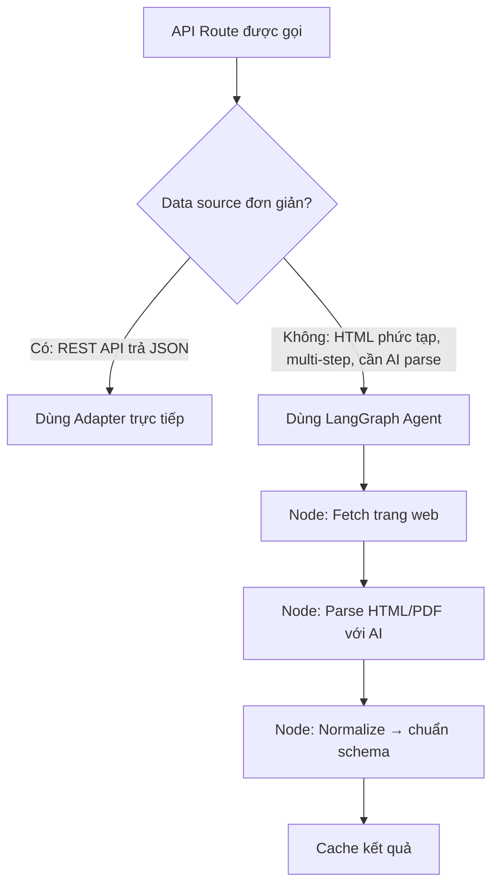

# aha-mind:data — Implementation Plan

> **Mục tiêu:** Xây dựng **aha-mind:data** — một full-stack data platform bằng Next.js (App Router) + TypeScript cung cấp dữ liệu tài chính thị trường Việt Nam, lấy cảm hứng kiến trúc từ `vnstock_data` — tập trung vào 5 domain chính với data source hợp pháp, ổn định, phục vụ nghiên cứu và phân tích.

**Quyết định đã xác nhận:**

- ✅ **Tên project:** `aha-mind:data`
- ✅ **Mục đích:** Học tập & nghiên cứu (không lo ToS)
- ✅ **Tech stack:** Next.js App Router (UI-first approach)
- ✅ **Database:** Bắt đầu không có DB → Khi cần persist dùng **MongoDB + Mongoose**
- ✅ **LangGraph:** Dùng cho các agent crawl dữ liệu phức tạp khi cần thiết
- ✅ **Hosting:** Chạy local trước (localhost:3000)

---

## 🏛️ Kiến Trúc 3 Lớp (Giữ nguyên triết lý)

```
┌──────────────────────────────────────────┐
│  Next.js UI Layer (React + App Router)   │  ← Dashboard, Charts, Tables
├──────────────────────────────────────────┤
│  API Route Handlers (/api/*)             │  ← Thay thế NestJS Controllers
│  Server Actions                          │  ← Direct data fetching từ Server
├──────────────────────────────────────────┤
│  Service Layer (Plain TypeScript)        │  ← Normalize, transform, cache
├──────────────────────────────────────────┤
│  Adapters (per source)                   │  ← VCI, SSI, GSO, SBV adapters
└──────────────────────────────────────────┘
         ↕  Khi dữ liệu phức tạp
┌──────────────────────────────────────────┐
│  LangGraph Agents (trong API Routes)     │  ← Multi-step crawl, normalize
└──────────────────────────────────────────┘
```

**Nguyên tắc giữ nguyên:** Swap data source không làm vỡ UI. Component `<OhlcvChart symbol="VCB" />` không biết bên dưới đang dùng VCI hay SSI.

---

## 🗂️ Cấu Trúc Thư Mục (Next.js App Router)

```
src/
├── app/
│   ├── (dashboard)/              # UI Pages
│   │   ├── layout.tsx
│   │   ├── page.tsx              # Home — Market Overview Dashboard
│   │   ├── reference/
│   │   │   └── [symbol]/page.tsx # Company Info + Events
│   │   ├── fundamental/
│   │   │   └── [symbol]/page.tsx # BCTC một mã CK
│   │   ├── market/
│   │   │   └── page.tsx          # Bảng giá + Charts
│   │   ├── macro/
│   │   │   └── page.tsx          # Dashboard vĩ mô
│   │   ├── commodity/
│   │   │   └── page.tsx          # Giá hàng hóa
│   │   └── insights/
│   │       └── page.tsx          # Rankings + Screener
│   │
│   └── api/                      # API Route Handlers
│       ├── reference/            # 🆕 Domain 0 — Master Data
│       │   ├── stocks/
│       │   │   ├── list/route.ts
│       │   │   ├── list-by-group/route.ts
│       │   │   └── list-by-industry/route.ts
│       │   ├── company/
│       │   │   └── [symbol]/
│       │   │       ├── info/route.ts
│       │   │       ├── shareholders/route.ts
│       │   │       └── events/route.ts
│       │   ├── industries/route.ts
│       │   └── event-calendar/route.ts
│       ├── fundamental/
│       │   └── [symbol]/
│       │       ├── income-statement/route.ts
│       │       ├── balance-sheet/route.ts
│       │       ├── cash-flow/route.ts
│       │       ├── ratio/route.ts
│       │       ├── notes/route.ts     # 🆕 LangGraph agent
│       │       └── pdf/route.ts       # 🆕 LangGraph agent
│       ├── market/
│       │   ├── multi-quote/route.ts   # 🆕 Bảng giá nhiều mã
│       │   ├── ohlcv/route.ts
│       │   ├── quote/route.ts
│       │   ├── trades/route.ts
│       │   ├── equity/
│       │   │   ├── foreign-flow/route.ts       # 🆕 Phase 2
│       │   │   └── proprietary-flow/route.ts   # 🆕 Phase 2
│       │   └── index/
│       │       ├── ohlcv/route.ts
│       │       └── quote/route.ts
│       ├── macro/
│       │   ├── gdp/route.ts
│       │   ├── cpi/route.ts
│       │   ├── exchange-rate/route.ts
│       │   └── interest-rate/route.ts
│       ├── commodity/
│       │   ├── gold/route.ts
│       │   ├── oil/route.ts
│       │   └── forex/route.ts
│       └── insights/
│           ├── ranking/route.ts
│           └── screener/route.ts
│
├── lib/
│   ├── adapters/                 # Data source adapters
│   │   ├── base.adapter.ts
│   │   ├── vci/
│   │   │   ├── vci-reference.adapter.ts   # 🆕 Domain 0
│   │   │   ├── vci-market.adapter.ts
│   │   │   └── vci-fundamental.adapter.ts
│   │   ├── ssi/
│   │   │   ├── ssi-market.adapter.ts
│   │   │   └── ssi-reference.adapter.ts   # 🆕 Fallback cho stocks/list
│   │   ├── gso/
│   │   │   └── gso-macro.adapter.ts
│   │   └── sbv/
│   │       └── sbv-currency.adapter.ts
│   │
│   ├── agents/                   # LangGraph agents
│   │   ├── fundamental-extractor/  # 🆕 PDF & Thuyết minh BCTC
│   │   │   ├── state.ts
│   │   │   ├── graph.ts
│   │   │   └── nodes/
│   │   │       ├── download-pdf.node.ts
│   │   │       ├── gemini-vision-extract.node.ts
│   │   │       ├── fetch-html.node.ts
│   │   │       ├── gemini-parse-table.node.ts
│   │   │       └── normalize.node.ts
│   │   ├── macro-crawler/          # GSO HTML phức tạp
│   │   │   ├── state.ts
│   │   │   ├── graph.ts
│   │   │   └── nodes/
│   │   │       ├── fetch-gso.node.ts
│   │   │       └── normalize.node.ts
│   │   └── commodity-crawler/      # Phase 2
│   │       └── ...
│   │
│   ├── db/                       # MongoDB + Mongoose (thêm khi cần persist)
│   │   ├── connect.ts            # Kết nối MongoDB
│   │   └── models/
│   │       ├── StockListing.model.ts  # 🆕 Domain 0 Reference
│   │       ├── Ohlcv.model.ts
│   │       ├── FinancialRatio.model.ts
│   │       ├── MacroIndicator.model.ts
│   │       └── Commodity.model.ts
│   │
│   ├── services/                 # Business logic layer
│   │   ├── reference.service.ts  # 🆕
│   │   ├── fundamental.service.ts
│   │   ├── market.service.ts
│   │   ├── macro.service.ts
│   │   ├── commodity.service.ts
│   │   └── insights.service.ts
│   │
│   └── cache/
│       └── cache.ts              # In-memory cache (node-cache)
│
└── components/                   # UI Components
    ├── reference/                # 🆕
    │   ├── StockSearch.tsx       # Tìm kiếm + autocomplete mã CK
    │   ├── CompanyInfoCard.tsx   # Card thông tin công ty
    │   └── EventTimeline.tsx     # Timeline cổ tức, ĐHCĐ, IPO
    ├── charts/
    │   ├── OhlcvChart.tsx        # TradingView Lightweight Charts
    │   ├── FinancialChart.tsx
    │   └── MacroChart.tsx
    ├── tables/
    │   ├── MultiQuoteTable.tsx   # 🆕 Bảng giá nhiều mã
    │   ├── FinancialTable.tsx
    │   └── RankingTable.tsx
    └── dashboard/
        └── MarketOverview.tsx
```

---

## 📡 6 Domain Dữ Liệu Chính

### Domain 0: Reference — Master Data (Nền Tảng)

> 🚨 **Ưu tiên cao nhất** — Mọi domain khác đều cần Reference để tra cứu symbol, thông tin công ty, danh sách ngành. Đây là layer đầu tiên phải xây dựng.

**API Routes:** `/api/reference/*`

| Route Handler                              | Mô tả                             | Data Source | Cache TTL |
| ------------------------------------------ | ----------------------------------- | ----------- | --------- |
| `stocks/list/route.ts`                   | Danh sách 1700+ mã CK             | VCI, SSI    | 24h       |
| `stocks/list-by-group/route.ts`          | CK theo nhóm (VN30, HNX30...)      | VCI, SSI    | 24h       |
| `stocks/list-by-industry/route.ts`       | CK theo ngành ICB                  | VCI         | 24h       |
| `company/[symbol]/info/route.ts`         | Thông tin tổng quan công ty      | VCI         | 6h        |
| `company/[symbol]/shareholders/route.ts` | Danh sách cổ đông chính        | VCI         | 24h       |
| `company/[symbol]/events/route.ts`       | Sự kiện: cổ tức, ĐHCĐ, IPO    | VCI         | 1h        |
| `industries/route.ts`                    | Danh sách ngành ICB               | VCI         | 24h       |
| `event-calendar/route.ts`                | Lịch sự kiện toàn thị trường | VCI         | 1h        |

**MongoDB Model:**

```typescript
// lib/db/models/StockListing.model.ts
const StockListingSchema = new mongoose.Schema({
  symbol:   { type: String, required: true, unique: true, index: true },
  name:     String,
  exchange: String,   // 'HSX' | 'HNX' | 'UPCOM'
  industry: String,   // Ngành ICB
  icbCode:  String,
  type:     String,   // 'stock' | 'etf' | 'fund' | 'derivative'
  updatedAt: { type: Date, default: Date.now },
});
export const StockListingModel = mongoose.models.StockListing ||
  mongoose.model('StockListing', StockListingSchema);
```

**Tại sao Reference phải đến trước:**

- Dashboard cần `stocks/list` để render danh sách → người dùng chọn mã → gọi các domain khác
- `company/[symbol]/events` (cổ tức, ĐHCĐ) là dữ liệu được tra cứu thường xuyên nhất
- Data thay đổi chậm → cache 24h → không tốn rate limit

---

### Domain 1: Fundamental — Báo cáo Tài chính

**API Route:** `/api/fundamental/[symbol]/income-statement`

| Route Handler                 | Mô tả                                 | Data Source | LangGraph?            |
| ----------------------------- | --------------------------------------- | ----------- | --------------------- |
| `income-statement/route.ts` | Kết quả kinh doanh (Q/Y)              | VCI, TCBS   | ❌ Không             |
| `balance-sheet/route.ts`    | Bảng cân đối kế toán (Q/Y)        | VCI, TCBS   | ❌ Không             |
| `cash-flow/route.ts`        | Lưu chuyển tiền tệ (Q/Y)            | VCI, TCBS   | ❌ Không             |
| `ratio/route.ts`            | Chỉ số tài chính (P/E, P/B, ROE...) | VCI, TCBS   | ❌ Không             |
| `notes/route.ts`            | Thuyết minh BCTC chi tiết             | VCI         | ✅**LangGraph** |
| `pdf/route.ts`              | Tải & trích xuất PDF BCTC scan       | VCI         | ✅**LangGraph** |

**Query params:** `?period=quarter&from=2023&to=2024`

**LangGraph Agent cho Fundamental:**

```
📄 PDF BCTC Flow:
download-pdf.node → gemini-vision-extract.node → normalize.node → mongodb-persist.node

📝 Thuyết minh BCTC Flow:
fetch-html.node → gemini-parse-table.node → normalize.node → cache.node
```

```typescript
// lib/agents/fundamental-extractor/graph.ts
const graph = new StateGraph<FundamentalState>()
  .addNode('download', downloadPdfNode)       // Tải PDF từ VCI
  .addNode('extract', geminiVisionExtract)    // Gemini đọc PDF ảnh scan
  .addNode('normalize', normalizeFinancial)   // Map sang schema chuẩn
  .addNode('persist', persistToMongoDB)       // Lưu vào FinancialRatioModel
  .addEdge('download', 'extract')
  .addEdge('extract', 'normalize')
  .addEdge('normalize', 'persist');

// Chỉ invoke khi user request PDF — không tự động
// Route handler: POST /api/fundamental/[symbol]/pdf
```

**Response schema chuẩn hóa:**

```json
{
  "symbol": "VCB",
  "period": "quarter",
  "unit": "billion_vnd",
  "data": [
    { "date": "2024Q1", "revenue": 45230, "net_profit": 8900, "eps": 2.3 }
  ],
  "source": "VCI",
  "cached_at": "2026-07-09T15:00:00Z"
}
```

**Data Source:** VCI API (bán công khai) + TCBS API (reverse-engineered từ web)

---

### Domain 2: Market — Dữ liệu Thị trường

**Endpoint prefix:** `/market`

| Method | Endpoint                     | Mô tả                                    | Data Source | Ưu tiên  |
| ------ | ---------------------------- | ------------------------------------------ | ----------- | ---------- |
| GET    | `/multi-quote`             | **Bảng giá nhiều mã cùng lúc** | SSI, VCI    | 🔴 Phase 1 |
| GET    | `/equity/ohlcv`            | Giá OHLCV lịch sử                       | SSI, VCI    | 🔴 Phase 1 |
| GET    | `/equity/quote`            | Bảng giá real-time (1 mã)               | SSI         | 🔴 Phase 1 |
| GET    | `/equity/foreign-flow`     | Dòng tiền nước ngoài                  | VCI         | 🟡 Phase 2 |
| GET    | `/equity/proprietary-flow` | Dòng tiền tự doanh                      | VCI         | 🟡 Phase 2 |
| GET    | `/equity/trades`           | Khớp lệnh trong ngày                    | SSI         | 🟡 Phase 2 |
| GET    | `/index/ohlcv`             | Lịch sử chỉ số VNINDEX/HNX             | SSI         | 🔴 Phase 1 |
| GET    | `/index/quote`             | Điểm chỉ số hiện tại                 | SSI         | 🔴 Phase 1 |

**MultiQuote — Quan trọng nhất cho Dashboard:**

```typescript
// GET /api/market/multi-quote?symbols=VCB,TCB,BID,CTG,VHM
// → Bảng giá nhiều mã cùng lúc, hiệu quả hơn gọi từng mã
// Dùng cho: Home Dashboard, Watchlist, Screener results

// Response:
{
  "data": [
    { "symbol": "VCB", "price": 89500, "change": 500, "pct_change": 0.56,
      "volume": 1234567, "value": 110000, "foreign_buy": 50000 },
    { "symbol": "TCB", "price": 23400, "change": -100, "pct_change": -0.42, ... }
  ],
  "updated_at": "2026-07-10T09:00:00+07:00"
}
```

**Query params OHLCV:** `?symbol=VCB&start=2024-01-01&end=2024-12-31&interval=1D`

**Interval hỗ trợ:** `1m`, `5m`, `15m`, `30m`, `1H`, `1D`, `1W`

**Data Source Analysis:**

- **SSI iBoard API** — SSI có public API documentation. Đây là nguồn ổn định nhất.
- **VCI** — Alternative, nhưng có thể bị chặn từ server cloud.

> ⚠️ **Lưu ý quan trọng:** Real-time quote sẽ bị block khi deploy lên server cloud (Vercel/Railway). Chiến lược: chạy local hoặc dùng proxy worker riêng.

---

### Domain 3: Macro — Chỉ số Vĩ mô

**Endpoint prefix:** `/macro`

| Method | Endpoint                    | Mô tả                   | Data Source                   |
| ------ | --------------------------- | ------------------------- | ----------------------------- |
| GET    | `/economy/gdp`            | Tăng trưởng GDP        | GSO (Tổng cục Thống kê)   |
| GET    | `/economy/cpi`            | Chỉ số giá tiêu dùng | GSO                           |
| GET    | `/economy/fdi`            | Đầu tư FDI             | GSO                           |
| GET    | `/economy/import-export`  | Xuất nhập khẩu         | GSO                           |
| GET    | `/currency/exchange-rate` | Tỷ giá hối đoái      | SBV (Ngân hàng Nhà nước) |
| GET    | `/currency/interest-rate` | Lãi suất                | SBV                           |

**Data Source Analysis — ĐÂY LÀ ĐIỂM MẠNH:**

- **GSO (gso.gov.vn)** — Tổng cục Thống kê VN có data portal công khai. Cần crawl/parse.
- **SBV (sbv.gov.vn)** — Ngân hàng Nhà nước có API cho tỷ giá.
- **World Bank API** — `api.worldbank.org` — public API, có data VN.
- **IMF API** — `imf.org/external/datamapper` — public, chuẩn quốc tế.

> 💡 **Lợi thế:** Đây là dữ liệu PUBLIC từ cơ quan chính phủ — không cần lo ToS.

---

### Domain 4: Commodity — Hàng hóa & Kim loại Quý

**Endpoint prefix:** `/commodity`

| Method | Endpoint   | Mô tả                    | Data Source            |
| ------ | ---------- | -------------------------- | ---------------------- |
| GET    | `/gold`  | Giá vàng VN & thế giới | SJC API, Gold API      |
| GET    | `/oil`   | Giá dầu WTI/Brent        | EIA, OPEC data         |
| GET    | `/steel` | Giá thép                 | Crawl SteelBenchmarker |
| GET    | `/forex` | Tỷ giá ngoại tệ        | SBV, ExchangeRate API  |

**Data Source Analysis:**

- **SJC** — sjc.com.vn có endpoint JSON public cho giá vàng.
- **ExchangeRate-API** — Free tier với 1500 requests/month.
- **EIA (eia.gov)** — US Energy Info, free API key, có giá dầu.
- **Gold API (metals-api.com)** — Free tier có giới hạn.
- **World Bank Commodity API** — Miễn phí hoàn toàn.

---

### Domain 5: Insights — Phân tích Thị trường

**Endpoint prefix:** `/insights`

| Method | Endpoint                  | Mô tả                             | Data Source |
| ------ | ------------------------- | ----------------------------------- | ----------- |
| GET    | `/ranking/gainer`       | Top cổ phiếu tăng mạnh nhất    | VCI, SSI    |
| GET    | `/ranking/loser`        | Top cổ phiếu giảm mạnh nhất    | VCI, SSI    |
| GET    | `/ranking/volume`       | Top theo khối lượng giao dịch   | VCI, SSI    |
| GET    | `/ranking/value`        | Top theo giá trị giao dịch       | VCI, SSI    |
| GET    | `/ranking/foreign-buy`  | Top nước ngoài mua ròng         | VCI         |
| GET    | `/ranking/foreign-sell` | Top nước ngoài bán ròng        | VCI         |
| GET    | `/screener`             | Bộ lọc cổ phiếu theo tiêu chí | VCI         |

---

## 🛠️ Tech Stack (Next.js Local-First)

| Thành phần          | Công nghệ                          | Ghi chú                     |
| --------------------- | ------------------------------------ | ---------------------------- |
| **Framework**   | Next.js 15 (App Router) + TypeScript | Full-stack trong 1 project   |
| **UI**          | React 19 + TailwindCSS v4            | Quen thuộc, đã có        |
| **Charts**      | Lightweight Charts (TradingView)     | OHLCV candlestick charts     |
| **HTTP Client** | Axios hoặc native`fetch`          | Gọi external APIs           |
| **Cache**       | `node-cache` (in-memory)           | Local dev, không cần Redis |
| **Validation**  | Zod                                  | Schema validation đã quen  |
| **LangGraph**   | `@langchain/langgraph`             | Agent crawl phức tạp       |
| **LLM**         | `@langchain/google-genai`          | Đã có key, dùng Gemini   |
| **State Mgmt**  | Zustand hoặc TanStack Query         | Client-side data fetching    |
| **Testing**     | Jest                                 | Unit test adapter & service  |

**Thêm khi cần persist dữ liệu:**

| Thành phần       | Công nghệ              | Lý do chọn                                    |
| ------------------ | ------------------------ | ----------------------------------------------- |
| **Database** | MongoDB (local → Atlas) | Flexible schema cho multi-source financial data |
| **ODM**      | **Mongoose**       | Native MongoDB, Aggregation Pipeline tự nhiên |

**Thêm sau khi cần API public:**

| Thành phần            | Công nghệ | Lý do                         |
| ----------------------- | ----------- | ------------------------------ |
| **API Framework** | NestJS      | Extract từ Next.js API Routes |
| **Cache**         | Redis       | Replace in-memory              |
| **Queue**         | BullMQ      | Background crawl jobs          |

---

## 🤖 LangGraph — Khi Nào Dùng?

LangGraph **không phải** cho mọi endpoint. Chỉ dùng khi data source phức tạp:



**Use cases cụ thể cho LangGraph:**

| Dữ liệu        | Tại sao cần Agent                                         | Node trong Graph                            |
| ---------------- | ----------------------------------------------------------- | ------------------------------------------- |
| GDP/CPI từ GSO  | HTML table phức tạp, structure thay đổi thường xuyên | fetch → parse-html → normalize            |
| BCTC PDF         | File PDF scan, cần OCR/AI extract                          | download-pdf → gemini-extract → normalize |
| Tin tức vĩ mô | Crawl nhiều nguồn, cần summarize                         | multi-fetch → filter → summarize          |

**Simple REST APIs → KHÔNG dùng LangGraph:**

- SBV tỷ giá (XML endpoint đơn giản)
- World Bank API (JSON chuẩn)
- EIA dầu thô (JSON chuẩn)
- VCI stock OHLCV (JSON chuẩn)

---

## 🗄️ Database Schema (MongoDB + Mongoose)

> **Chiến lược:** Bắt đầu **không có DB** — fetch & in-memory cache. Khi volume tăng hoặc cần persist lịch sử → kết nối MongoDB.

### Tại sao Mongoose thay vì Prisma?

| Tiêu chí                     | Mongoose                            | Prisma + MongoDB                               |
| ------------------------------ | ----------------------------------- | ---------------------------------------------- |
| **Aggregation Pipeline** | ✅ Native, tự nhiên               | ⚠️ Phải dùng`$rawQuery`                  |
| **Flexible schema**      | ✅`Mixed` type, dễ mở rộng     | ⚠️ Strict schema làm mất lợi thế MongoDB |
| **Time-series query**    | ✅ Aggregation`$group`, `$sort` | ⚠️ Workaround                                |
| **Học tập**            | ✅ Quen thuộc, tài liệu nhiều   | ⚠️ Overhead setup                            |

```typescript
// lib/db/connect.ts — Kết nối MongoDB
import mongoose from 'mongoose';

let isConnected = false;

export async function connectDB() {
  if (isConnected) return;
  await mongoose.connect(process.env.MONGODB_URI!);
  isConnected = true;
}

// lib/db/models/Ohlcv.model.ts — Giá lịch sử OHLCV
const OhlcvSchema = new mongoose.Schema({
  symbol:   { type: String, required: true, index: true },
  time:     { type: Date, required: true, index: true },
  interval: { type: String, enum: ['1m','5m','15m','1H','1D','1W'] },
  open:     Number,
  high:     Number,
  low:      Number,
  close:    Number,
  volume:   Number,
  source:   String,        // 'VCI' | 'SSI'
}, { timeseries: { timeField: 'time', metaField: 'symbol', granularity: 'hours' } });
// ↑ MongoDB Time Series Collection — tối ưu write/query theo time

export const OhlcvModel = mongoose.models.Ohlcv ||
  mongoose.model('Ohlcv', OhlcvSchema);

// lib/db/models/FinancialRatio.model.ts — Chỉ số tài chính
const FinancialRatioSchema = new mongoose.Schema({
  symbol:    { type: String, required: true, index: true },
  period:    String,        // '2024Q1', '2024'
  data:      mongoose.Schema.Types.Mixed,  // Flexible: 50+ chỉ số, không cố định
  source:    String,
  fetchedAt: { type: Date, default: Date.now },
});

export const FinancialRatioModel = mongoose.models.FinancialRatio ||
  mongoose.model('FinancialRatio', FinancialRatioSchema);

// lib/db/models/MacroIndicator.model.ts — Vĩ mô (GDP, CPI...)
const MacroIndicatorSchema = new mongoose.Schema({
  category:  { type: String, index: true }, // 'gdp' | 'cpi' | 'fdi'
  date:      { type: Date, index: true },
  value:     Number,
  unit:      String,
  country:   { type: String, default: 'VN' },
  source:    String,        // 'GSO' | 'WorldBank' | 'SBV'
  raw:       mongoose.Schema.Types.Mixed,  // Giữ nguyên raw data từ source
  fetchedAt: { type: Date, default: Date.now },
});

export const MacroIndicatorModel = mongoose.models.MacroIndicator ||
  mongoose.model('MacroIndicator', MacroIndicatorSchema);

// lib/db/models/Commodity.model.ts — Hàng hóa & Kim loại quý
const CommoditySchema = new mongoose.Schema({
  type:     { type: String, index: true }, // 'gold' | 'oil' | 'steel'
  market:   String,        // 'VN' | 'GLOBAL'
  date:     { type: Date, index: true },
  price:    Number,
  currency: { type: String, default: 'USD' },
  source:   String,
  fetchedAt: { type: Date, default: Date.now },
});

export const CommodityModel = mongoose.models.Commodity ||
  mongoose.model('Commodity', CommoditySchema);
```

**Lợi thế `data: Mixed` cho FinancialRatio:**

```typescript
// KBS trả về 30 columns, VCI trả về 10 columns
// → Lưu nguyên document, không cần migrate schema
await FinancialRatioModel.create({
  symbol: 'VCB',
  period: '2024Q1',
  source: 'KBS',
  data: {
    revenue: 45230, net_profit: 8900,
    ceo_name: 'Nguyen Van A',   // KBS-only field
    free_float: 12345678,       // KBS-only field
    // ... 30 fields
  }
});
```

---

## ⚡ Caching Strategy (In-Memory → MongoDB)

```
              Lần đầu request         Lần sau
                     ↓                    ↓
Client → API Route → Cache hit? ──Yes──→ Trả về ngay
                          │
                          No
                          ↓
                    Gọi Adapter → External API
                          ↓
                    Lưu vào Cache
                          ↓ (nếu cần persist)
                    Lưu vào MongoDB
                          ↓
                    Trả về Client
```

**TTL theo loại dữ liệu (node-cache):**

```typescript
const TTL = {
  ohlcvDay:    3600,       // 1 giờ
  ohlcvMinute: 60,         // 1 phút
  quote:       15,         // 15 giây
  fundamental: 86400,      // 24 giờ (BCTC ít thay đổi)
  macro:       6 * 3600,   // 6 giờ
  commodity:   300,        // 5 phút
  rankings:    300,        // 5 phút
};
```

**Cache key pattern:** `{domain}:{class}:{symbol}:{period}:{interval}`

Ví dụ: `market:equity:VCB:ohlcv:1D`

**Khi nào persist vào MongoDB?**

- OHLCV lịch sử (1D trở lên) — tránh gọi lại nhiều lần
- Macro indicators — cập nhật chậm, query thường xuyên
- Commodity prices — cache dài hạn

---

## 🏗️ Kiến Trúc Adapter Pattern (Plain TypeScript)

```typescript
// lib/adapters/base.adapter.ts — Interface chung
export interface IDataAdapter<TInput, TOutput> {
  fetch(params: TInput): Promise<TOutput>;
  normalize(rawData: unknown): TOutput;
  isAvailable(): Promise<boolean>;
}

// lib/adapters/vci/vci-market.adapter.ts
export class VciMarketAdapter implements IDataAdapter<OhlcvParams, OhlcvData[]> {
  async fetch(params: OhlcvParams): Promise<OhlcvData[]> {
    const res = await fetch(`${VCI_BASE_URL}/ohlcv`, {
      method: 'POST',
      headers: { 'Content-Type': 'application/json' },
      body: JSON.stringify({ code: params.symbol, ...params })
    });
    return this.normalize(await res.json());
  }

  normalize(rawData: unknown): OhlcvData[] {
    // Map VCI field names → chuẩn của hệ thống
    return (rawData as any).data.map((item: any) => ({
      time:   new Date(item.t * 1000), // VCI dùng Unix timestamp
      open:   item.o,
      high:   item.h,
      low:    item.l,
      close:  item.c,
      volume: item.v,
    }));
  }

  async isAvailable(): Promise<boolean> {
    try {
      await fetch(VCI_HEALTH_URL, { signal: AbortSignal.timeout(3000) });
      return true;
    } catch { return false; }
  }
}

// lib/services/market.service.ts — Fallback tự động
export class MarketService {
  private adapters = [new SsiMarketAdapter(), new VciMarketAdapter()];

  async getOhlcv(params: OhlcvParams): Promise<OhlcvData[]> {
    // 1. Kiểm tra MongoDB cache trước
    const cached = await OhlcvModel.find({
      symbol: params.symbol,
      time: { $gte: params.start, $lte: params.end },
      interval: params.interval
    }).sort({ time: 1 }).lean();

    if (cached.length > 0) return cached as OhlcvData[];

    // 2. Fallback sang external adapter
    for (const adapter of this.adapters) {
      try {
        if (await adapter.isAvailable()) {
          const data = await adapter.fetch(params);
          // 3. Persist vào MongoDB (background)
          OhlcvModel.insertMany(data).catch(console.error);
          return data;
        }
      } catch (e) {
        console.warn(`Adapter failed, trying next...`, e);
      }
    }
    throw new Error('All data sources unavailable');
  }
}
```

---

## 📅 Roadmap Phát Triển

### Phase 1 — Foundation: Reference + Fundamental + Market (2-3 tuần)

```
⬜ Khởi tạo Next.js project (hoặc dùng aha-tools hiện có)
⬜ Base Adapter interface + Zod schemas + IDataAdapter<TInput, TOutput>
⬜ Domain 0: Reference — VCI Adapter + stocks/list + company/info
⬜   → UI: Stock Search Bar + Company Info Card
⬜ Domain 1: Fundamental — VCI Adapter + income-statement + ratio
⬜   → UI: Financial Table (KQKD, CĐKT, LCTT)
⬜ Domain 2: Market — MultiQuote + OHLCV + Index Quote
⬜   → UI: Home Dashboard (bảng giá nhiều mã + VNINDEX chart)
⬜ In-memory cache (node-cache) + cache key pattern
```

### Phase 2 — Data Coverage + Persist (2-3 tuần)

```
⬜ Domain: Macro — World Bank API + SBV Adapter + Dashboard UI
⬜ Domain: Commodity — SJC/EIA/ExchangeRate + Chart UI
⬜ Domain: Insights — Rankings Table UI
⬜ LangGraph Agent: GSO crawler (GDP/CPI từ HTML phức tạp)
⬜ Kết nối MongoDB + Mongoose (khi in-memory không đủ)
⬜   → Setup OhlcvModel (Time Series Collection)
⬜   → Setup MacroIndicatorModel (persist GDP/CPI)
⬜   → Cron-like refresh: persist + invalidate cache
```

### Phase 3 — Polish & Optional Public API (1-2 tuần)

```
⬜ UI/UX polish, mobile responsive
⬜ Dark mode Dashboard
⬜ Export dữ liệu CSV
⬜ [Optional] Tách NestJS microservice nếu cần public API
⬜ [Optional] Deploy Railway / Vercel + MongoDB Atlas
```

---

## ⚠️ Risk Register & Mitigation

| Rủi ro                    | Khả năng xảy ra | Giải pháp                                               |
| -------------------------- | ------------------ | --------------------------------------------------------- |
| VCI/SSI chặn server IP    | 🔴 Cao             | Rotate proxy IPs + Fallback sang KBS                      |
| API schema thay đổi      | 🟡 Trung bình     | Integration test tự động hàng ngày, alert khi fail   |
| Rate limit bị hit         | 🟡 Trung bình     | Redis cache + BullMQ throttle queue                       |
| ToS violation              | 🔴 Quan trọng     | Ưu tiên nguồn chính phủ (GSO/SBV), kiểm tra ToS kỹ |
| GSO data format thay đổi | 🟡 Trung bình     | Versioned scraper, alert khi parse fail                   |

---

## 🔑 Data Source Map (Công khai & Hợp pháp)

| Dữ liệu            | URL Nguồn                   | Loại       | Ghi chú                     |
| -------------------- | ---------------------------- | ----------- | ---------------------------- |
| Tỷ giá hối đoái | `sbv.gov.vn`               | Gov API     | Free, cần parse HTML/XML    |
| GDP, CPI, FDI        | `gso.gov.vn`               | Gov Portal  | Free, cần crawl             |
| GDP, CPI World       | `api.worldbank.org/v2`     | Public API  | Hoàn toàn miễn phí, JSON |
| Giá vàng SJC       | `sjc.com.vn/xml/tygia`     | Semi-public | XML endpoint công khai      |
| Giá dầu WTI/Brent  | `api.eia.gov`              | Public API  | Free API key, 100req/h       |
| Tỷ giá ngoại tệ  | `exchangerate-api.com`     | 3rd party   | Free 1500req/month           |
| BCTC/Chỉ số CK     | VCI API (reverse-engineered) | Semi-public | Cần kiểm tra ToS           |
| Giá cổ phiếu      | SSI iBoard API               | Semi-public | Tốt nhất khi dùng local   |

---

## 📊 Gap Analysis & Coverage Map

> **Nguồn:** Nghiên cứu toàn bộ 8 file tài liệu kỹ thuật vnstock_data (Reference, Market, Fundamental, Macro, Insights, Analytics, Architecture, Introduction). Dùng làm roadmap phát triển Phase tiếp theo.

### Độ phủ hiện tại so với vnstock_data (6 Layer)

```
Reference Layer     ████████████   Phase 1  (vừa bổ sung)
Market Layer        ████████░░░░   60%  (có OHLCV/Quote, thiếu Derivative/ETF/Fund)
Fundamental Layer   ████████████   80%  (có BCTC + LangGraph PDF, thiếu Health Score)
Macro Layer         ████████████   85%  (nguồn public tốt)
Commodity Layer     ████████░░░░   40%  (có 4/11 loại hàng hóa)
Insights Layer      ████████████   90%  (đầy đủ ranking + screener)
Analytics Layer     ░░░░░░░░░░░░    0%  (P/E, P/B lịch sử toàn thị trường — Phase 3+)
```

### Backlog Phase Tiếp Theo

#### Phase 2 — Mở rộng Data Coverage

| Feature                                 | Layer     | Nguồn          | Ghi chú                            |
| --------------------------------------- | --------- | --------------- | ----------------------------------- |
| ForeignFlow, ProprietaryFlow            | Market    | VCI             | Dòng tiền nước ngoài/tự doanh |
| Company Events (cổ tức lịch sử)     | Reference | VCI             | Lịch sử chia cổ tức             |
| Commodity mở rộng (7 loại còn lại) | Commodity | World Bank, FAO | Gas, Steel, IronOre, Fertilizer...  |
| GSO Crawler (LangGraph)                 | Macro     | GSO HTML        | GDP/CPI từ HTML phức tạp         |
| MongoDB Persist                         | All       | Local           | OHLCV 1D+, Macro, Reference         |

#### Phase 3 — Analytics & Advanced

| Feature            | Layer       | Mô tả                                                       |
| ------------------ | ----------- | ------------------------------------------------------------- |
| Analytics Layer    | Analytics   | P/E, P/B lịch sử VNINDEX — đánh giá chu kỳ định giá |
| Health Score       | Fundamental | Điểm sức khỏe tài chính doanh nghiệp                   |
| OpenFund NAV       | Market      | Lịch sử NAV + top holding quỹ mở                          |
| Derivative OHLCV   | Market      | Hợp đồng tương lai VN30F                                 |
| Screener nâng cao | Insights    | Lọc theo Financial Health Score                              |

### Rủi ro Data Source theo Layer

| Layer            | Rủi ro                      | Mức độ      | Giải pháp                                     |
| ---------------- | ---------------------------- | -------------- | ----------------------------------------------- |
| Market real-time | Bị block trên server cloud | 🔴 Cao         | Chạy local hoặc proxy worker riêng           |
| Fundamental VCI  | Rate limit 60 req/min        | 🟡 Trung bình | Cache 24h cho BCTC                              |
| Macro GSO        | HTML structure thay đổi    | 🟡 Trung bình | LangGraph + Gemini linh hoạt hơn CSS selector |
| Reference VCI    | Schema thay đổi            | 🟢 Thấp       | Cache 24h, ít gọi lại                        |
| Commodity EIA    | 100 req/h free tier          | 🟢 Thấp       | Cache 5 phút đủ dùng                        |

---

*Made by Anh Tu - Share to be share*
