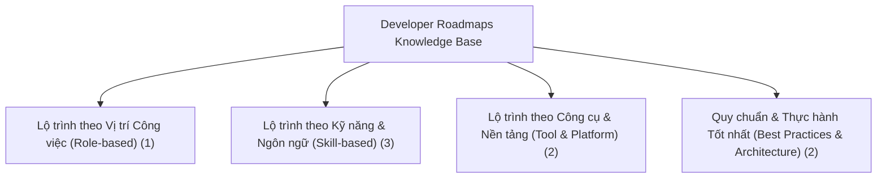

# Tổng Quan Dữ Liệu Lộ Trình Phát Triển (Developer Roadmaps)

> Dữ liệu được thu thập tự động từ mã nguồn mở [roadmap.sh](https://github.com/kamranahmedse/developer-roadmap) nhằm phục vụ công tác đào tạo, xây dựng giáo trình và viết bài kỹ thuật chuyên sâu.

## 1. Thống Kê Tổng Quan

- **Tổng số Lộ trình (Roadmaps):** 8
- **Tổng số Modules (Phân cấp):** 145
- **Tổng số Chủ đề (Topics):** 781
- **Thời gian tạo:** 00:08:23 17/9/2026

## 2. Bản Đồ Phân Loại (Mermaid Graph)

## 3. Danh Sách Chi Tiết Theo Nhóm

### 🔹 Lộ trình theo Vị trí Công việc (Role-based) (1 roadmaps)

| STT | Tên Lộ Trình (Title) | Slug | Số Modules | Số Topics | Đường Dẫn File JSON |
|:---:|:---|:---|:---:|:---:|:---|
| 1 | **Frontend** | `frontend` | 38 | 123 | `role-based/frontend.json` |

### 🔹 Lộ trình theo Kỹ năng & Ngôn ngữ (Skill-based) (3 roadmaps)

| STT | Tên Lộ Trình (Title) | Slug | Số Modules | Số Topics | Đường Dẫn File JSON |
|:---:|:---|:---|:---:|:---:|:---|
| 1 | **NestJS** | `nestjs` | 24 | 78 | `skill-based/nestjs.json` |
| 2 | **Next.js** | `nextjs` | 33 | 96 | `skill-based/nextjs.json` |
| 3 | **Node.js** | `nodejs` | 19 | 114 | `skill-based/nodejs.json` |

### 🔹 Lộ trình theo Công cụ & Nền tảng (Tool & Platform) (2 roadmaps)

| STT | Tên Lộ Trình (Title) | Slug | Số Modules | Số Topics | Đường Dẫn File JSON |
|:---:|:---|:---|:---:|:---:|:---|
| 1 | **Docker** | `docker` | 1 | 56 | `tool-platform/docker.json` |
| 2 | **Kubernetes** | `kubernetes` | 1 | 67 | `tool-platform/kubernetes.json` |

### 🔹 Quy chuẩn & Thực hành Tốt nhất (Best Practices & Architecture) (2 roadmaps)

| STT | Tên Lộ Trình (Title) | Slug | Số Modules | Số Topics | Đường Dẫn File JSON |
|:---:|:---|:---|:---:|:---:|:---|
| 1 | **Api Design** | `api-design` | 1 | 99 | `best-practice/api-design.json` |
| 2 | **System Design** | `system-design` | 28 | 148 | `best-practice/system-design.json` |

---

*Made by Anh Tu - Share to be share*